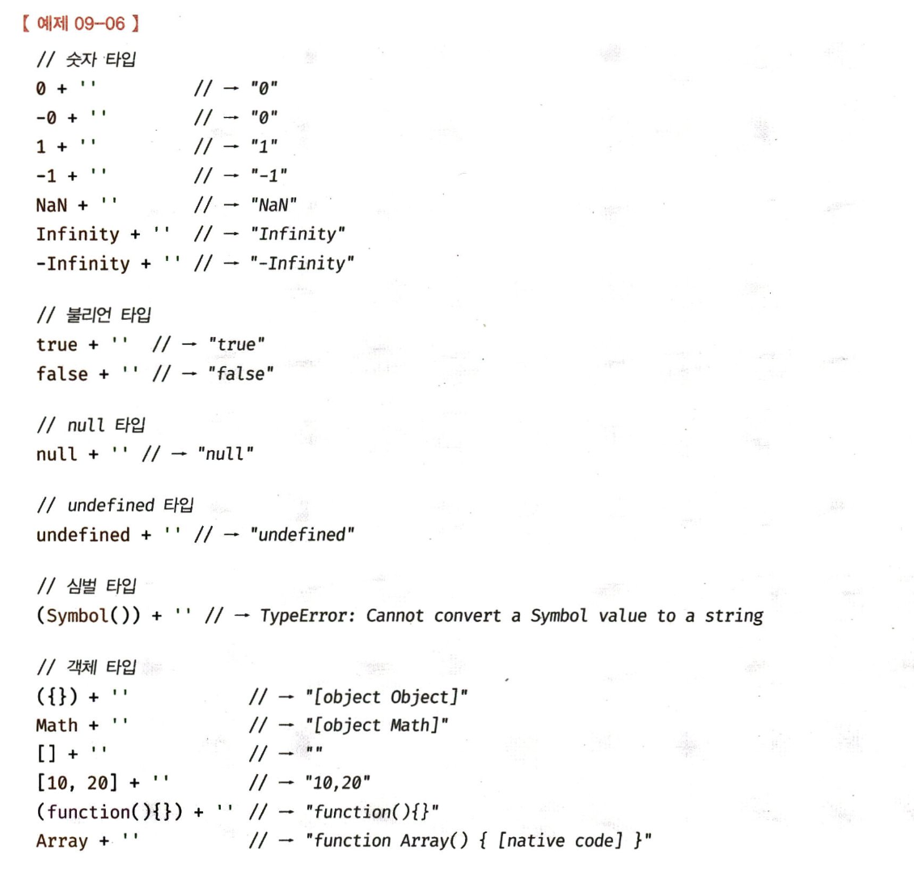

# 9-1. 타입 변환이란?

개발자가 의도적으로 값의 타입을 변환하는 것을 **명시적 타입 변환(explicit coercion)** 또는 **타입 캐스팅(type casting)** 이라고 한다.

그런데 개발자의 의도와는 상관 없이 표현식을 평가하는 도중에 JS 엔진에 의해 암묵적으로 타입이 자도 변환되기도 한다.

이를 **암묵적 타입 변환(implicit coercion)** 또는 **타입 강제 변환(type coercion)** 이라 한다.

명시적 타입 변환이나 암묵적 타입 변환이 기존 원시 값을 직접 변경하는 것은 아니다.

원시 값은 immutable value이므로 변경할 수 없다.

타입 변환이란, 기존 원시 값을 사용해 다른 타입의 새로운 원시 값을 생성하는 것이다.

JS 엔진은 표현식을 에러 없이 평가하기 위해 피연산자의 값을 암묵적 타입 변환하여 새로운 타입의 값으로 만들고 한 번 사용하고 버린다.

명시적 타입 변환만 사용하고 암묵적 타입 변환은 발생하지 않도록 코드를 작성하면?

---

# 9-2. 암묵적 타입 변환

## 9-2-1. 문자열 타입으로 변환

```jsx
1 + '2' // "12"
```

“+”는 문자열 연결 연산자로 동작한다.

따라서 위 표현식에서 문자열 타입이 아닌 피연산자를 문자열 타입으로 암묵적 타입 변환한다.

문자열이 아닌 값을 문자열로 암묵적 타입 변환을 수행할 땐 다음과 같이 동작한다.



## 9-2-2. 숫자 타입으로 변환

```jsx
1 - '1' // 0
1 * '10' // 10
1 / 'one' // NaN
```

위에서 쓰인 연산자는 모두 산술 연산자이다.

따라서 산술 연산자의 피연산자는 모두 숫자여야 한다.

숫자에 대한 암묵적 타입 변환은 아래와 같이 이루어진다.


## 9-2-3. 불리언 타입으로 변환

JS 엔진은 불리언 타입이 아닌 값을 Truthy 값 or Falsy 값으로 구분한다.

제어문의 조건식에서는 Truthy 값은 true, Falsy 값은 false로 암묵적 타입 변환을 수행한다.

아래 값들은 false로 평가되는 Falsy 값이다.

- false
- undefined
- null
- 0, -0
- NaN
- ‘’ (빈 문자열)

---

# 9-3. 명시적 타입 변환

명시적으로 타입을 변경하는 방법은 다양하다.

1. 표준 빌트인 생성자 함수(String, Number, Boolean)을 new 연산자 없이 호출하는 방법
2. 빌트인 메서드를 사용하는 방법
3. 암묵적 타입 변환을 이용하는 방법

## 9-3-1. 문자열 타입으로 변환

1. String 생성자 함수를 new 연산자 없이 호출한다.

   ```jsx
   String(1) // "1"
   String(NaN) // "NaN"
   String(Infinity) // "Intinity"
   ```

2. Object.prototype.toString 메서드를 사용한다.

   ```jsx
   ;(1).toString() // "1"
   NaN.toString() // "NaN"
   ```

3. 문자열 연결 연산자를 이용한다.

   ```jsx
   1 + '' // "1"
   NaN + '' // "NaN"
   ```

## 9-3-2. 숫자 타입으로 변환

1. Number 생성자 함수를 new 연산자 없이 호출한다.

   ```jsx
   Number('0') // 0
   Number('-1') // -1
   ```

2. parseInt, parseFloat 함수를 사용한다. (문자열만 숫자 타입으로 변환 가능하다.)

   ```jsx
   parseInt('0') // 0
   parseInt('-1') // -1
   ```

3. “+” 단항 산술 연산자를 이용한다.

   ```jsx
   ;+'0' // 0
   ;+'-1' // -1
   ```

4. “\*” 산술 연산자를 이용한다.

   ```jsx
   '0' * 1 // 0
   '-1' * 1 // -1
   ```

## 9-3-3. 불리언 타입으로 변환

1. Boolean 생성자 함수를 new 연산자 없이 호출한다.

   ```jsx
   Boolean('x') // true
   Boolean('') // false
   ```

2. ! 부정 논리 연산자를 두 번 사용한다.

   ```jsx
   !!'x' // true
   !!'' // false
   ```

---

# 9-4. 단축 평가

## 9-4-1. 논리 연산자를 사용한 단축 평가

논리곱 (&&) 연산자는 두 개의 피연산자가 모두 true로 평가될 때 true를 반환한다.

```jsx
'Cat' && 'Dog' // "Dog"
```

Dog까지 평가되어야 위 표현식을 평가할 수 있으므로 최종 반환 값은 Dog가 된다.

```jsx
'Cat' || 'Dog' // Cat
```

Cat만 평가되어도 위 표현식을 평가할 수 있으므로 최종 반환 값은 Cat이 된다.

위처럼 표현식을 평가하는 도중에 평가 결과가 확정된 경우, 나머지 평가 과정을 생략하는 것을 단축 평가(short-circuit evaluation)이라고 한다.

아래와 같은 상황에서 유용하게 사용된다.

1. 객체를 가리키기를 기대하는 변수가 null 또는 undefined가 아닌지 확인하고 프로퍼티를 참조할 때

   객체는 키와 값으로 구성된 프로퍼티의 집합이다.

   객체를 가리키기를 기대하는 변수의 값이 객체가 아니라 null 또는 undefined인 경우 객체의 프로퍼티를 참조하면 `TypeError`가 발생한다.

   이에 단축 평가를 발생하면 에러가 발생하지 않고 평가할 수 있다!

   ```jsx
   var elem = nulll

   var value = elam && elem.value
   ```

1. 함수 매개변수에 기본값을 설정할 때

   함수를 호출할 때 인수를 전달하지 않으면 매개변수는 undefined가 할당된다. 이때 단축 평가를 사용하면 에러 방지할 수 있다.

## 9-4-2. 옵셔널 체이닝 연산자

ES11(ECMAScript2020)에서 도입된 **옵셔널 체이닝(optional chaining)** 연산자는 좌항의 피연산자가 null 또는 undefined인 경우 undefined를 반환하고, 그렇지 않으면 참조를 이어간다.

## 9-4-3. null 병합 연산자

ES11(ECMAScript2020)에서 도입된 null 병합(nullish coalescing) 연산자 ??는 좌항의 피연산자가 null 또는 undefined인 경우 우항의 피연산자를 반환하고, 그렇지 않으면 좌항의 피연산자를 반환한다.
