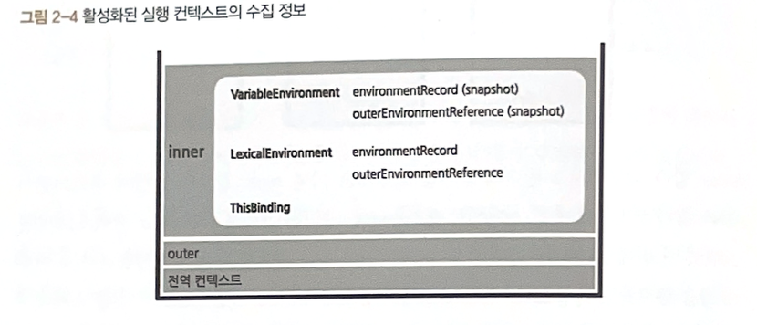

# 1. 실행 컨텍스트란

실행할 코드에 제공할 환경 정보들을 모아놓은 객체이다.

실행 컨텍스트를 구성할 수 있는 방법으로는 전역 공간, eval() 함수, 함수 등이 있다.

> 😓 **eval은 뭘까?**
>
> 문자열을 코드처럼 실행할 수 있는 내장 함수이다.
>
> ```jsx
> eval('let x = 10; console.log(x);') // 10
> ```

> 😓 **“실행 컨텍스트를 구성한다.”가 무슨 말이지**
>
> 새로운 실행 컨텍스트를 생성해서 JS 엔진 내부에 “실행 환경”을 만든다 라는 뜻이다.

그래서 실행 컨텍스트는 아래처럼 생긴다.



# 2. VariableEnvironment

현재 컨텍스트 내의 식별자들에 대한 정보와 외부 환경 정보가 담긴다.

이거를 그대로 복사해서 LexicalEnvironment를 만들고 이후부터는 LexicalEnvironment를 주로 쓰게 된다.

# 3. LexicalEnvironment

사전같은 느낌이다.

사전에 “바나나”를 검색하면 나오는 문구처럼

해당 컨텍스트 내부에는 어쩌구저쩌구 식별자들이 있고 외부 정보는 려쩌구를 참고한다 같은 느낌!

> 😓 **VariableEnvironment의 복사본이 LexicalEnvironment이면 왜 굳이 두 개를 분리하지?**
>
> **VariableEnvironment** 은 **초기 선언 정보를 저장** 하는 공간으로, **초기 상태 백업용** 이자 내부적으로만 사용되는 기록 용도이다. \*\*\*\*
>
> **⇒** 출석부
>
> **LexicalEnvironment** 은 실행 중인 현재 환경을 추적하는 공간이다.
> ⇒ 현재 교실 상태
>
> 결론은 선언 정보는 유지하고, 실행 도중에 스코프 체인이나 환경이 바뀌면 **LexicalEnvironment** 에서 관리할 수 있기 위함이다@!

## 3-1. environmentRecord와 호이스팅

**environmentRecord**에는 현재 컨텍스트와 관련된 코드의 식별자 정보가 저장된다.

컨텍스트 내부를 처음부터 끝까지 훑으면서 순서대로 저장된다.

⇒ JS 엔진은 식별자를 최상단으로 끌어올리고 실제 코드를 실행한다~~

⇒ 이것이 호이스팅이다~~

## 3-2. 함수 선언문과 함수 표현식

**함수 선언문**은 function 정의부만 존재하고 별도의 할당 명령이 없는 것이고,

반드시 함수명이 정의돼 있어야 한다.

**함수 표현식**은 정의한 function을 별도의 변수에 할당하는 것이다.

함수명이 정의되지 않아도 된다.

이때 함수명을 정의하면 **‘기명 함수 표현식’**, 정의하지 않으면 **‘익명 함수 표현식’**이라고 한다.

```jsx
// 함수 선언문
function a() {}
a();

// 기명 함수 표현식
var b = function c() {}
b(); // 실행 o
c(); // 실행 x

// 익명 함수 표현식
var d = function ();
d(); // 실행 o
```

아래 예제 코드를 통해

실행 컨텍스트의 lexicalEnvironment가 수집하는 정보 중 하나인 environmentRecord의 정보 수집 과정에 대해 살펴보자며언

```jsx
// 호이스팅 전
console.log(sum(1, 2))
console.log(multiply(3, 4))

function sum(a, b) {
  return a + b
}

var multiply = function (a, b) {
  return a * b
}
```

```jsx
// 호이스팅 후

// 함수 선언문은 전체를 호이스팅 한다!
var sum = function sum(a, b) {
  return a + b
}

// 함수 표현식은 변수 선언부만 호이스팅한다 !-!
var multiply

console.log(sum(1, 2))

// multiply is not a function 에러 메세지가 출력될 것....
console.log(multiply(3, 4))

// 👍🏻 함수 표현식의 변수 할당부는 원래 자리에 위치
multiply = function (a, b) {
  return a * b
}
```

함수 선언문과 표현식은 호이스팅이 다르게 처리됐는데,

이것이 극명한 차이다~~

그래서 원래 코드에서는 `console.log(sum(1, 2));` 가 에러를 일으킬 거 같지만, 호이스팅 과정 덕분에 에러가 발생하지 않는다.

→ 선언문은 혼란의 원인이다. ㄱ-..

그런데 같은 함수를 여러 번 선언하면 결국 나중에 할당한 값이 먼저 할당한 값을 덮어씌우므로 문제가 발생할 수 있다.

이때 함수 표현식을 사용했다면, 의도된 코드 흐름을 유지할 수 있겠죠 호호호

## 3-3. 스코프, 스코프 체인, outerEnvironmentReference

> 😓 ES5까지의 JS는 특이하게도 전역공간을 제외하면 오직 함수에 의해서만 스코프가 생성된다.

스코프는 식별자에 대한 유효범위이고,

스코프 체인은 식별자의 유효범위를 안에서 바깥으로 검색해나가는 것을 의미한다.

⇒ 요것은 LexicalEnvironment의 두 번째 수집 자료인 outerEnvironmentReference을 통해 이루어진다~~

### 스코프 체인

outerEnvironmentReference는 현재 호출된 함수가 선언될 당시의 LexicalEnvironment을 참조한다.

그래서 연결리스트 마냥 연결된 스코프 체인상에서 안에서 바깥으로 식별자 검색을 해나가기 때문에, 나가면서 가장 먼저 발견된 식별자에만 접근이 가능하다.

```jsx
var a = 1

var outer = function () {
  var inner = function () {
    console.log(a)
    var a = 3
  }
  inner()
  console.log(a)
}
outer()
console.log(a)
```


outer는 outer 및 전역 스코프에서 생성된 변수에 접근 가능하지만, inner 스코프 내부에서 생성된 변수에는 접근하지 못한다.

변수 a 같은 경우에는 inner 내부에도 있고, 전역 상태에도 있는데

이때 Inner 스코프에서는 반드시 inner의 LE 상의 값만 반환하게 되고

전역상태의 LE의 a는 접근할 수 없다

⇒ **변수 은닉화(variable shadowing)** 이라고 한다.

### 전역변수와 지역변수

전역 공간에서 선언한 변수가 전역변수고,

함수 내부에서 선언한 변수는 무조건 지역변수다~~

### 정리!!

**실행 컨텍스트** 는 **실행할 코드에 제공할 환경 정보 모음 객체** 이다.

전역에서 자동으로 생성되는 전역 컨텍스트,

eval 및 함수 실행에 의한 컨텍스트 등이 있다.

실행 컨텍스트가 활성화되는 시점에 **VariableEnvironment**, **LexicalEnvironment**, **ThisBinding** 정보를 수집한다.

**VariableEnvironment** 는 **초기 정보** 를 가지고 있고, VariableEnvironment의 복사본이 LexicalEnvironment인데

**LexicalEnvironment** 은 **함수 실행 도중에 변경되는 사항이 즉시 반영** 된다.

LexicalEnvironment은 **매개변수명, 변수의 식별자, 선언한 함수의 함수명 등을 수집하는 environmentRecord** 와 바로 직전 컨텍스트의 LexicalEnvironment 정보를 **참조** 하는 **outerEnvironmentRefernece** 로 구성되어 있다.

**호이스팅** 은 **environmentRecord** 수집 과정을 추상화한 개념이다.

이때 함수 선언문과 함수 표현식의 차이가 발생한다. (함수 선언문은 혼란을 야기한다!!)

스코프는 변수의 유효범위이다.

outerEnvironmentRefernece는 해당 함수가 선언된 위치의 LexicalEnvironment를 참조하는데,

해당 스코프의 LexicalEnvironment 내에서 검색하다가 안 나오면 outerEnvironmentRefernece (참조하고 있는 환경)의 LexicalEnvironment를 탐색하는 연쇄적인 과정을 거친다.

전역 LexicalEnvironment까지 갔는데 변수를 못 찾으면 `undefined`를 뱉는다.
