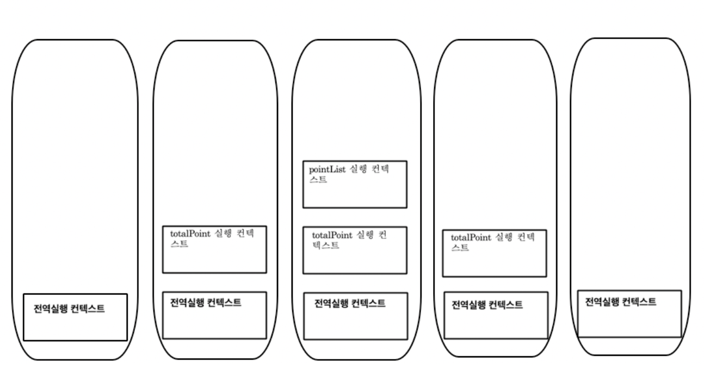

# 1. 스코프

var, let, const 키워드로 선언한 변수의 스코프는 각각 다르게 동작한다.

함수의 매개변수는 함수 몸체 내부에서만 참조할 수 있고, 함수 몸체 외부에서는 참조할 수 없다. → “함수의 유효범위 == 함수의 스코프가 함수 몸체로 제한된다”

변수는 자신이 선언된 위치에 의해 스코프가 결정된다.

아래의 코드는 어떻게 동작할까?

```jsx
var x = 'global'

function foo() {
  var x = 'local'
  console.log(x)
}

foo()

console.log(x)
```

```jsx
// 내 예상
// local
// global
```

함수 내부와 외부에서 같은 이름의 변수 x가 선언됐다.

이때 JS 엔진은 어떤 변수를 참조할 지에 대한 **식별자 결정(identifier resolution)** 과정을 거친다.

그리고 이는 스코프를 통해 결정된다.

> 💡 **렉시컬 환경 (lexical environment)**
>
> 코드가 어디서 실행되며 주변에 어떤 코드가 있는가?

따라서 위 코드에서는 같은 이름의 변수 x지만, 렉시컬 환경에 따라 스코프가 다른 별개의 변수로 치부된다고 볼 수 있다.

변수는 고유한 이름을 가져야 하므로, 스코프를 통해 변수 이름 충돌을 방지할 수도 있다.

즉 스코프는 **네임스페이스** 라고 할 수 있다.

## 1-1. 스코프의 종류

- 전역 (global): 어디서든지 참조할 수 있다.
- 지역 (local): 자신의 지역 스코프와 하위 지역 스코프에서 유효하다.

## 1-2. 스코프 체인

함수 몸체 내부에서 함수가 정의되는 것을 **함수의 중첩**이라고 한다.

- 중첩 함수 (nested function): 함수 내부에 정의한 함수
- 외부 함수 (outer function): 중첩 함수를 포함하는 함수

함수는 중첩될 수 있으므로, 함수의 지역 스코프도 중첩될 수 있다.

⇒ **스코프가 함수의 중첩에 의해 계층적 구조를 갖는다.**

⇒ 외부 함수의 지역 스코프는 중첩 함수의 상위 스코프가 된다.

⇒ 이를 곧 **스코프 체인(scope chain)**이라 한다.

JS 엔진이 변수를 참조할 때, inner에서 outer로 올라가면서 변수를 검색 (identifier resolution)하므로

상위 스코프에서 선언한 변수를 하위 스코프에서도 참조할 수 있다.

> 😓 “**스코프 체인은 실행 컨텍스트의 렉시컬 환경을 단방향으로 연결한 것이다**. 전역 렉시컬 환경은 코드가 로드되면 곧바로 생성되고 함수의 렉시컬 환경은 함수가 호출되면 곧바로 생성된다.”
>
> _~~이게 무슨 말이냠…?~~_
>
> **1. 실행 컨텍스트부터!**
>
> 실행 컨텍스트는는 JS 코드가 실행하는데 필요한 정보를 갖고있다.
> 코드가 실행될 때 생성된다. (전역 코드, 함수 코드, 모듈 코드 등)
>
> 전역 코드가 가장 먼저 실행된다.
>
> 코드를 위에서 아래로 쭉 훑으면서 함수 호출문을 만나면 실행 컨텍스트가 생성되고, 함수의 첫부분부터 또 훑는다.
>
> 이때 실행 컨텍스트는 스택으로 관리된다.
>
> 새로운 실행 컨텍스트가 생성되면 스택에 쌓고, 실행 중인 코드가 종료되면 스택에서 제거된다.
>
> 아래는 예시 코드다람쥐
>
> ```jsx
> var point1 = 10;
>
> function totalPoint() {
> 	var point2 = 20;
>
> 	function pointList() {
> 		console.log(point2);
> 		console.log(point1);
> 	}
>
> 	pointList();
>
> 	console.log('get' + (point1 + point2) + 'point);
> }
>
> totalPoint();
>
> console.log("game over");
> ```
>
> 위 코드의 실행 컨텍스트는 아래와 같다.
>
> 
>
> **2. 여기서 렉시컬 환경이 나오는데**
> 렉시컬 환경은 코드의 작성 및 선언된 환경을 의미한다.
>
> 렉시컬 환경은 환경 레코드 (Environment Record)와 외부 렉시컬 환경 (Outer Lexical Environment)로 구성되어 있다.
>
> 코드로 나타내면 아래와 같다.
>
> ```jsx
> ExecutionContext = {
> 	LexicalEnvironment : {
> 		EnvironmentRecord : {
> 			point2 : 10,
> 			pointList : <function>
> 		},
> 		OuterLexicalEnvironment : 참조
> 	}
> }
> ```
>
> 그래서 아까 예시 코드의 실행 컨텍스트의 외부 렉시컬 환경은 아래처럼 연결되어 있다.
>
> 
>
> 요게 체인처럼 연결되어 있다고 해서 **스코프 체인이 형성되었다.** 라고 표현한다고 한다고 한다고 한다고…한다.
>
> **3. 그럼 스코프 체인을 통해 식별자를 찾는 과정은?**
>
> 예를 들어, pointList 함수가 실행되고 그 안에서 point1, point2 값을 출력하기 위해 본인(pointList)의 실행 컨텍스트의 렉시컬 환경에서 변수를 찾는다.
>
> 그런데 point1, point2를 선언한 곳은 pointList 함수가 아니라서 해당 함수의 환경 레코드에는 아무런 Key, value 쌍이 없다…./…..
>
> 그래서 외부 렉시컬 환경으로 연결되어 있는 totalPoint 실행 컨텍스트에서 해당 식별자를 찾게 되고,
>
> totalPoint 실행 컨텍스트에서 point2를 선언했기 때문에, totalPoint 실행 컨텍스트의 환경 레코드에서 key를 찾아 20을 출력하게 된다.!

## 1-3. 함수 레벨 스코프

`if, for, while, try/catch`로 코드를 작성하면 지역 스코프가 생기는데 이는 **블록 레벨 스코프** 라고 한다.

근데 var 키워드로 선언된 변수는 오로지 함수 코드 블록만 지역 스코프로 인정한다.

그래서 아래같은 경우에는 x가 전역 변수여서 의도치 않은 오염이 발생할 수 있다.

```jsx
var x = 1

if (true) {
  var x = 10 // 으악 오염됐어 으악
}

console.log(x) // 10
```
