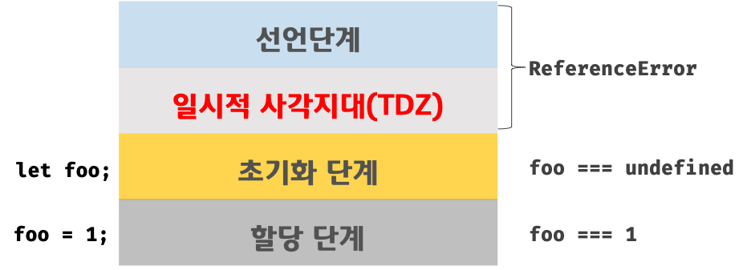

# 1. var 키워드의 특징과 한계

## 1-1. 변수 중복 선언이 가능하다.

var로 선언한 변수는 같은 스코프 내에서 중복 선언이 가능하다.

선언만 중복되면 무시되는데 초기화까지 하면 기존의 값이 덮어씌워진다.

```jsx
var x = 1
var x = 100

console.log(x) // 100
```

이런 특징은 의도치 않은 값 변경을 유발할 수 있다.

## 1-2. 함수 레벨 스코프만 지원한다.

var은 only only only only 함수 스코프만 지원한다.

일반 블록문 (if, for, while 등)에서는 지역 스코프를 생성하지 않는다.

```jsx
var x = 1;

if (true) {
	var  = 10;
}

console.log(x); // 10
```

블록 내에서 선언해도, 함수 밖이면 전역 변수처럼 동작한다!

## 1-3. 변수 호이스팅 발생

var로 선언한 변수는 선언이 끌어올려져서(undefined로 초기화) 선언 이전에도 접근이 가능하다.

```jsx
console.log(x) // undefined
var x = 3
```

# 2. let, const 배경 등장은

ES6(ECMAScript 2015)에서 등장해서 var의 문제점을 보완하고, 보다 명확한 변수 스코프와 선언 방식을 제공한다.

> 😓 **ECMAScript가 뭐야**
>
> 자바스크립트의 **표준 명세**이다.
> 자바스크립트, JScript, ActionScript 등은 이 ECMAScript 명세를 기반으로 구현된 **스크립트 언어의 구현체**이다.
>
> ECMA 국제 표준 기구(ECMA International)에서 관리하며, 표준 문서 이름은 **ECMA-262**이다.

| 키워드 | 스코프      | 중복 선언 | 재할당 | TDZ                                         |
| ------ | ----------- | --------- | ------ | ------------------------------------------- |
| var    | 함수 스코프 | 허용      | 허용   | 미존재 (선언과 동시에 undefined 할당되므로) |
| let    | 블록 스코프 | 비허용    | 허용   | 존재                                        |
| const  | 블록 스코프 | 비허용    | 비허용 | 존재                                        |

# 3. let 키워드

블록 레벨 스코프를 지원한다.

```jsx
let x = 1

if (true) {
  let x = 2
  console.log(x) // 2
}

console.log(x) // 1
```

위 코드에서 전역 변수 x와 if문 내부의 지역 변수 x는 별개의 변수이다.

블록 스코프 덕분에 지역 변수 개념이 명확해지고, 코드의 안정성이 높아진다.

## 3-2. 변수 중복 선언을 허용하지 않는다.

같은 스코프 내에서 동일한 이름으로 중복 선언하면 에러가 발생한다.

```jsx
let y = 1
let y = 2 // SyntaxError 발생
```

## 3-3. **TDZ 존재**

```jsx
console.log(a) // ReferenceError
let a = 3
```

위 코드에서 a는 선언은 되었지만, 초기화되지 않았기 때문에

console.log 시점에는 a는 TDZ에 있으므로 참조 오류가 발생한다.

> 😓 **TDZ?**
>
> Temporal Dead Zone으로, 호이스팅되고 초기화되기 전까지 변수에 접근이 불가능한 구역이당



# **4. const 키워드**

**선언시 반드시 초기화해줘야 한다.**

```jsx
const a; // SyntaxError
```

**재할당이 불가능하다.**

```jsx
const a = 10
a = 20 // TypeError
```

**객체나 배열은 내부 변경이 가능하다.**

```jsx
const me = { status: '크아아아아아아아악' }
me.status = '야호'
```

→ const는 참조 값 자체를 고정하는 거고, 그 내부의 내용까지 고정하는 거슨 아니다~~~

**블록 레벨 스코프와 TDZ 적용**

```jsx
if (true) {
  const x = 1
}
console.log(x) // ReferenceError
```

→ let과 동일하게 블록 스코프를 따르고, TDZ 구간이 존재한다.
