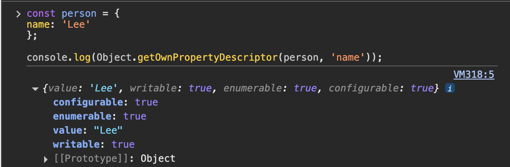

# 1. 내부 슬롯과 내부 메서드

내부 슬롯(internal slot), 내부 메서드(internal method)는 JS 엔진 구현을 설명하기 위해 ECMAScript 사양에서 사용하는 의사 프로퍼티(pseudo property)와 의사 메서드(pseudo method)이다.

> 😓 프로퍼티 먼저 정리하고 넘어가기
>
> > JS에서의 객체는 ”키-값 쌍”의 집합이다.
> >
> > 그러므로 프로퍼티는 그 “**키-값 쌍**”을 의미하며,
> >
> > **객체의 속성**이라고도 한다.
> >
> > ```jsx
> > const user = {
> >   name: '나', // 프로퍼티
> >   age: 9999, // key: "age", value: 900
> > }
> > ```

> 😓 **의사 프로퍼티(pseudo property)와 의사 메서드(pseudo method)가 뭐야/?**
>
> > 실제로 프로퍼티, 메서드가 아니지만 그렇게 보이는 속성을 뜻한다.
> >
> > 내부적으로는 getter/setter나 이벤트 바인딩 같은 특수한 처리가 숨겨져 있다.
> >
> > ECMAScript 사양에 ‘`([[…]])`’로 되어있다.
> >
> > JS가 접근할 수도 있고 접근하지 못할 수도 있다.
> >
> > → 자바스크립트 내부 동작의 설명을 위해 정의해 놓은 가상 메소드

# 2. 프로퍼티 어트리뷰트와 프로퍼티 디스크립터 객체

JS 엔진은 프로퍼티를 생성할 때, 프로퍼티의 상태를 나타내는 프로퍼티 어트리뷰트를 기본값으로 자동 정의한다.

프로퍼티 상태는 값, 값의 갱신 가능 여부, 열거 가능 여부, 재정의 가능 여부를 포함한다.

프로퍼티 어트리뷰트는 내부 동작을 정의하는 숨겨진 **값**이다.

아래와 같은 어트리뷰트들이 존재한다.

| 이름             | 의미                                   |
| ---------------- | -------------------------------------- |
| [[Value]]        | 프로퍼티에 실제 저장된 값              |
| [[Writable]]     | 값 수정 가능 여부                      |
| [[Enumerable]]   | Object.keys 등에 열거될지 여부         |
| [[Configurable]] | 프로퍼티 삭제/어트리뷰트 수정 가능여부 |

어트리뷰트에는 직접 접근할 수 없고 `Object.getOwnPropertyDescriptor` 메서드로 간접적으로 확인할 수 있다.

얘는 그냥 어트리뷰트 정보를 볼 수 있게 도와주는 **객체**임



`Object.getOwnPropertyDescriptor` 의 첫 번째 매개변수는 객체의 참조,

두 번째 매개변수는 프로퍼티 키이다.

이때 해당 메서드는 **프로퍼티 디스크립터(PropertyDescriptor)** 객체를 반환한다.

존재하지 않거나, 상속받은 프로퍼티에 대한 디스크립터를 요구하면 `undefined`를 뱉는다.

> 😓 **상속받은 프로퍼티라는 게 무슨 말이야?**
>
> > JS 객체는 프로토타입 체인 구조를 가진다.
> >
> > ```jsx
> > const animal = {
> >   eats: true,
> > }
> >
> > const rabbit = Object.create(animal)
> > rabbit.jumps = true
> >
> > console.log(rabbit.eats) // true
> > console.log(rabbit.jumps) // true
> > ```

원래 `Object.getOwnPropertyDescriptor` 는 하나의 프로퍼티에 대한 디스크립터만 뱉는데,
ES8부터 `Object.getOwnPropertyDescriptors` 에서는 모든 어트리뷰터 정보를 제공하는 디스크립터 객체들을 반환한다.


# 3. 데이터 프로퍼티와 접근자 프로퍼티

**데이터 프로퍼티(data property)**는 키와 값으로 구성된 일반적인 프로퍼티,

```jsx
const user = {
  name: 'Ha..................',
}
```

위의 `user.name`은 아래의 어트리뷰트들이 있다.

| 이름             | 의미                   |
| ---------------- | ---------------------- |
| [[Value]]        | “Ha..................” |
| [[Writable]]     | true                   |
| [[Enumerable]]   | true                   |
| [[Configurable]] | true                   |

**접근자 프로퍼티(accessor property)**는 자체적으로는 값을 갖지 않고! 다른 프로퍼티 값을 읽거나 저장할 때 호출되는 접근자 함수로 구성된 프로퍼티이다.

→ 머라는 거임..

→ **값에 접근할 때 도와주는 프로퍼티, 자체적으로 값 저장 X**

```jsx
const user = {
  firstName: '청송',
  lastName: '사과박수',

  // getter
  get fullName() {
    return `${this.firstName} ${this.lastName}`
  },

  // setter
  set fullName(value) {
    ;[this.firstName, this.lastName] = value.split(' ')
  },
}

console.log(user.fullName) // getter: "청송 사과박수"

user.fullName = '의성 마늘쫑' // setter 실행
console.log(user.firstName) // "의성"
console.log(user.lastName) // "마늘쫑"
```

위 user 객체의 프로퍼티별 어트리뷰트는 아래와 같다.

| 프로퍼티       | [[Value]]  | [[Get]]           | [[Set]]           | [[Writable]] | [[Enumerable]] | [[Configurable]] |
| -------------- | ---------- | ----------------- | ----------------- | ------------ | -------------- | ---------------- |
| firstName (DP) | “청송”     | -                 | -                 | true         | true           | true             |
| lastName (DP)  | “사과박수” | -                 | -                 | true         | true           | true             |
| fllName (AP)   | -          | get fullName() {} | set fullName() {} | -            | true           | true             |

> 😓 아아아악!!! 프로퍼티 어트리뷰트랑 내부 슬롯의 차이가 뭔데,..
>
> > | 구분      | 어트리뷰트                | 슬롯                  |
> > | --------- | ------------------------- | --------------------- |
> > | 적용 대상 | 객체 각각의 프로퍼티      | 객체 자체 (전체)      |
> > | 역할      | 프로퍼티 동작과 속성 제어 | 객체의 내부 상태 저장 |
> > |           |
> >
> > ```jsx
> > const obj = { name: 'Lee' }
> > ```
> >
> > - name 프로퍼티의 어트리뷰트
> >
> >   1.  [[Value]]: “Lee”
> >   2.  [[Writable]]: true
> >   3.  [[Enumerable]]: true
> >   4.  [[Configurable]]: true
> >
> > - obj **자체의 내부 슬롯**
> >
> > 1. [[Prototype]]: Object.prototype
> > 2. [[Extensible]]: true

이제 귀찮으니까

프로퍼티 어트리뷰트 → PA 라고 하겠다……

# 4. 프로퍼티 정의

프로퍼티 정의는 새로운 프로퍼티를 추가하면서 프로퍼티 어트리뷰트를 명시적으로 정의하거나, 기존 프로퍼티의 어트리뷰트를 재정의하는 것이다.

`Object.defineProperty` 메서드로 PA를 재정의할 수 있다.

```jsx
// 1. 기본 객체 생성
const user = {}

// 2. Object.defineProperty로 name 프로퍼티 정의
Object.defineProperty(user, 'name', {
  value: '하...', // [[Value]]: "하..."
  writable: false, // [[Writable]]: false (값 변경 불가)
  enumerable: true, // [[Enumerable]]: true (열거 가능)
  configurable: true, // [[Configurable]]: true (삭제/재정의 가능)
})

console.log(user.name) // "하..."

// 3. writable이 false이므로 값 변경 시도 → 실패 (무시)
user.name = '밥이나 먹어'
console.log(user.name) // "하..."

// 4. configurable이 true이므로 프로퍼티 삭제 가능
delete user.name
console.log(user.name) // undefined

// 5. 다시 name 프로퍼티를 재정의
Object.defineProperty(user, 'name', {
  value: '입 닫고 빵이나 먹어',
  writable: true, // 값 변경 가능으로 설정
  enumerable: false, // 열거 불가능으로 설정
  configurable: false, // 재정의/삭제 불가능으로 설정
})

console.log(user.name) // "입 닫고 빵이나 먹어"

// 6. name을 다시 enumerable false로 만든 결과 확인
console.log(Object.keys(user)) // [] (name이 열거되지 않음)

// 7. writable true니까 값 변경은 가능
user.name = '싫어'
console.log(user.name) // "싫어"

// 8. configurable false이므로 프로퍼티 삭제나 재정의는 불가능
delete user.name // 실패 (strict 모드에서는 에러)
console.log(user.name) // "싫어"
```


실제로도 잘 나오는 모오습

# 5. 객체 변경 방지

객체는 변경 가능한 값이므로 재할당 없이 직접 변경할 수 있다.

이것에 대해서 JS는 다양한 메서드를 제공하지만, 각자 변경을 금지하는 강도가 다르다!


### Object.preventExtensions

**객체 확장 금지**는

프로퍼티 추가를 금지한다는 의미이다.

프로퍼티 추가는 동적 추가 or `Object.defineProperty`가 있다.

확장이 가능한지는 `Object.isExtensible`로 확인 가능하다.

### Object.seal

**객체 밀봉**은

객체가 읽기와 쓰기만 가능하다.

밀봉된지는 `Object.isSealed`로 확인 가능하다.

### Object.freeze

**객체 동결**은

객체가 읽기만 가능하다.

동결된지는 `Object.freeze`로 확인 가능하다.

근데 위의 3개는 모두 **얕은 변경 방지(shallow only)**여서 중첩 객체까지는 영향을 주지 못한다!

객체의 중첩 객체까지 동결**해서 불변 객체**를 만드려면 모든 프로퍼티에 대해 재귀적으로 Object.freeze 메서드를 호출해줘야 한다.
