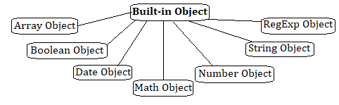

> 함수를 사용해서 객체를 생성해보자!

# 1. Object 생성자 함수

```jsx
const person = new Object()

person.name = '크아아아아아아아악'
person.sayHello = function () {
  console.log('안녕 나는 ' + this.name)
}

console.log(person) // {name: "크아아아아아아아악", sayHello: f}
person.sayHello() // 안녕 나는 크아아아아아아아악
```

**생성자 함수(constructor)** 는 new 연산자와 함께 호출해서 객체를 생성하는 함수이다.

생성자 함수로 만들어진 객체는 **인스턴스(instance)** 라고 한다.

이외에도 다양한 빌트인 생성자 함수가 있다…



# 2. 생성자 함수

객체 리터럴로 객체를 만들면 직관적이고 간편하긴 한데

매번 하나씩만 만들 수 있어서 반복 작업이 발생할 수 있다. 😱

아래 예시에서는 메서드는 같은데 radius가 달라서 코드 반복이 발생하고 있다.

```jsx
const circle1 = {
  radius: 5,
  getDiameter() {
    return 2 * this.radius
  },
}

console.log(circle1.getDiameter()) // 10

const circle2 = {
  radius: 10,
  getDiameter() {
    return 2 * this.radius
  },
}

console.log(circle2.getDiameter()) // 20
```


## 그래서 생성자 함수로 객체를 생성하면 이런 장점이 있따

템플릿처럼 생성자 함수를 만들고 프로퍼티 구조가 동일한 객체 여러 개를 쉽게 만들 수 있다.

```jsx
function Circle(radius) {
  this.radius = radius
  this.getDiameter = function () {
    return 2 * this.radius
  }
}

const circle1 = new Circle(5)
const circle2 = new Circle(10)

console.log(circle1.getDiameter()) // 10
console.log(circle2.getDiameter()) // 20
```


> 😓
>
> 생성자 함수는 반드시 앞에 `new` 연산자와 함께 호출해야 한다!
> 그러지 않으면 일반 함수로 동작함 ㄱ-…

### 그럼 생성자 함수는 인스턴스를 어떻게 생성하냠?

생성자 함수는 아래의 업무를 담당한다.

1. 인스턴스 생성 (필수)

   암묵적으로 빈 객체가 생성되며, 해당 인스턴스(암묵적으로 어쩌구 객체)는 this에 바인딩 된다.

   생성자 내부 this가 생성자 함수를 가르키는 이유!!!! 오홍홍홍ㅎ로홀홀홀홀!!!

   런타임 이전에 실행된다.

2. 인스턴스 초기화 (옵션)
3. 생성자 함수 내부의 모든 처리가 끝나면 this가 암묵적으로 반환쓰~!~~

   

   근데 이때 return 문에 명시적으로 반환하면 this가 무시된다;

   

### 내부 메서드 [[Call]], [[Construct]]

함수는 객체이므로, 일반 객체와 동일하게 내부 슬롯과 내부 메서드를 가진다.

그런데 일반 객체와는 다르다;;

일반 객체는 호출할 수 없지만, 함수는 호출할 수 있다!!

함수 객체는 함수로서 동작하기 위해 아래 것들을 추가로 가지고 있다.

함수 객체만을 위한 내부 슬롯

- [[Environment]]
- [[FormalParameters]]

함수 객체만을 위한 내부 메서드

- [[Call]] → 함수가 일반 함수로 호출될 때 호출!
  - 해당 메서드를 가지면 `callable`
- [[Construct]] → 함수가 new 연산자와 함께 호출될 때 호출!
  - 해당 메서드를 가지면 `constructor`
  - 안 가지면 `non-constructor`

함수 객체는 `constructor`일 수도 있고 `non-constructor`일 수도 있다..


### constructor랑 non-constructor 구분 어케 하는데…


함수 정의 방식에 따라 구분한다!

- constructor: 함수 선언문, 함수 표현식, 클래스
- non-constructor: 메서드, 화살표 함수

⚠️ ECMAScript 사양에서 메서드로 인정하는 범위는 매우 좁다…

```jsx
// 1. constructor 함수들

// 1) 함수 선언문
function Foo() {
  this.x = 1
}
const fooInstance = new Foo()
console.log(fooInstance.x) // 1

// 2) 함수 표현식
const Bar = function () {
  this.y = 2
}
const barInstance = new Bar()
console.log(barInstance.y) // 2

// 3) 클래스
class Baz {
  constructor() {
    this.z = 3
  }
}
const bazInstance = new Baz()
console.log(bazInstance.z) // 3

console.log('-----')

// 2. non-constructor 함수들

// 4) 메서드 (객체 리터럴의 메서드 축약 문법)
const obj = {
  greet() {
    console.log('Hello!')
  },
}
obj.greet() // "Hello!"
// new obj.greet(); // TypeError: obj.greet is not a constructor

// 5) 화살표 함수
const arrowFunc = () => {
  console.log('I am an arrow function!')
}
arrowFunc() // "I am an arrow function!"
// new arrowFunc(); // TypeError: arrowFunc is not a constructor
```


축약 문법


화살표 함수

# 3. new 연산자

new 연산자와 함께 호출되는 함수는 생성자 함수로 동작하므로

`[[Constructor]]` 가 호출되므로

constructor이다!

```jsx
function checkNewTarget() {
  console.log('new.target:', new.target)
}

console.log('new 없이 호출')
checkNewTarget() // new.target: undefined

console.log('-----')

console.log('new와 함께 호출')
new checkNewTarget() // new.target: [Function: checkNewTarget]
```


# 4. new.target

생성자 함수가 new 연산자 없이 호출되는 것을 방지하기 위해

ES6에서 `new.target`을 지원한다.

요고는 constructor 내부에서 암묵적인 지역 변수처럼 사용된다 (메타 프로퍼티라고도 불림)

new 연산자랑 호출된 함수 내부에서 new.target은 자기 자신을 가르킨다.

new 연산자랑 호출되지 않으면 `undefined`를 뱉는다.

```jsx
function Circle(radius) {
  if (!new.target) {
    return new Circle(radius)
  }

  this.radius = radius
  this.getDiameter = function () {
    return 2 * this.radius
  }
}

const circle = Circle(5)
console.log(circle.getDiameter())
```


근데 얘가 최신 ES6 문법에서 지원하고

IE에서는 지원하지 않아서

스코프 세이프 생성자 패턴으로 대신할 수도 있다!

### 스코프 세이프 생성자 패턴이 먼디.

동작 방식은 new.target이랑 똑같다.

```jsx
function Circle(radius) {
  // this가 Circle의 인스턴스인지 확인!
  if (!(this instanceof Circle)) {
    // new가 없으면, 다시 new로 호출!
    return new Circle(radius)
  }

  // 인스턴스 초기화
  this.radius = radius
  this.getDiameter = function () {
    return 2 * this.radius
  }
}

// new 없이 호출해도 안전!
const circle = Circle(5)
console.log(circle.getDiameter()) // 10
```


`this instanceof`로 확인해주면 된다!!
