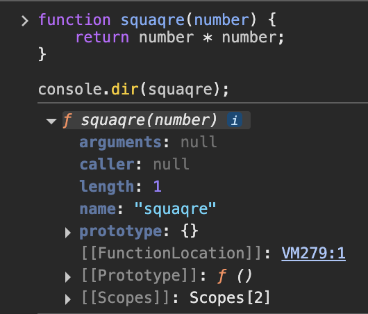

# 1. 일급 객체

일급 객체의 조건

1. 무명의 리러털로 생성할 수 있다. (런타임 생성 가능)
2. 변수나 자료구조에 저장할 수 있다.
3. 함수의 매개변수에 전달할 수 있다.
4. 함수의 반환값으로 사용할 수 있다.

따라서 JS의 함수는 일급 객체이다.

> 😓 “함수가 일급 객체라는 것은 함수와 객체를 동일하게 쓸 수 있다는 것이다.”
>
> > ⇒ 값처럼 취급할 수 있다.
> >
> > 함수 리터럴은 코드를 실행하는 시점에 함수 객체로 평가된다.
> >
> > 따라서 정의되는 순간 실제 객체가 된다.

그런데! 함수는 일반 객체와 차이점이 있다.

일반 객체는 호출을 못 하지만, 함수는 호출이 가능하다.

또 함수는 함수 고유의 프로퍼티를 소유한다.

# 2. 함수 객체의 프로퍼티

```jsx
function squaqre(number) {
  return number * number
}

console.dir(squaqre)
```



```jsx
function square(number) {
  return number * number
}

console.log(Object.getOwnPropertyDescriptors(square))

// 접근자 프로퍼티 이므로 undefined가 출력될 것
console.log(Object.getOwnPropertyDescriptor(square, '__proto__'))

// __proto__는 함수 객체의 고유한 프로퍼티가 아니라, Object.prototype 객체의 프로퍼티를 상속받는 것임
console.log(Object.getOwnPropertyDescriptor(Object.prototype, '__proto__'))
```


> 😓 `__proto__` 가 뭐지??
>
> > 모든 객체가 가지고 있는 숨겨진 링크 같은 속성이다.
> > 객체 간의 상속 경로를 연결하는 역할을 한다!
> >
> > 그래서 위의 예시에서도 square의 디스크립터로는 안 나오지만, Ojbect.prototype 객체의 `__proto__`를 상속받았다고 하는 것임!

> 😓 그럼 `Object.prototype`은 뭐야
>
> JS 객체의 최상위 프로토타입 객체로,
>
> 모든 객체는 직접적 or 간접적으로 이 객체를 상속 받는다.

## 2-1. arguments 프로퍼티

함수 객체의 arguments 프로퍼티 값은 arguments 객체이다.

arguments 객체는 함수 호출 시 전달된 인수(argument)들의 정보를 담고 있는 순회 가능한(iterable) 유사 배열 객체이고 ,

함수 내부에서 지역 변수로 사용된다.

예시로 아래 코드에서

`showArguments` 라는 함수 객체에 `arguments` 라는 프로퍼티가 있고,

함수가 호출될 때 `arguments 객체`가 만들어져서 프로퍼티에 연결이 된다!

```jsx
function showArguments(a, b) {
  console.log(arguments)
}

showArguments(1, 2, 3)
```

예시에서 arguments 객체는

함수로 전달된 인수를 저장하게 된다.

순회 가능하다는 건

실제 배열이 아니지만, 배열처럼 인덱스로 접근할 수 있다는 뜻이다.

```jsx
function showArguments(a, b) {
  console.log(arguments[0]) // 1번째 인수
  console.log(arguments[1]) // 2번째 인수
  console.log(arguments[2]) // 3번째 인수
}

showArguments(1, 2, 3)
```

지금은 `arguments` 프로퍼티가 지원되고 있지만, ES3부터 표준에서 폐지되었으므로 함수 내부에서 지역 변수처럼 사용하는 방식으로 쓰인다고 한다.

> > 😓 근데 매개변수 개수 ≠ 인수 개수 인데 왜 동작하느냐???
> >
> > JS는 함수의 매개변수와 인수의 개수가 일치하지 않아도 괜찮다~~
> >
> > 대신 넘친 인수는 arguments 객체에 저장되고 접근 가능하지만, 함수 본문에서는 무시됨!
> >
> > ```jsx
> > function showArguments(a, b) {
> >   console.log('a:', a)
> >   console.log('b:', b)
> >   console.log('arguments:', arguments)
> > }
> >
> > // ✅ 인수가 없을 때
> > console.log('=== 인수가 없을 때 ===')
> > showArguments()
> >
> > console.log('=== 인수가 하나일 때 ===')
> > showArguments(1)
> >
> > console.log('=== 인수가 정확히 2개일 때 ===')
> > showArguments(1, 2)
> >
> > console.log('=== 인수가 넘칠 때 ===')
> > showArguments(1, 2, 3, 4)
> > ```
> >
> > 1.  인수 없을 때
> >
> >     
> >
> > 2.  인수 하나
> >
> >     
> >
> > 3.  매개변수 개수 == 인수 개수
> >
> >     
> >
> > 4.  인수 넘침
> >
> >     

위 특징 때문에 함수가 호출되면 인수 개수를 확인하고 함수 동작을 달리하는 방법이 필요하고, 이때 arguments 객체가 쓰인다!

> 😓 **가변 인자 함수**
>
> 매개변수 개수를 확정할 수 없는 함수!

`arguments` 는 유사 배열 객체이므로 length 프로퍼티를 통해 for문으로 순회할 수 있다.

```jsx
function sum() {
  let res = 0

  // arguments 객체는 length 프로퍼티가 있는 유사 배열 객체이므로 for문으로 순회할 수 있다
  for (let i = 0; i < arguments.length; i++) {
    res += arguments[i]
  }

  return res
}

console.log(sum()) // 0 (인수가 없으면 0 반환)
console.log(sum(1, 2)) // 3 (1 + 2)
console.log(sum(1, 2, 3)) // 6 (1 + 2 + 3)
```


근데 진짜 배열이 아니기 때문에 `map`, `forEacth` 같은 배열 메서드를 직접 쓸 수는 없다.


그래서 배열의 메서드를 직접 쓰는 게 아니라 간접적으로 호출해서 써야 한다

`call`이나 `apply`로 this를 유사 배열 객체로 바꿔서 대신 실행시키는 방법이다.


> 😓 “`call`이나 `apply`로 this를 유사 배열 객체로 바꿔서 대신 실행시키는 방법이다.” 가 무슨 말이야아아아악으아악
>
> 배열의 메서드는 Array.prototype에 정의되어 있다.
>
> 그래서 call이나 apply를 쓰면 배열의 메서드를 다른 객체(this)에서 대신 실행할 수 있다.!

## 2-2. caller 프로퍼티

_ECMAScript 사양에 포함되지 않은 비표준 프로퍼티이고, 이후로도 표준화 계획이 없는 프로퍼티이다._

함수 자신을 호출한 함수를 가르킨다!

```jsx
function foo(func) {
  return func()
}

function bar() {
  // bar.caller는 bar를 호출한 함수(즉, 호출 스택의 바로 위 함수)를 참조
  return 'caller: ' + bar.caller
}

// foo 함수가 bar를 호출했기 때문에 foo가 caller로 나옴
console.log(foo(bar)) // caller: function foo(func) { return func(); }

// bar를 직접 호출했기 때문에 caller가 없음(null)
console.log(bar()) // caller: null
```


## 2-3. length 프로퍼티

함수를 정의할 때 선언한 매개변수의 개수르 가르킨다.

`arguments` 객체의 length 프로퍼티와 함수 객체의 length 프로퍼티 값을 다를 수 있다!

## 2-4. name 프로퍼티

함수 이름을 나타낸다.

ES5에서는 비표준이었어서 빈 문자열을 갖고,

ES6부터 정상 작동한다.

## 2-5. `__proto__` 접근자 프로퍼티

모든 객체는 [[Prototype]]이라는 내부 슬롯을 갖는다.

`__proto__` 프로퍼티는 위 내부 슬롯에 접근하기 위한 프로퍼티이다.

## 2-6. prototype 프로퍼티

constructor만이 소유하는 프로퍼티로, non-constructor에는 없다.

호출될 때 생성자 함수가 생성할 인스턴스의 프로토타입 객체를 가르킨다.
