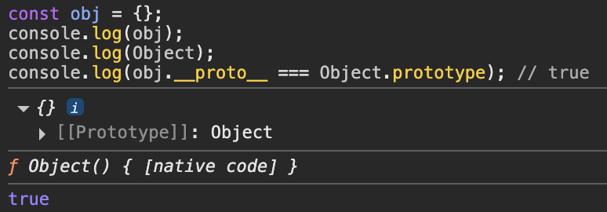
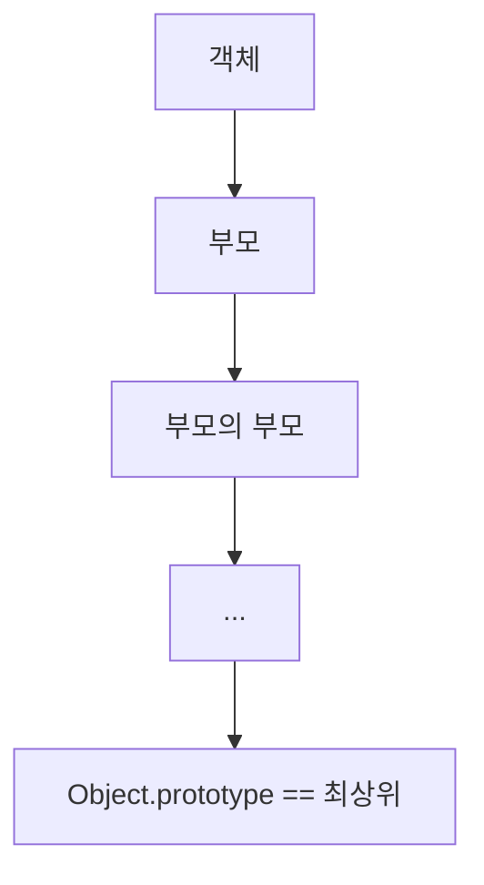
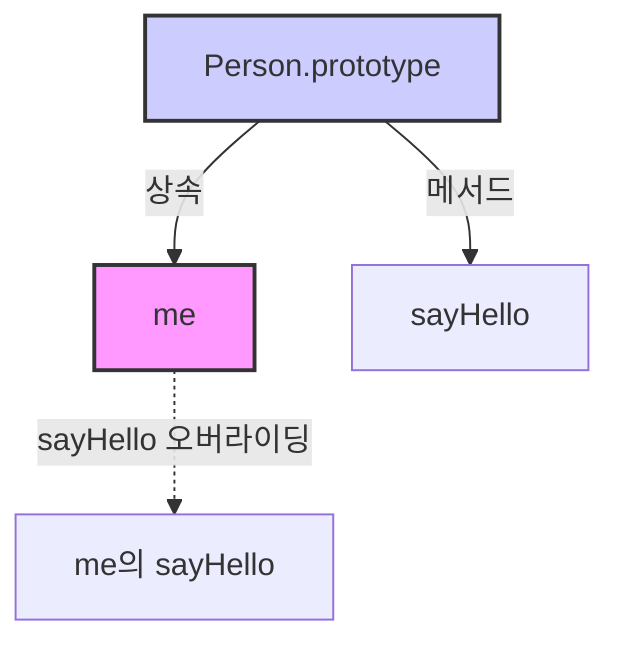

JS는 명령형, 함수형, 프로토타입 기반 객체지향 프로그래밍을 지원하는 멀티 패러다임 프로그래밍 언어이다.

JS는객체 기반 프로그래밍 언어이므로 JS를 이루는 거의 모든 것이 객체이다.

# 1. 객체 지향 프로그래밍 (OOP)

객체 지향 프로그래밍은 전통적인 명령형/절차지향 프로그래밍과 달리

프로그램을 **독립적인 객체들의 집합**으로 표현하려는 프로그래밍 패러다임이다.

OOP에서 모들 실체는 속성(attibute/property)를 갖고, 이를 통해서 다른 실체와 구별된다.

ex) 사람 → 이름, 주소, 성별, 나이 등

각 실체들 중 필요한 속성만 간추려 표현하는 것을 **추상화** 라고 한다.

```jsx
// 이름과 주소 속성을 갖는 객체
const person = {
  name: 'Lee',
  address: 'Seoul',
}
console.log(person) // { name: "Lee", address: "Seoul" }
```

OOP에서 객체는 상태 데이터와 동작의 논리적 단위로 본다.

아래 코드에서 `radius`가 상태 데이터,

`getDiameter`, `getPerimeter`, `getArea` 는 상태 데이터를 조작하는 동작이다.

```jsx
const circle = {
  radius: 5, // 상태 데이터 (속성)

  // 동작 (메서드)
  getDiameter() {
    return 2 * this.radius
  },
  getPerimeter() {
    return 2 * Math.PI * this.radius
  },
  getArea() {
    return Math.PI * this.radius ** 2
  },
}

console.log(circle.getDiameter()) // 10
console.log(circle.getPerimeter()) // 31.4159...
console.log(circle.getArea()) // 78.5398...
```

그래서 객체는 상태 데이터 + 상태 데이터를 조작하는 동작을 논리적 단위로 묶은 자료구조이고

다른 객체와 관계를 맺거나, 다른 객체의 상태/동작을 상속받아 쓸 수도 있다.

# 2. 상속과 프로토타입

상속은 어떤 객체의 프로퍼티나 메서드를 다른 객체가 그대로 사용할 수 있게 하는 것이고,

JS는 프로토타입을 기반으로 상속을 구현한다.

상속은 불필요한 중복을 제거하고, 코드를 재사용하므로서 개발 비용을 절감할 수 있는 장점이 있다!

아래 코드를 보쟈

각 인스턴스마다 동일한 `getArea` 메서드가 중복해서 생성된다.

이는 곧 메모리 낭비, 성능 저하로 이어진다.

```jsx
function Circle(radius) {
  this.radius = radius
  this.getArea = function () {
    return Math.PI * this.radius ** 2
  }
}

const circle1 = new Circle(1)
const circle2 = new Circle(2)

console.log(circle1.getArea === circle2.getArea) // false
```

그래서 아래 코드처럼 상속을 이용하자

`getArea`는 `Circle.prototype`에 단 하나만 만들고

모든 인스턴스는 이 메서드를 상속받아서 쓸 수 있다!

```jsx
function Circle(radius) {
  this.radius = radius
}

// 프로토타입에 메서드를 추가 (공유)
Circle.prototype.getArea = function () {
  return Math.PI * this.radius ** 2
}

const circle1 = new Circle(1)
const circle2 = new Circle(2)

console.log(circle1.getArea === circle2.getArea) // true
console.log(circle1.getArea()) // 3.1415...
console.log(circle2.getArea()) // 12.566...
```

# 3. 프로토타입 객체

**프로토타입(Prototype)** 은 OOP에서 상속을 구현하기 위해 사용되는 객체이고,

**다른 객체의 상위(부모) 역할**을 한다.

👉🏻 **프로토타입 ========= 부모!!!**

프로토타입은 자신의 프로퍼티를 하위 객체(자식)가 자유롭게 사용할 수 있도록 제공해준다.

프로토타입은 객체가 생성될 때 생성 방식에 따라 결정된다.

| 객체 생성 방식     | 연결되는 프로토타입                 |
| ------------------ | ----------------------------------- |
| 객체 리터럴로 생성 | Object.prototype                    |
| 생성자 함수로 생성 | 생성자 함수의 prototype 프로퍼티 값 |

> 😓 객체 리터럴 생성 방식 vs 생성자 함수 생성 방식
>
> > 1. 객체 리터럴
> >
> >    ```jsx
> >    const obj = {}
> >    console.log(obj)
> >    console.log(Object)
> >    console.log(obj.__proto__ === Object.prototype) // true
> >    ```
> >
> >    
> >
> >    👉🏻 `Object.prototype`을 자동으로 상속받음
> >
> > 2. 생성자 함수
> >
> >    ```jsx
> >    function Circle(radius) {
> >      this.radius = radius
> >    }
> >    const c = new Circle(1)
> >
> >    console.log(c)
> >    console.log(Circle)
> >    console.log(c.__proto__ === Circle.prototype) // true
> >    ```
> >
> >    
> >
> >    👉🏻 `new Circle()`로 만든 객체는 `Circle`의 `prototype`을 자동으로 상속받음

모든 객체는 `[[Prototype]]` 이라는 내부 슬롯을 가지고

이 슬롯은 객체의 프로토타입을 참조한다.

👉🏻 **객체가 자신의 부모(프로토타입)을 참조하는 연결고리**

모든 객체는 하나의 프로토타입을 가지고

모든 프로토타입은 생성자 함수와 연결되어 있다.

`[[Prototype]]` 내부 슬롯에는 직접 접근할 수 없지만, `__proto__` 접근자 프로퍼티를 통해 자신의 `[[Prototype]]` 이 가르키는 프로토타입에 간접적으로 접근할 수 있다.


> 😓 위 그림에서 `생성자 함수`랑 `생성자 함수.prototype`의 차이가 뭘까??
>
> > 1.  생성자 함수는
> >
> >     그냥 함수 객체이고, 새로운 객체를 만들기 위한 함수인 것이고
> >
> >     ```jsx
> >     function Circle() {}
> >     ```
> >
> > 1.  생성자 함수.prototype은
> >
> >     이 함수가 만든 객체들의 부모(프로토타입)역할을 하는 프로퍼티인 것이다.
> >
> >     ```jsx
> >     function Circle() {}
> >     console.log(Circle.prototype) // 객체! (프로토타입 역할)
> >     ```
> >
> > 정리하면!
> >
> > ```
> > 생성자 함수 (Circle)
> >  ├─ prototype 프로퍼티
> >  │      └─ Circle.prototype 객체
> >  │            ├─ 공유 메서드 (getArea 등)
> >  │            └─ constructor 프로퍼티 (자기 자신 Circle을 가리킴)
> >  └─ (생성자로서 new와 함께 호출되면) → 새 객체 생성
> > ```

## 3-1. `__proto__` 접근자 프로퍼티

모든 객체는 `__proto__`라는 **접근자 프로퍼티**를 가지고 있다.

이 프로퍼티를 통해 객체의 프로토타입에 간접적으로 접근할 수 있는 것이다~~

> 😓 **접근자 프로퍼티 복습**
>
> 1. getter/setter 함수를 통해 동작하고
> 2. 자체적으로 값을 갖지 않고
> 3. 다른 프로퍼티의 값을 읽거나 쓰는 함수를 제공하는 프로퍼티!

`__proto__` 의 동작을 예시 코드를 통해 살펴뵤면

```jsx
const obj = {}
const parent = { x: 1 }

// getter 함수 실행: 프로토타입을 읽어옴
console.log(obj.__proto__) // Object.prototype (기본 프로토타입)

// setter 함수 실행: 프로토타입을 교체
obj.__proto__ = parent

console.log(obj.__proto__) // 상속 잘 됐나 확인
console.log(obj.x) // 1 (parent의 프로퍼티를 상속받음)
```


위 코드는 원래는 `obj`가 `Object`를 프로토타입으로 가졌는데

`parent`로 프로토타입을 교체하게 되고,

`obj`에는 여전히 `x 프로퍼티`는 없지만 JS의 **프로토타입 체인** 덕분에

`obj`는 자신의 부모인 `parent`에서 `x`를 찾아보게 되고,

`parent`에는 `x가 있으므로` 1을 반환하게 된다.

[🔗 프로토타입 체인은 아래처럼 이루어져 있다.](https://www.notion.so/19-20c10e12f8ca8041b34fe02972c586ac?pvs=21)

프로퍼티를 찾을 땐 이 단방향 체인을 따라 탐색하게 된다.



이때 서로가 서로의 프로토타입이 되는 구조는 금지된다.

순환 참조가 발생하면, 프로토타입 체인이 무한 루프에 빠지게 되기 때문이다. (JS 엔진이 자동으로 막아주긴 함)

> 😓 `__proto__` 는 ES5까지는 비표준이었고 ES6부터 표준이 되었다고 한드아아악
>
> > 그래서 대신 쓸 수 있는 표준 메서드는 다음과 같다.
> >
> > | 작업            | 표준 메서드                         | 지원       |
> > | --------------- | ----------------------------------- | ---------- |
> > | 프로토타입 취득 | `Object.getPrototypeOf(obj)`        | ES5, IE9+  |
> > | 프로토타입 교체 | `Object.setPrototypeOf(obj, proto)` | ES6, IE11+ |

> 😓 **모든 객체가 Object.prototype을 상속받는 건 아니다.**
>
> > `Object.create(null)`로 만든 객체는 `__proto__` 가 없다.
> >
> > ```jsx
> > const obj = Object.create(null)
> > console.log(obj.__proto__) // undefined
> > ```
> >
> > 

## 3-2. 함수 객체의 prototype 프로퍼티

함수 객체만 소유하는 프로퍼티이다.

```jsx
;(function () {}).hasOwnProperty('prototype') // true
;({}).hasOwnProperty('prototype') // false (일반 객체에는 없음)
```


`non-constructor(화살표 함수, ES6 메서드 축약 표현)`는 `prototype`이 없다.

- **화살표 함수 / 메서드 축약은 왜 new가 불가하지???**

  1. **화살표 함수**
     1. 내부적으로 `[[Construct]]`를 갖지 않고,
     2. this도 렉시컬(상위 스코프)로 고정돼 있기 때문
        1. 보통 함수는 호출될 때마다 this가 바뀌어서 새로운 this가 만들어지는데
        2. 화살표 함수는 아예 정의될 때 상위 스코프의 this로 고정된다.
  2. **축약 문법**

     1. JS에서 내부적으로 메서드 정의로 간주
     2. `[[Construct]]` 갖지 않음

     > 😓 **🔗 [`[[Construct]]`가 뭐더라……](https://www.notion.so/19-20c10e12f8ca8041b34fe02972c586ac?pvs=21)**

```jsx
const Person = (name) => {
  this.name = name
}
console.log(Person.hasOwnProperty('prototype')) // false
console.log(Person.prototype) // undefined

const obj = { foo() {} }
console.log(obj.foo.hasOwnProperty('prototype')) // false
console.log(obj.foo.prototype) // undefined
```


생성자 함수로 쓰지 않는다면 prototype은 아무 의미가 없다. 부모가 될 것이 아니기 때문!

> 😓 `__proto__` 랑 `prototype`이랑 헷갈리늗데….
>
> > 1.  `__proto__` 는
> >     1. 모든 객체가 소유하고
> >     2. 자신의 프로토타입을 참조하고
> >     3. 자신의 프로토타입에 접근하기 위함이다.
> > 2.  `prototype` 은
> >     1. 함수 객체만 소유하고
> >     2. 생성할 객체의 부모 데이터를 가지고 있고 (즉, 자신!)
> >     3. 자기가 만든 부모들의 객체들의 부모를 지정해주기 위함이다.
> >
> > ```jsx
> > function Person(name) {
> >   this.name = name
> > }
> > const me = new Person('Lee')
> >
> > console.log(Person.prototype === me.__proto__) // true
> > ```
> >
> > ```mermaid
> > graph TD
> >   subgraph 생성자_함수
> >     A[Person]
> >     A -- prototype --> B[프로토타입 객체]
> >   end
> >
> >   subgraph 프로토타입_객체
> >     B --> C[constructor: Person]
> >     B --> D[__proto__: Object.prototype]
> >   end
> >
> >   subgraph 인스턴스
> >     E[me ]
> >     E -- __proto__ --> B
> >   end
> > ```

### 3-3. 프로토타입의 constructor 프로퍼티와 생성자 함수

모든 프로토타입 객체는 `constructor 프로퍼티`를 갖는다.

이 `constructor`는 **자신을 가르키는 생성자 함수를 참조**하고,

생성자 함수가 만들어질 때 자동으로 연결이 생성된다.

> 😓 **이게 뭔소리야!@!!!!!!**
>
> > 프로토타입 객체는 **생성자 함수와 연결**되어 있고,
> >
> > 프로토타입 객체의 `constructor 프로퍼티`는 **‘나를 만든 함수’**을 기억하고 있음
> >
> > ```jsx
> > function Person(name) {
> >   this.name = name
> > }
> >
> > // 이때 Person.prototype.constructor는 누구?
> > console.log(Person.prototype.constructor === Person) // true
> > ```
> >
> > `Person.prototype`은 **프로토타입 객체**이다.
> >
> > `Person.prototype.constructor`는 **“나를 만든 생성자 함수는 Person이야!”**라고 가르키고 있음
> >
> > ```jsx
> > const me = new Person('Lee')
> > console.log(me.constructor === Person) // true
> > ```
> >
> > `me`는 `Person`을 통해 만들어졌고
> >
> > `me`는 자신의 부모인 Person.prototype에게 **“너를 만든 함수가 누구야?”**라고 물어보면
> >
> > `Person.prototype.constructor`가 `Person`을 가르키니까 `me.constructor`도 결국 `Person`이 되는 것임

# 4. 리터럴 표기법으로 생서된 객체의 생성자 함수와 프로토타입

`생성자 함수로 만든 인스턴스`는 `프로토타입의 constructor 프로퍼티`에 의해 **생성자 함수와 연결**된다.

그런데 리터럴 표기법으로 생성한 객체도 프로토타입을 갖는다!

```jsx
const obj = {} // 객체 리터럴
const add = function () {} // 함수 리터럴
const arr = [1, 2, 3] // 배열 리터럴
const regexp = /is/gi // 정규표현식 리터럴
```

👉🏻 `constructor`가 직접 new로 생성된 것은 아니다.

위 코드에서 `obj`는 리터럴로 생성되어서 `new Object()`는 아니지만

obj.constructor는 Object를 가르킨다.

왜냐묜~~ `객체 리터럴`이랑 `new Object()`는 내부적으로 [🔗 `OrdinaryObjectCreate`](https://www.notion.so/19-20c10e12f8ca8041b34fe02972c586ac?pvs=21) 를 사용하기 때문에

둘 다 Object.prototype을 부모로 삼는 빈 객체를 만든다.

```jsx
OrdinaryObjectCreate(%Object.prototype%)
```

함수 리터럴은 Function 생성자로 만든 함수가 아니다.

아래 코드에서 `foo`는 함수 선언문으로 만들어졌지,

`new Function()`으로 만들어지지 않았지만

`foo.constructor`는 **Function을 가르킨다.**

```jsx
function foo() {}
console.log(foo.constructor === Function) // true
```

리터럴 표기법으로 생성된 객체의 생성자와 프로토타입은 다음과 같다.

| **리터럴 표기법** | **생성자 함수** | **프로토타입 객체**  |
| ----------------- | --------------- | -------------------- |
| 객체 리터럴       | `Object`        | `Object.prototype`   |
| 함수 리터럴       | `Function`      | `Function.prototype` |
| 배열 리터럴       | `Array`         | `Array.prototype`    |
| 정규표현식 리터럴 | `RegExp`        | `RegExp.prototype`   |

```jsx
OrdinaryObjectCreate(%Function.prototype%)
OrdinaryObjectCreate(%Array.prototype%)
OrdinaryObjectCreate(%RegExp.prototype%)

```

리터럴로 만든 객체도 결국 “생성자 함수”로부터 상속된 프로토타입을 갖고 있어서 생성자 함수의 특징(상속, 메서드 공유) 등을 똑같이 수행할 수 이따!

# 5. 프로토타입 생성 시점

객체는 리터럴이든, 생성자 함수든 결국 생성자 함수와 연결된다.

프로토타입과 생성자 함수는 항상 **짝꿍**으로 존재한다.

1. 생성자 함수가 만들어질 때
2. 그와 짝이 되는 프로토타입 객체도 함께 생성되고
3. 프로토타입 객체는 생성자 함수의 prototype 프로퍼티에 바인딩된다.

사용자 정의 생성자 함수의 경우에는

평가 시점에 프로토타입이 생성된다.

```jsx
function Person(name) {
  this.name = name
}
console.log(Person.prototype) // { constructor: f Person() }
```


👉🏻 프로토타입의 프로토타입은 `Object.prototype`이다 (당연함 최상위임)

[🔗 non-constructor 함수는 프로토타입이 없다~~](https://www.notion.so/19-20c10e12f8ca8041b34fe02972c586ac?pvs=21)


함수 선언문은 런타임 이전에 평가된다.

함수가 호이스팅 되기 때문!

따라서 함수 선언 시점에 프로토타입 객체도 함께 만들어진당

## 5-1. 빌트인 생성자 함수와 프로토타입 생성 시점

`Object, String, Number, Function, Array, RegExp, Date, Promise …` 이런 것들을 **빌트인 생성자 함수**라고 부른다.

얘네도 빌트인 생성자 함수가 생성될 때 짝이 되는 프로토타입 객체가 함께 생성되고

빌트인 생성자 함수는 **전역 객체가 생성될 때** 함께 생성된다.

그래서 내가 만드는 객체들의 `[[Prototype]]` 은 이미 만들어져있던 `Object.prototype`을 참조하게 되는 것임….

# 6. 객체 생성 방식과 프로토타입 결정

JS에서 객체를 만드는 방식은 아래와 같다.

1. 객체 리터럴
2. Object 생성자 함수
3. 생성자 함수
4. Object.create 메서드
5. ES6 클래스

머 내부적으로 차이가 있겠지만, 객체 생성의 핵심은 **추상 연산** `OrdinaryObjectCreate`를 사용한다는 점이다.

> 😓 **OrdinaryObectCreate 동작 방식!**
>
> > 1.  빈 객체 생성
> > 2.  [[Prototype]] 내부 슬롯에 전달받은 프로토타입(인수로 받음)
> > 3.  을 할당
> > 4.  (옵션) 전달받은 프로퍼티 목록 있으면 추가하고
> > 5.  생성된 객체 반환

## 6-1. 객체 리터럴

```jsx
const obj = { x: 1 }
```

객체 리터럴이 평가될 때 `OrdinaryObjectCreate` 가 호출됨

`Object.prototype` 프로토타입이 자동으로 연결됨

obj는 Object.prototype의 메서드와 프로퍼티를 상속받아 사용할 수 있다!

## 6-2. Object 생성자 함수

```jsx
const obj = new Object()
obj.x = 1
```

내부적으로 `OrdinaryObjectCreate` 가 호출됨

프로토타입은 `Object.prototype` 이고

생성 후에 프로퍼티를 추가해주면 된다.

## 6-3. 생성자 함수

```jsx
function Person(name) {
  this.name = name
}

const me = new Person('Lee')
```

생성자 함수를 new와 호출하면 `OrdinaryObjectCreate` 가 호출되고

프로토타입은 `생성자함수.prototype`이 된다.

# 7. 프로토타입 체인

JS는 객체가 다른 객체를 프로토타입으로 **상속**받아 사용할 수 있꼬

이 관계를 형성하는 것이 **프로토타입 체인**이다.

객체가 자신의 프로퍼티를 찾을 때 자신에게 없으면

`[[Prototype]]` 내부 슬롯이 가리키는 부모 객체로 탐색을 이어간다.

최종적으로 `Object.prototype`까지 올라감

그리고 마지막에 못 찾으면 `undefined`를 반환함


> 😓 **스코프 체인 vs 프로토타입 체인**
>
> > 1.  **스코프 체인**은
> >
> >     1.  변수(식별자)를 찾기 위한 체인이고
> >
> >         ```jsx
> >         var x = 10 // x -> 변수의 식별자
> >         function foo() {} // foo -> 함수의 식별자
> >         ```
> >
> >     2.  렉시컬 환경의 연속된 연결이다.
> >
> > 2.  **프로토타입 체인** > 1. 객체의 프로퍼티(데이터, 메서드)를 찾기 위한 체인이고
> >     > ```jsx
> >     > const obj = {
> >     >   a: 1, // obj의 데이터 프로퍼티
> >     >   b: function () {}, // obj의 메서드
> >     > }
> >     > ```
> >     >
> >     > 2.  객체의`[[Prototype]]` 내부 슬롯이 가르키는 프로토타입의 연속된 연결이다.

# 8. 오버라이딩과 프로퍼티 섀도잉

**프로퍼티 섀도잉(Property Shadowing)**은

인스턴스가 프로토타입과 같은 이름의 프로퍼티(또는 메서드)를 갖게 되는 것이다.

그래서 프로토타입 체인을 따라 올라가기 전에 인스턴스 자신의 프로퍼티가 먼저 검색된다.

프로토타입 프로퍼티가 덮어써지는 게 아니라, 인스턴스가 새로 추가한 것임

**오버라이딩(Overriding)**은

상속받은 메서드를 같은 이름으로 새로 정의해서 덮어쓴 거임

```jsx
const Person = (function () {
  function Person(name) {
    this.name = name
  }

  // 프로토타입 메서드
  Person.prototype.sayHello = function () {
    console.log(`Hi! My name is ${this.name}`)
  }

  return Person
})()

const me = new Person('Lee')

// 인스턴스 메서드 (프로퍼티 섀도잉 + 오버라이딩)
me.sayHello = function () {
  console.log(`Hey! My name is ${this.name}`)
}

me.sayHello() // "Hey! My name is Lee"
```

인스턴스의 메서드를 삭제하게 되면 다시 프로토타입의 메서드가 보이게 된다.

```jsx
// 인스턴스 메서드 삭제
delete me.sayHello

// 인스턴스에는 없으므로, 다시 프로토타입 메서드가 호출됨
me.sayHello() // "Hi! My name is Lee"
```

프로토타입 메서드를 삭제하려면

프로토타입 체인을 통해 접근하면 안 되고

프로토타입 객체에 직접 접근해야 한다.

```jsx
// 프로토타입 메서드는 인스턴스에서 delete 불가!
delete me.sayHello // 삭제 X

// 직접 프로토타입에 접근해야 삭제 가능
delete Person.prototype.sayHello

// 이제는 아예 없으므로 오류
me.sayHello() // TypeError: me.sayHello is not a function
```

프로토타입 메서드를 바꾸면, 해당 프로토타입을 참조하는 모든 인스턴스가 변경된 메서드를 사용하게 된다!

```jsx
Person.prototype.sayHello = function () {
  console.log(`Hey! My name is ${this.name}`)
}

me.sayHello() // "Hey! My name is Lee"
```



# 9. 프로토타입의 교체

프로토타입은 동적으로 다른 객체로 교체가 가능하고, 상속 관계를 바꿀 수 있다.

## 9-1. 생성자 함수에 의한 프로토타입 교체

```jsx
function Person(name) {
  this.name = name
}

// 프로토타입을 새 객체로 교체
Person.prototype = {
  sayHello() {
    console.log(`Hi! My name is ${this.name}`)
  },
}

const me = new Person('Lee')
```

위의 코드에서 `Person.prototype`에 **객체 리터럴을 할당**하면

기본으로 있던 **`constructor` 프로퍼티가 사라져서**

인스턴스의 `constructor`는 `Object`가 되고

`me.constructor ≠ Person`이 된다.


다시 살리는 방법은 아래와 같다.

```jsx
Person.prototype = {
  constructor: Person,
  sayHello() {
    console.log(`Hi! My name is ${this.name}`)
  },
}

console.log(me.constructor === Person) // true
```

## 9-2. 인스턴스에 의한 프로토타입 교체

```jsx
function Person(name) {
  this.name = name
}

const me = new Person('Lee')

const parent = {
  sayHello() {
    console.log(`Hi! My name is ${this.name}`)
  },
}

// me의 프로토타입을 parent로 교체
Object.setPrototypeOf(me, parent)

// me.__proto__ = parent; // 위 코드와 동일
```

이렇게 하면 새 프로토타입(parent)에는 constructor가 없으므로 me.constructor는 Object가 된다.

근데 이 방법은 상속 관계가 꼬일 수 있으니 추천하지 않는다!

# 10. instanceof 연산자

`instanceof 연산자`란,

객체가 생성자 함수로부터 **생성or상속 받았거나**

그 생성자 함수의 프로토타입을 **“부모”**로 갖는지 확인하는 연산자이다.

true/false를 뱉음 우웩

생성자함수.prototype이 객체의 프로토타입 체인에 존재하는지 확인한다.

```jsx
function Person(name) {
  this.name = name
}
const me = new Person('Lee')

console.log(me instanceof Person) // true
console.log(me instanceof Object) // true (모든 객체는 Object.prototype을 상속)
```


만약 객체의 프로토타입이 교체되면

me 객체의 프로토타입 체인에서 Person.prototype은 더이상 존재하지 않기 때문에 아래와 같은 결과가 나온다.

```jsx
const parent = {}
Object.setPrototypeOf(me, parent)

console.log(me instanceof Person) // false
console.log(me instanceof Object) // true
```


`constructor 프로퍼티`는 단지 참조용이고 `prototype 교체`로 끊기거나 바뀔 수 있다.

다만 `instanceof`는 **오직 프로토타입 체인만 보기 때문**에

**constructor가 바뀌어도 영향을 받지 않는다!**

> 😓 `constructor`와 `instanceof`가 헷갈린다….
>
> > 1.  prototype
> >     1. 내 부모가 누구야?를 나타내는 객체
> >     2. 상속을 위해 참조하는 부모 객체
> > 2.  constructor
> >     1. 나를 만든 함수가 누구야?를 알려주는 힌트!
> >     2. prototype 안에 들어있음
> > 3.  instanceof 1. 객체의 prototype chain을 쭉 따라가면서 내 부모 중에 저 생성자의 prototype이 있나?를 봄

책에 있는 코드로 공부를 해보자….

```jsx
const Person = (function () {
  function Person(name) {
    this.name = name
  }

  // ⚠️ 여기서 프로토타입을 교체!
  Person.prototype = {
    sayHello() {
      console.log(`Hi! My name is ${this.name}`)
    },
  }

  return Person
})()
```

1. Person 생성자 함수를 정의하고
2. Person.prototype을 객체 리터럴로 교체했음

```jsx
// 원래 이랬는데
{
  constructor: Person,
  __proto__: Object.prototype
}
// 이래 됐그든예
// constructor가 없음
{
  sayHello: function() { ... }
}
```

```jsx
const me = new Person('Lee')
```

1. me 객체는 새로운 Person.prototype을 부모로 삼고

```jsx
console.log(me.constructor === Person) // false
```

1. false를 뱉는다.

   `me.constructor`는 실제로

   `me.__proto__.constructor === Person.prototype의 constructor`를 보는데

   현재 `Person.prototype`에 **`constructor`가 없음..**

   그래서 프로토타입 체인 따라 올라가고 결국 `Object.prototype.constructor`에 있는 `Object`를 만나니까 `false`를 뱉음

```jsx
console.log(me instanceof Person) // true
```

1. true를 뱉는다.

   `me.__proto__`는 `Person.prototype`인데

   **`instanceof`는 프로토타입을 보니까 `true`로 평가됨**

# 11. 직접 상속

직접 상속이란, `Object.create` 메서드를 사용해서 **명시적으로 프로토타입을 지정하면서 객체를 만드는 것**이다.

객체를 생성할 때, 부모로 삼을 객체를 직접 지정할 수 있다.

이때 또 `OrdinaryObjectCreate` 를 호출해서 쓴다.

```jsx
Object.create(proto, propertiesObject)
```

- proto: 새로 만들 객체의 프로토타입
- propertiesObject: 새로 만든 객체의 프로퍼티를 정의하는 프로퍼티 디스크립터 객체 (선택)

### 11-1-1. 프로토타입이 없는 객체 생성

```jsx
const obj = Object.create(null)
console.log(Object.getPrototypeOf(obj) === null) // true
console.log(obj.toString()) // TypeError (Object.prototype을 상속받지 X)
```


### 11-1-2. Ojbect.prototype을 상속받는 객체 생성

```jsx
const obj = Object.create(Object.prototype)
console.log(Object.getPrototypeOf(obj) === Object.prototype) // true
```


### 11-1-3. 프로퍼티를 직접 정의하며 생성

```jsx
const obj = Object.create(Object.prototype, {
  x: { value: 1, writable: true, enumerable: true, configurable: true },
})
console.log(obj.x) // 1
```


### 11-1-4. 임의의 객체를 직접 상속받기

```jsx
const myProto = { x: 10 }
const obj = Object.create(myProto)
console.log(obj.x) // 10
console.log(Object.getPrototypeOf(obj) === myProto) // true
```


### 11-1-5. 생성자 함수와 같은 구조 만들기

```jsx
function Person(name) {
  this.name = name
}
const obj = Object.create(Person.prototype)
obj.name = 'Lee'
console.log(obj.name) // Lee
console.log(Object.getPrototypeOf(obj) === Person.prototype) // true
```


new 없이도 객체를 생성할 수 있고, 명시적으로 프로토타입을 설정할 수 있는 점이 장점이다.

> 😓 **주의!**
>
> `Object.create(null)` 로 생성된 객체는 Object.prototype의 메서드를 사용할 수 없으며,
> [🔗 call, apply 등의 간접 호출 방법을 이용해야 한다.](https://www.notion.so/18-20b10e12f8ca8037a3d1c1c6f32bb072?pvs=21)

## 11-2. 객체 리터럴 내부에서 `__proto__` 에 의한 직접 상속

Object.create는 두 번째 인자로 프로퍼티 디스크립터 객체를 쓰거나, 이후에 Object.defineProperties로 추가하는 게 번거로움..

그래서 ES6부터는 객체 리터럴 내부에서 `__proto__` 를 이용해서 직접 상속을 구현할 수 있ㄷ듬

```jsx
const myProto = { x: 10 }

const obj = {
  y: 20,
  __proto__: myProto,
}

// 결과
console.log(obj.x) // 10 (myProto에서 상속받음)
console.log(obj.y) // 20 (자신의 프로퍼티)
console.log(Object.getPrototypeOf(obj) === myProto) // true
```

# 12. 정적 프로퍼티 / 메서드

정적 프로퍼티 / 메서드는 생성자 함수 자체에 직접 정의된 것이다.

인스턴스를 생성하지 않고도 참조 / 호출할 수 있음

인스턴스에서는 참조 / 호출 못해!!

↔ 프로토타입 메서드는 생성자 함수가 만든 인스턴스로만 접근 가능!

```jsx
function Person(name) {
  this.name = name
}

// 프로토타입 메서드
Person.prototype.sayHello = function () {
  console.log(`Hi! My name is ${this.name}`)
}

// 정적 프로퍼티
Person.staticProp = 'static prop'

// 정적 메서드
Person.staticMethod = function () {
  console.log('staticMethod')
}

const me = new Person('Lee')

// 정적 메서드는 생성자 함수에서 직접 호출
Person.staticMethod() // staticMethod

// 인스턴스에서는 접근 불가!
console.log(me.staticMethod) // undefined
```


MDN에서는 아래처럼 구분한다.

- 정적 메서드: `Object.create()`
- 프로토타입 메서드: `Ojbect.prototype.hasOwnProperty`
  - `Object#hasOwnProperty` 처럼 표기하기도 함

# 13. 프로퍼티 존재 확인

## 13-1. `in 연산자`

```jsx
'key' in object
```

객체 자체의 프로퍼티뿐 아니라 프로토타입 체인 상에 있는 프로퍼티까지 모두 확인한다.

```jsx
const person = {
  name: 'Lee',
  address: 'Seoul',
}

console.log('name' in person) // true
console.log('age' in person) // false
console.log('toString' in person) // true (Object.prototype에서 상속)
```


toString 같이 Object.prototype의 메서드까지 나옴!

## 13-2. `Reflect.has()`

ES6에서 추가된 메서드로 in 연산자와 동일하게 동작한다.

```jsx
console.log(Reflect.has(person, 'name')) // true
console.log(Reflect.has(person, 'toString')) // true
```


> 😓 이미 in 연산자가 있는데 왜 굳이 또 나온 거지??
>
> **Reflect 패밀리의 메서드들과 “통일성 있게” 쓸 수 있는 API**로 만들어진 것이라고 함

## 13-3. `Object.prototype.hasOwnProperty()`

```jsx
object.hasOwnProperty('key')
```

객체 자체가 소유한 프로퍼티만 true로 반환

상속 받은 프로퍼티는 false로 반환!!!!!@#!@!

# 14. 프로퍼티 열거

## 14-1. `for…in 문`

`for…in 문` 은 객체의 모든 열거 가능한(Enumerable) 프로퍼티를 순회할 때 사용한다.

기본 문법은 아래와 같다.

```jsx
for (const key in 객체) {
  // key: 프로퍼티 키
  // 객체[key]: 프로퍼티 값
}
```

활용 코드!

```jsx
const person = { name: 'Lee', address: 'Seoul' }

for (const key in person) {
  console.log(key + ': ' + person[key])
}

// name: Lee
// address: Seoul
```

`for…in 문` 은 객체의 프로퍼티 개수만큼 순회하고 각 순회마다 프로퍼티 키를 key 변수에 할당한다.

`for…in 문` 은 상속받은 프로토타입의 프로퍼티도 포함해서 순회하는데

위 코드에서 왜 `Object.prototype`은 안 나왔냐면!~~~

`Object.prototype` 의 프로퍼티들은 기본적으로 `[[Enumerable]]: false`로 정의되어서, `for...in`으로 **열거되지 않는다**

> 😓 **[[Enumerable]] 어트리뷰트**
>
> 프로퍼티가 열거 가능한지 여부를 결정한다.

심벌로 된 키는 열거하지 않는다.

```jsx
const sym = Symbol()
const obj = { a: 1, [sym]: 10 }

for (const key in obj) {
  console.log(key) // 'a'만 출력됨
}
```


자기 자신의 프로퍼티만 열거할 수도 있다.

```jsx
const person = {
  name: 'Lee',
  address: 'Seoul',
  __proto__: { age: 20 },
}

for (const key in person) {
  if (!person.hasOwnProperty(key)) continue
  console.log(key + ': ' + person[key])
}
```


`for…in` 은 순서를 보장하지 않는다.

하지만 최신 JS 엔진들은 정수 형태의 키는 오름차순 정렬하고

문자열 키는 추가된 순서대로 처리한다고 한다.

```jsx
const obj = { 2: 2, 3: 3, 1: 1, b: 'b' }
for (const key in obj) {
  console.log(key + ': ' + obj[key])
}
```


배열에는 `for…in` 말고 일반적인 for 문이나 for…of 문을 사용하자

프로퍼티나 상속받은 프로퍼티가 같이 나올 수 있기 때문..

## 14-2. **Object.keys / Object.values / Object.entries 메서드**

`for...in` 문은 **자신의 프로퍼티뿐 아니라 상속받은 프로퍼티도 열거**하므로,

추가로 `hasOwnProperty` 확인을 해야 하는 번거로움이 있다.

**Object.keys/values/entries 메서드는**

**자신의 열거 가능한 프로퍼티만** 반환한다.

→ 상속받은 프로퍼티는 무시!

→ 배열 형태로 반환

### 14-2-1. Object.keys

```jsx
const person = {
  name: 'Lee',
  address: 'Seoul',
  __proto__: { age: 20 },
}

console.log(Object.keys(person)) // ["name", "address"]
```


자신의 열거 가능한 프로퍼티 키를 배열로 반환

### 14-2-2. Object.entries

```jsx
console.log(Object.values(person)) // ["Lee", "Seoul"]
```


자신의 열거 가능한 프로퍼티 값만 배열로 반환

### 14-2-3. Object.entries

```jsx
console.log(Object.entries(person))
// [["name", "Lee"], ["address", "Seoul"]]

Object.entries(person).forEach(([key, value]) => {
  console.log(key, value)
})
// name Lee
// address Seoul
```


자신의 열거 가능한 프로퍼티 [키, 값] 쌍을 배열로 반환
