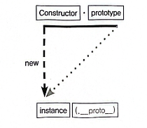

# 코어자바스크립트 6장 - 프로토타입

주차: 5주차

# 1. 프로토타입과 프로토타입 체인

모든 함수는 생성될 때 prototype 이라는 객체를 가진다.

생성자 함수로부터 만들어진 인스턴스는 `__proto__` 라는 숨겨진 프로퍼티를 갖고 있는데, 이는 생성자 함수의 prototype을 참조한다.



new 연산자로 Constructor를 호출하면 instance가 만들어지는데, 이 instance의 생략 가능한 프로퍼티인 `__proto__` 는 Constructor의 prototype을 참조한다!

```jsx
var Constructor = function (name) {
  this.name = name
}

Constructor.prototype.method1 = function () {}
Constructor.prototype.property1 = 'Constructor Prototype Property'

var instance = new Constructor('Instance')

console.dir(Constructor)
console.dir(instance)
```


옅은 색은 열거할 수 없는 프로퍼티, 짙은 색은 열거할 수 있는 프로퍼티이다.

```jsx
var arr = [1, 2]
console.dir(arr)
console.dir(Array)
```


생성된 인스턴스의 `__proto__` 는 Array.prototype을 참조하므로

인스턴스는 push, pop 등을 호출할 수 있다.

그러나 Array의 prototype 프로퍼티 내부에 없는 from, isArray 등은 인스턴스가 직접 호출할 수 없다.!

```jsx
var arr = [1, 2]
console.log(Array.isArray(arr)) // 0 true
console.log(arr.isArray()) // x TypeError: arr.isArray is not a function
```


어떤 프로퍼티나 메서드를 찾을 때,

인스턴스 → 생성자 함수의 prototype → Object.prototype 순으로 계속 거슬러 올라가는 구조이다.

## 1-1. constructor 프로퍼티

constructor 프로퍼티는 생성자 함수가 자신을 가리키도록 하는 프로퍼티다.

모든 인스턴스는 `.constructor`로 자기를 만든 생성자 함수를 알 수 잇듬!

```jsx
var arr = [1, 2]

Array.prototype.constructor === Array // true
arr.__proto__.constructor === Array // true
arr.constructor === Array // true
```

👉🏻 `arr.constructor`는 내부적으로 `arr.__proto__.constructor`를 찾고, 이는 곧 `Array.prototype.constructor` → 즉 `Array`를 가리킴

원칙적으로 `constructor`는 읽기 전용이 아니어서 대부분 바꿀 수 있다.

> 😓 **예외!**
>
> 기본형 리터럴은 원시값이라서 `immutable`해서 `constructor` 변경이 불가능함!!

# 2. 프로토타입 체인

## 2-1. 메서드 오버라이드

`prototype` 객체를 참조하는 `__proto__` 를 생략하면 인스턴스는 `prototype`에 정의된 프로퍼티나 메서드를 사용할 수 있다.

근데 만약 인스턴스가 동일한 이름의 프로퍼티 or 메서드를 가지고 있다미연?

```jsx
var Person = function (name) {
  this.name = name
}

Person.prototype.getName = function () {
  return this.name
}

var iu = new Person('지금')

iu.getName = function () {
  return '바로 ' + this.name
}

console.log(iu.getName()) // '바로 지금'
```

`iu.getName = …` 으로 인스턴스 수준에서 메서드를 덮어 썻음

이건 `prototype`에 있는 원래 `getName`을 지운 게 아니라, 단순히 iu 객체 안에 **같은 이름의 메서드를 하나 더 올려놓은 것임**!

자바스크립트는 메서드를 찾을 때

`객체 자신` → `__proto__` → `그 위의 prototype...` 순으로 올라가며 찾기 때문에 `iu.getName()`은 iu 자신에게 있는 메서드를 먼저 호출하게 됨

만약 프로토타입 메서드에 직접 접근하고 싶다면 아래처럼 하면 되는데

지금은 프로토타입에 name 프로퍼티가 없어서 undefined가 뜸

```jsx
console.log(iu.__proto__.getName()) // undefined
```

원래 메서드를 인스턴스 기준으로 호출하고 싶다면

call이나 apply로 this를 명시적으로 주면 됨

```jsx
console.log(iu._proto_.getName.call(iu)) // 지금
```

## 2-2. 프로토타입 체인

```jsx
console.dir({ a: 1 })
```


`__proto__` 는 Object.prototype을 가르키고 있다.

`constructor`는 이 객체를 만든 생성자 함수는 Object를 참조한다.

```jsx
console.dir([1, 2, 3])
```


`__proto__`는 `Array.prototype`을 가리킨다.

그런데 `Array.prototype.__proto__`를 다시 열어보면 **`Object.prototype`**이 들어있다?
`Array.prototype` 도 결국은 객체이기 때문이다. 결국 모든 객체는 마지막에 `Object.prototype`을 프로토타입 체인의 끝으로 삼는다!

프로토타입 체인이란 JS에서 어떤 프로퍼티나 메서드를 찾을 때, 자신의 객체에 없으면 `__proto__`로 연결된 부모 객체를 타고 올라가며 찾는 구조를 의미한다.


## 2-3. 객체 전용 메서드의 예외사항

> 😓 **객체 전용 메서드가 뭔데!@!!!#@!@$!**
>
> 오직 객체 타입만을 대상으로 동작해야 하는 메서드 ^>^

모든 생성자 함수의 `.prototype`은 결국 객체(Object)이다.
→ 그래서 프로토타입 체인의 최종 종착점은 항상 `Object.prototype`

그런데 `Object.prototype` 에 메서드를 추가한다면?

```jsx
Object.prototype.getEntries = function () {
  const res = []
  for (var prop in this) {
    if (this.hasOwnProperty(prop)) {
      res.push([prop, this[prop]])
    }
  }
  return res
}
```

👉🏻 `getEntries`라는 메서드를 모든 객체가 쓸 수 있게 만든 것

```jsx
const data = [
  ['object', { a: 1, b: 2, c: 3 }],
  ['number', 345],
  ['string', 'abc'],
  ['boolean', false],
  ['func', function () {}],
  ['array', [1, 2, 3]],
]

data.forEach(function (datum) {
  console.log(datum[1].getEntries())
})
```

나는 위 코드를 `{ a: 1, b: 2, c: 3 }` 같은 객체에만 `getEntries`가 동작하길 원하는데, 다른 값들에도 모두 적용이 되어버림..

JS는 모든 값에 대해 객체처럼 처리하는 유연성이 있기 때문이다.

따라서 `Object.prototype` 은 모든 객체의 프로토타입 체인에 포함되기 때문에 어떤 데이터 타입이든, 원래 의도와 다르게 의도하지 않은 접근이 발생할 수가 있다!!

그러니까 `Object.prototype` 에 직접 메서드 추가하는 건 피하고

꼭 써야 한다면 this로 타입 검사를 하자

```jsx
Object.prototype.getEntries = function () {
  if (this.constructor !== Object) {
    // 객체 아니면 아웃이야!
    throw new Error('Only plain objects are allowed!')
  }

  const res = []
  for (var prop in this) {
    if (this.hasOwnProperty(prop)) {
      res.push([prop, this[prop]])
    }
  }
  return res
}
```

### 2-3-1. 왜 객체 전용 메서드는 Object에 직접 붙일까?

프로토타입 체인의 성격 때문이다!

그래서 **정적 메서드(static method)**로 구현해서 해결했었다.

> 😓 **정적 메서드는 또 뭐야!**
>
> > 클래스나 생성자 함수에 직접 붙은 메서드로,
> >
> > 인스턴스에서 사용하는 게 아니라 클래스 자체에서 사용하는 메서드
> >
> > ```jsx
> > class Dog {
> >   static bark() {
> >     console.log('멍!')
> >   }
> > }
> >
> > Dog.bark() // 가능 (정적 메서드니까)
> > const d = new Dog()
> > d.bark() // 에러 (인스턴스에서는 사용 불가)
> > ```

대표적인 예시로 아래와 같은 메서드들이 있다.

- `Object.freeze(obj)` : 객체를 동결한다.
- `Object.getPrototypeOf(obj)` : 프로토타입을 반환한다.

이런 방식은 this를 쓰지 않고, 인자를 통해 객체를 직접 전달받는다.

> 😓 **그럼 왜 `obj.freeze()` 처럼 못 쓰게 했을까?**
>
> 만약 `obj.__proto__`에 `freeze()`를 추가했다면,
>
> 숫자든 문자든 모든 값에서 `freeze()`를 호출할 수 있게 됐을 것임
>
> 그래서 객체에만 적용돼야 하는 메서드는 Object 생성자에 직접 넣은 거임!

### 2-3-2. 예외적으로 Object.create(null)을 쓰면?

```jsx
const proto = Object.create(null) // 프로토타입이 없는 순수한 객체
proto.getValue = function (key) {
  return this[key]
}

const obj = Object.create(proto)
obj.a = 1
console.log(obj.getValue('a')) // 1
```


요기서 `obj.__proto__`는 `proto` 인데 `proto.__proto__` 가 없어서

내장 메서드가 없음!

그래서 성능은 좋은데 기능이 제한되는 단점이 있다.

JSON API, 해시 테이블처럼 순수한 key-value 저장소로 쓰기가 좋다.

> 😓 **왜 성능이 좋고 왜 JSON API 등에 쓰기가 좋은가??**
>
> > 1.  **프로토타입 체인 탐색이 없다**
> >
> >     일반 객체는 키를 읽거나 쓸 때, 해당 키가 없으면 `Object.prototype`까지 올라가서 찾는데
> >
> >     얘는 아예 상속 체인이 없기 때문이다.
> >
> > 2.  **충돌 위험이 없다**
> >
> >     일반 객체는 키 이름이 `Object.prototype` 메서드 이름과 충돌할 위험이 있다.

## 2-4. 다중 프로토타입 체인

자바스크립트의 기본 내장 객체들은 보통 `1단계(ex. Object)` 또는 `2단계(ex. Array → Object)`로 프로토타입 체인이 끝나는데
사용자가 직접 만든 객체는 얼마든지 깊은 체인을 구성할 수 있다.
`.prototype`과 `__proto__`를 조작하여 상속 구조를 자유롭게 만들 수 있다!

책에 있는 코드로 공부해보쟈..

```jsx
// 생성자 함수 Grade 정의
var Grade = function () {
  var args = Array.prototype.slice.call(arguments) // 진짜 배열 만들어서 args에 저장
  for (var i = 0; i < args.length; i++) {
    this[i] = args[i] // 배열의 각 요소를 this에 인덱싱해서 넣음
  }
  this.length = args.length // length 프로퍼티 수동으로 넣음
}
```

이 생성자 함수로 만들어지는 인스턴스는 아래와 같다.

```jsx
var g = new Grade(100, 80)

console.log(g) // { 0: 100, 1: 80, length: 2 }
```


만들어진 g는 **배열처럼 생긴 유사배열 객체**일 뿐이고, `__proto__`는 `Grade.prototype`을 바라보게 된다.

요때 유사 배열을 찐배열처럼 쓰고 싶으면 아래처럼 하면 된다!

```jsx
var Grade = function () {
  var args = Array.prototype.slice.call(arguments)
  for (var i = 0; i < args.length; i++) {
    this[i] = args[i]
  }
  this.length = args.length
}

// Grade의 prototype을 Array의 인스턴스로 연결
Grade.prototype = Object.create(Array.prototype)

// constructor 복구 (안하면 constructor가 Array로 되어버림)
Grade.prototype.constructor = Grade

var g = new Grade(100, 80)
console.log(g) // {0: 100, 1: 80, length: 2}
g.push(90) // 이제 push 가능!
console.log(g) // {0: 100, 1: 80, 2: 90, length: 3}
```


이렇게 하면 `Grade.prototype`이 실제 `Array`의 인스턴스를 바라보게 되고, `g.__proto__` 가 `Array.prototype`을 바라보게 되어서

g가 배열처럼 동작하게 되는 거시다.

> 😓 `prototype`이 교체되는 과정이 이해가 잘 안 된다 ㄱ-..
>
> > 1.  **생성자 함수 정의**
> >
> >     ```jsx
> >     var Grade = function () {
> >       var args = Array.prototype.slice.call(arguments)
> >       for (var i = 0; i < args.length; i++) {
> >         this[i] = args[i]
> >       }
> >       this.length = args.length
> >     }
> >     ```
> >
> >     위 시점에서 아래와 같은 프로토타입 객체가 만들어짐
> >
> >     ```jsx
> >     Grade.prototype = {
> >       constructor: Grade,
> >     }
> >     ```
> >
> > 2.  **Array.prototype을 상속하는 prototype으로 교체**
> >
> >     ```jsx
> >     Grade.prototype = Object.create(Array.prototype)
> >     ```
> >
> >     `Object.create(Array.prototype)`는 `Array.prototype`을 `prototype`으로 갖는 새로운 객체를 생성해서 `Grade.prototype`을 그 객체로 완전히 덮어씀
> >
> >     ```jsx
> >     Grade.prototype = {
> >       __proto__: Array.prototype,
> >     }
> >     ```
> >
> >     
> >
> > 3.  **constructor 복구**
> >
> >     ```jsx
> >     Grade.prototype.constructor = Grade
> >     ```
> >
> >     직접 constructor 프로퍼티를 Grade 함수로 다시 연결함
> >
> >     [_🔗 근데 왜 복구를 해야 하지??_](https://www.notion.so/6-21310e12f8ca80d887a6e5fd0a51b66a?pvs=21)
> >
> >     ```jsx
> >     Grade.prototype = {
> >       constructor: Grade,
> >       __proto__: Array.prototype,
> >     }
> >     ```
> >
> > 그래서 g의 프로토타입 체인은 요렇게 된당
> >
> > ```
> > g → Grade.prototype → Array.prototype → Object.prototype
> > ```
> >
> > 

> 😓 **`prototype` 변경 후 `constructor`를 복구해야 하는 이유는 뭘까**
>
> > **직접 타입 체크**하거나, **디버깅 툴에서 객체의 생성자 이름을 확인**하거나, **프레임워크에서 `instanceof`, `constructor`로 분기 처리할 때 중요**하기 때문!
> >
> > **👉🏻 내가 의도한 생성자 정보가 유지되도록 하기 위해서다~~~**
> >
> > 그래도 잘 모르겟음.. 그정도는 `prototype`이나 `__proto__`로 대신 할 수 있지 않나?
> >
> > `__proto__나` `.prototype`은 **`constructor`의 대체재가 아니라고 함..**
> >
> > 각자 목적과 쓰임이 달라서 안 된대
> >
> > - `constructor`는 어떤 생성자 함수로 만들어졌는지 알기 위해 쓰는 거고
> > - `__proto__`는 객체의 프로토타입 참조의 역할을 하는 거고
> > - `.prototype`은 인스턴스가 공유할 속성/메서드 역할을 하는 거임
