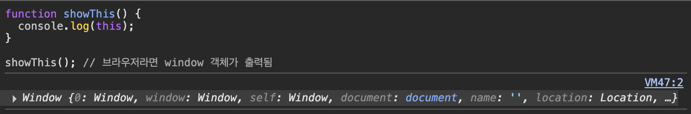

# 1. strict mode란

자바스크립트란 암묵적 전역(implicit global)을 발생시킨다.

전역 스코프까지 갔는데 변수의 선언이 존재하지 않으면 암묵적으로 전역 객체에 변수 프로퍼티를 동적 생성하는 것이다.

그런데 개발자의 의도와 상관없이 발생한 암묵적 전역은 오류를 발생시킨다.

그래서 요런 오류 발생을 막기 위해 ES5부터 strict mode가 추가되었다.

비슷하게 ESLint를 사용해도 정적 분석 기능을 통해 코드 실행 전에 코드를 스캔해서 오류를 잡아주기도 한다.

# 2. strict mode 적용

strict mode를 적용하려면 전역 선두에 `‘use strict’;` 를 추가해야 한다.

함수 몸체의 선두에 추가하면 해당 함수와 중첩 함수에 strict mode가 적용된다.

## 2-1. 그런데 **전역에 strict mode를 적용하는 것은 피해야 한다.**

외부 라이브러리를 사용하는 경우, 외부 라이브러리는 Non-strict mode인 경우도 있기 때문이다. (라이브러리가 안 돌아갈 수도 있음)

> 😓 **“이런 경우에는 즉시 실행 함수로 스크립트 전체를 감싸서 스코프를 구분하고 즉시 실행 함수의 선두에 strict mode를 적용해야 한다.”**
>
> > _이게 무슨 말이야…_
> >
> > **즉시 실햄 함수(Immediately Invoked Function Expression, IIFE)**를 쓰면, 내 코드만 strict 모드로 돌리고 외부 라이브러리에는 영향을 주지 않음
> >
> > ```jsx
> > ;(function () {
> >   'use strict'
> >   // 이 함수 내부만 strict mode 적용!
> >   // 내 코드만 안전하게!
> >
> >   // 여기에 내 코드 작성
> > })()
> > ```

> 😓 **즉시 실행 함수(IIFE)**
>
> > - 정의와 동시에 즉시 실행되는 함수이다.
> > - 정의가 끝나자마자 바로 실행된다.
> >
> > 즉시 실행 함수를 쓰는 이유는?
> >
> > 1.  변수 스코프 제한: 전역 스코프의 오염을 방지한다.
> > 2.  비공개 데이터: 외부에서 접근할 수 없는 private한 변수와 메서드를 만들 수 있다.
> > 3.  모듈화: 독립적인 기능 단위를 만들 수 있다.
> > 4.  초기화 코드: 애플리케이션 시작 시 한 번만 실행되어야 하는 코드를 관리할 수 있다.
> >
> > 함수 표현식, 화살표 함수 IIFE 비교해보기
> >
> > https://velog.io/@micaelknife/JavaScript-%EC%A6%89%EC%8B%9C%EC%8B%A4%ED%96%89%ED%95%A8%EC%88%98IIFE-%EC%99%84%EB%B2%BD-%EA%B0%80%EC%9D%B4%EB%93%9C-%EC%A3%BC%EB%8B%88%EC%96%B4-%EA%B0%9C%EB%B0%9C%EC%9E%90%EB%A5%BC-%EC%9C%84%ED%95%9C-%EC%83%81%EC%84%B8-%EC%84%A4%EB%AA%85

## 2-2. 함수 단위로 strict mode를 적용하는 것도 피해야 한다.

모든 함수에 일일이 strict mode를 적용하는 것은 번거롭다.

그리고 strict mode가 적용된 함수가 참조할 함수 외부의 컨텍스트에 strict mode를 적용하지 않는다면 이것도 문제다.

# 3. strict mode가 발생시키는 에러

1. [🔗 암묵적 전역](https://www.notion.so/20-strict-mode-20e10e12f8ca8086bc16f0e1b885ae05?pvs=21)

   선언하지 않은 변수를 참조하면 ReferenceError가 발생한다.

   ```jsx
   'use strict'

   undeclaredVar = 123 // ReferenceError: undeclaredVar is not defined
   ```

2. 변수, 함수, 매개변수의 삭제

   `delete` 연산자로 변수, 함수, 매개변수를 삭제하면 SyntaxError가 발생한다.

   ```jsx
   'use strict'

   var x = 1
   delete x // SyntaxError: Delete of an unqualified identifier in strict mode.

   function foo() {}
   delete foo // SyntaxError: Delete of an unqualified identifier in strict mode.

   function bar(param) {
     delete param // SyntaxError: Delete of an unqualified identifier in strict mode.
   }
   ```

3. 매개변수 이름의 중복

   중복된 매개변수 이름을 사용하면 SyntaxError가 발생한다.

   ```jsx
   'use strict'

   function duplicateParam(a, a) {
     // SyntaxError: Duplicate parameter name not allowed in this context
     console.log(a)
   }
   ```

4. with문의 사용

   with문을 사용하면 SyntaxError가 발생한다.

   with문은 동일한 객체의 프로퍼티를 반복해서 사용할 때 객체 이름을 생략할 수 있어서 코드가 간단해진다.

   근데 성능과 가독성을 버림 에잇 퉤

   ```jsx
   'use strict'

   var obj = { a: 1, b: 2 }

   with (obj) {
     // SyntaxError: Strict mode code may not include a with statement
     console.log(a)
   }
   ```

# 4. strict mode 적용에 의한 변화

1. strict mode에서 일반 함수를 호출하면 this에 undefined가 바인딩된다.

   원래 기본 동작은 아래와 같다.

   ```jsx
   function showThis() {
     console.log(this)
   }

   showThis() // 브라우저라면 window 객체가 출력됨
   ```

   

   strict mode가 아니면, 일반 함수에서는 this는 전역(window)을 가리킨다.

   그런데!!!!@!@#!@#!@#!@#

   strict mode에서는

   ```jsx
   'use strict'

   function showThis() {
     console.log(this)
   }

   showThis() // undefined
   ```

   

   일반 함수에서 this가 undefined로 바인딩된다. (오류 방지 위함)

   > 😓 **근데 왜 일반 함수에서 this가 바인딩되는 게 위험한 건데요 예?앙?읭?읭??!**
   >
   > > 암묵적 전역과 관련이 있는데
   > >
   > > 아래 코드를 보면
   > >
   > > ```jsx
   > > function foo() {
   > >   this.value = 10
   > > }
   > >
   > > foo()
   > > console.log(value) // 10
   > > ```
   > >
   > > `foo` 안의 this가 window를 가리키기 때문에 `window.value = 10`이 된다.
   > >
   > > 그러면 의도치 않게 전역변수 value가 생겨버린다.
   > >
   > > 이런 오류를 방지하기 위함이다.

2. strict mode에서 매개변수에 전달된 인수를 재할당하여 변경해도 arguments 객체에 반영되지 않는다.

   non-strict mode에서는

   ```jsx
   function foo(a) {
     arguments[0] = 42
     console.log(a) // 42
   }

   foo(10)
   ```

   

   arguments로 접근해서 매개변수로 전달된 인수를 바꿔버릴 수 있다.

   근데 strict mode에선

   ```jsx
   'use strict'

   function foo(a) {
     arguments[0] = 42
     console.log(a) // 10 (바뀌지 않음!)
   }

   foo(10)
   ```

   

   어림도 없지 쿸,큨.쿸..
