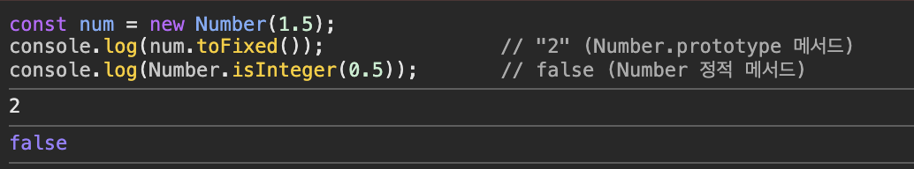

# 1. 객체의 분류

1. **표준 빌트인 객체(Standard Built-in Objects)**

   ECMAScript 명세에 정의되어 있는 객체로 언제나 사용 가능하다.

   전역 객체에 바인딩되어 있어 별도의 `Import` 없이 전역에서 사용이 가능하다.

   ex) Object, String, Number, Math, Array, Promise ,JSON 등

2. **호스트 객체(Host Objects)**

   JS 실행 환경이 제공하는 객체이다.

   ECMAScript 명세에는 없고, 환경별로 다르다.

   ex) 브라우저: document, window, fetch 등

   ex) Node.js: require, module, process, fs, http 등

3. **사용자 정의 객체(User-defined Objects)**

   사용자가 직접 만든 객체이다.

   ex) 클래스, 생성자 함수, 리터럴로 만든 객체 등

# 2. 표준 빌트인 객체

대부분은 생성자 함수여서 인스턴스를 만들 수 있다.

따라서 `typeof` 결과는 모두 `Object` 혹은 `function`으로 나옴

그리고 프로토타입도 `String.prototype` 등의 프로토타입 메서드로 정의되어있음!

> 😓 **예외!!!!!1**
>
> `Math`, `JSON`, `Reflect` 는 생성자가 아님

> 😓 **정적 메서드 vs 프로토타입 메서드**
>
> > 메서드가 **어디에 붙어 있는가**에 따라 다름
> >
> > 1.  **정적 메서드**는
> >
> >     생성자 함수(혹은 클래스)에 직접 붙어 있는 메서드로,
> >
> >     주로 유틸리티성 기능을 제공한다.
> >
> >     → 객체 생성 없이 독립적으로 동작하는 로직에서 쓴다.
> >
> > 2.  **프로토타입 메서드**는
> >
> >     생성자 함수의 프로토타입 객체에 정의된 메서드로,
> >
> >     해당 생성자 함수로 생성된 모든 인스턴스에서 사용할 수 있다.
> >
> >     인스턴스의 상태(this)를 기반으로 동작한다~~
> >
> >     → 객체 인스턴스의 값을 다루는 로직에서 쓴다.
> >
> > 

> 😓 **유틸리티성 기능을 정확히 짚고 넘어가자미욘**
>
> 어떤 객체의 상태에 직접적으로 의존하지 않고, 공통적이고 반복적인 작업을 도와주는 기능!

# 3. 원시값과 래퍼 객체

원시값은 객체가 아니다!

원시값은 불변(immutable)하고, 프로퍼티도 없고, 메서드도 없다.

> 😓 **근데 var로 선언하면 가변적인 거 아니냠??**
>
> > 원시 값이 불변하다는 건, 값 자체를 변경할 수 없다는 거다.
> >
> > ```jsx
> > var name = 'hello'
> > name = 'world'
> > ```
> >
> > 여기서 바뀐 건 변수 name이 가리키는 값이지
> >
> > 원시값 “hello”나 “world”가 바뀐 게 아니다

아래 예시에서 문자열은 원시값인데 왜 메서드처럼 `.length`, `.toUpperCase()`를 쓸 수 있을까??

```jsx
const str = 'hello'
console.log(str.length) // 5
console.log(str.toUpperCase()) // "HELLO"
```


👉🏻 JS 엔진이 순간적으로 객체처럼 다룰 수 있게 해주기 때문이다.

> 😓 **`.length` vs `.toUpperCase()` 에서 괄호 ()의 의미는 ?**
>
> 괄호가 없는 건 **프로퍼티(속성)를 읽는 거**고
>
> 괄호가 있는 건 **메서드(함수)를 실행하는 거**임

## 3-1. 래퍼 객체 (Wrapper Object)

원시값을 객체처럼 사용하면, JS가 임시 객체를 **자동으로 생성**한다.

이 객체는 잠깐 생성되었다가 작업이 끝나면 자동으로 사라진다. (가비지 컬렉션)

```jsx
const str = 'hi' // ① 원시값
str.name = 'Lee' // ② 래퍼 객체가 잠깐 생김
console.log(str.name) // ③ undefined → 래퍼 객체는 사라짐
```


### 3-1-1. 래퍼 객체는 왜 존재하냠?

편의성을 위해서다.

문자열, 숫자, 불리언을 객체처럼 다루고 싶을 때 자동으로 변환해준다.

개발자가 직접 `new String(”hi”)` 처럼 래퍼 객체를 수동 생성하는 건 권장되지 않는다.

### 3-1-2. 예외: `null`/`undefined`

얘네는 객체처럼 다룰 수 없다.

따라서 래퍼 객체가 생성되지 않고, 객체처럼 사용하면 에러가 발생한다.

```jsx
null.toString()
undefined.valueOf()
```


# 4. 전역 객체

전역 객체는 JS 코드가 실행되기 전에 JS 엔진이 자동으로 생성하는 ✨특수 최상위 객체✨이다.

특수 최상위 객체란

어떤 객체에도 속하지 않고, 모든 표준 빌트인 객체와 호스트 객체들을 자신의 프로퍼티로 보유하는 객체이다.

전역 객체는 실행 환경마다 다르다.

| **환경**      | **전역 객체 이름**                 |
| ------------- | ---------------------------------- |
| 브라우저      | `window`, `self`, `frames`, `this` |
| Node.js       | `global`, `this`                   |
| 공통 (ES2020) | `globalThis`                       |

전역 객체에는 이런 것들이 있다.

1. 표준 빌트인 객체
2. 호스트 객체 (환경별)
3. `var` 선언 전역 변수

   > 😓 `let`, `const`는 전역 객체의 프로퍼티가 아니다.
   >
   > ES6부터 등장한 `let`, `const` 는 블록 스코프를 가지며
   >
   > 전역 객체와 연결되지 않도록 설계되었다.
   >
   > 그래서 전역 렉시컬 환경이라는 내부 구조에 저장된당다리당

4. 암묵적 전역
5. 전역 함수

전역 객체는 하나의 전역 공간에서 공유되므로 충돌하지 않게 주의해야 한다.

## 4-1. 빌트인 전역 프로퍼티 (Built-in Global Properties)

전역 객체의 프로퍼티로, 전역에서 바로 사용이 가능하다.

`.window`, `globalThis.` 를 생략할 수 있음

1. **`Infinity`**

   양의 무한대를 의미하며, 예외 상황에서 자주 등장한다.

   타입은 `number`이다.

   ```jsx
   console.log(Infinity) // Infinity
   console.log(3 / 0) // Infinity
   console.log(-3 / 0) // -Infinity
   console.log(typeof Infinity) // 'number'
   console.log(window.Infinity === Infinity) // true
   ```

   

2. `NaN`

   숫자가 아님을 의미하며, 숫자 연산이 실패했을 때 등장한다.

   타입은 `number`이다.

   ```jsx
   console.log(NaN) // NaN
   console.log(Number('abc')) // NaN
   console.log(1 * 'text') // NaN
   console.log(typeof NaN) // 'number'
   console.log(window.NaN === NaN) // true
   console.log(NaN === NaN) // 이러면 안돼앳
   console.log(isNaN(NaN)) // true
   console.log(Number.isNaN(NaN)) // true
   ```

   

3. `undefined`

   값이 할당되지 않은 상태를 의미하며, 타입은 `undefined`이다.

   ```jsx
   console.log(undefined) // undefined
   var foo
   console.log(foo) // undefined
   console.log(typeof undefined) // 'undefined'
   console.log(window.undefined === undefined) // true
   ```

   

## 4-2. 빌트인 전역 함수 (Built-in Global Functions)

전역에서 사용할 수 있고, 전역 객체의 메서드로 등록되어 있는 함수들이다.

1. `eval()`

   문자열 형태의 JS 코드를 실행하거나 평가한다.

   근데 위험하고 느려서 실무에선 사용 금지!

   사용자 입력을 eval로 입력하면 XSS 공격이 가능하기 때문이다.

   ```jsx
   eval('1 + 2') // 3 (표현식: 평가하여 결과 반환)
   eval('var x = 10;') // undefined (문: 실행만 함)
   console.log(x) // 10 (실제로 변수 생성됨)
   ```

   

   크롬의 CSP 떄문에 eval() 사용이 안 되는 모습

2. `isFinite()`

   전달된 값이 유효한 숫자인지 검사해서 `true`/`false`를 반환한다.

   전달된 값이 숫자가 아니면 자동으로 숫자로 변환한 뒤 검사한다.

   ```jsx
   console.log(isFinite(10)) // true
   console.log(isFinite(1 / 0)) // false
   console.log(isFinite('20')) // true
   console.log(isFinite('hello')) // false
   console.log(isFinite(NaN)) // false
   console.log(isFinite(null)) // true
   ```

   

3. `isNaN(value)`

   전달된 값이 NaN인지 여부를 검사한다.

   ```jsx
   console.log(isNaN(NaN)) // true
   console.log(isNaN('hello')) // true ('hello' → NaN)
   console.log(isNaN('10')) // false ('10' → 10)
   console.log(isNaN('10.5')) // false ('10.5' → 10.5)
   console.log(isNaN('')) // false ('' → 0)
   console.log(isNaN(true)) // false (true → 1)
   console.log(isNaN(undefined)) // true (undefined → NaN)
   console.log(isNaN(null)) // false (null → 0)
   console.log(isNaN({})) // true ({} → NaN)
   console.log(isNaN(new Date())) // false (→ timestamp number)
   console.log(isNaN(new Date().toString())) // true (문자열이므로 NaN)
   ```

   

4. `parseFloat(string)`

   문자열을 **부동 소수점(실수)**으로 변환한다.

   ```jsx
   console.log(parseFloat('3.14')) // 3.14
   console.log(parseFloat('10.00')) // 10
   console.log(parseFloat('34 45 66')) // 34 (첫 번째 숫자만 파싱)
   console.log(parseFloat('40 years')) // 40
   console.log(parseFloat('He was 40')) // NaN
   console.log(parseFloat('  60  ')) // 60 (공백 무시)
   ```

   

5. `parseInt(string, radix)`

   문자열을 **정수로 해석하고,** 두 번째 인수는 진법(radix)을 지정한다.

   ```jsx
   console.log(parseInt('10')) // 10
   console.log(parseInt('10.123')) // 10
   console.log(parseInt(10.123)) // 10
   console.log(parseInt('10', 2)) // 2 (2진수)
   console.log(parseInt('10', 8)) // 8 (8진수)
   console.log(parseInt('10', 16)) // 16 (16진수)

   console.log(parseInt('0xf')) // 15 (16진수 리터럴)

   console.log(parseInt('34 45 66')) // 34
   console.log(parseInt('40 years')) // 40
   console.log(parseInt('He was 40')) // NaN
   console.log(parseInt('  60  ')) // 60 (공백 무시)
   ```

   

6. `toString(radix)`

   radix에서 들어온 진법을 적용해서 숫자에서 문자열로 변환한다.

   ```jsx
   const x = 15

   // 10진수 → 2진수 문자열
   const binaryStr = x.toString(2) // '1111'

   // 다시 2진수 문자열 → 10진수 숫자
   const parsedBack = parseInt(binaryStr, 2) // 15

   console.log(binaryStr) // '1111'
   console.log(parsedBack) // 15
   ```

   

7. `encodeURI` / `decodeURI`

   

   전체 URI를 인코딩/디코딩 하기 위해 사용한다.

   ```jsx
   const uri = 'https://example.com?name=치이카와귀여워&job=햄스터';

   // 인코딩
   const encoded = encodeURI(uri);
   console.log(encoded);
   // https://example.com?name=%EC%9D%B4%EC%9B%85%EB%AA%A8&job=programmer

   // 디코딩
   const decoded = decodeURI(encoded);
   console.log(decoded);
   // https://example.com?name=치이카와귀여워&job=햄스터
   VM73:5 https://example.com?name=%EC%B9%98%EC%9D%B4%EC%B9%B4%EC%99%80%EA%B7%80%EC%97%AC%EC%9B%8C&job=%ED%96%84%EC%8A%A4%ED%84%B0
   VM73:10 https://example.com?name=치이카와귀여워&job=햄스터
   undefined

   ```

   

8. `encodeURIComponent` / `decodeURIComponent`

   URI 구성 요소를 인코딩/디코딩 하기 위해 사용한다.

   encodeURI 랑 다르게 `:, /, ?, &` 등 특수문자를 다 인코딩한다.

   ```jsx
   const query = 'name=치이카와귀여워&job=햄스터'

   // 인코딩
   const encoded = encodeURIComponent(query)
   console.log(encoded)
   // name%3D%EC%9D%B4%EC%9B%85%EB%AA%A8%26job%3Dprogrammer

   // 디코딩
   const decoded = decodeURIComponent(encoded)
   console.log(decoded)
   // name=치이카와귀여워&job=햄스터
   ```

   

## 4-3. 암묵적 전역 (Implicit Global)

변수를 선언하지 않고 값을 할당하면, 해당 식별자는 자동으로 전역 객체의 프로퍼티가 된다!

```jsx
function foo() {
  y = 20 // 변수 선언 안 함 -> 암묵적 전역
}
foo()

console.log(y) // 20
console.log(window.y) // 20
```


선언적 변수와는 다르게 **호이스팅 되지 않고** **`delete`로 삭제가 가능**하다.

호이스팅 예제는 아래와 같고

```jsx
console.log(x) // undefined (호이스팅 O)
console.log(y) // ReferenceError (호이스팅 X)

var x = 10
function foo() {
  y = 20 // 암묵적 전역
}
foo()
```


delete 예제는 아래와 같다.

```jsx
var x = 10
function foo() {
  y = 20
}
foo()

console.log(window.x) // 10
console.log(window.y) // 20

delete x // 전역 변수는 삭제 안 됨
delete y // 전역 객체 프로퍼티는 삭제 가능

console.log(window.x) // 10
console.log(window.y) // undefined
```


`var`, `let`, `const`로 선언되는 전역 변수는 `configurable` 속성이 `false`인 프로퍼티로 생성되기 때문에 delete가 불가능하고,

암묵적 전역 변수는 그냥 일반 객체 프로퍼티처럼 생성되므로 `configurable` 속성이 `true`인 프로퍼티로 생성된다.
