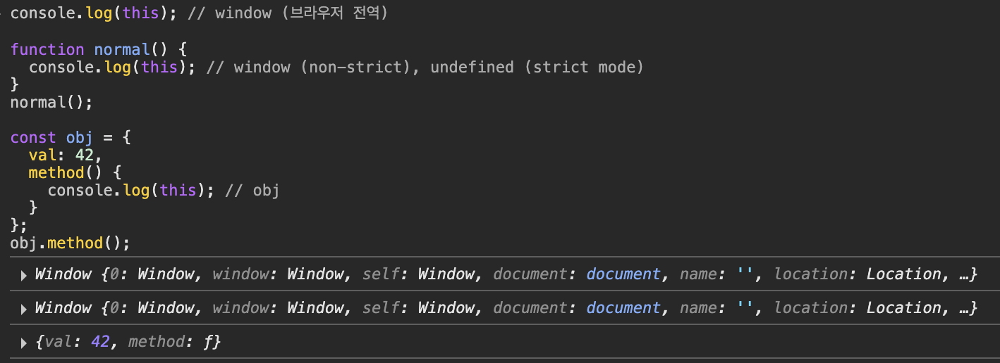

# 1. this란

자기 자신이 속한 객체를 가리키는 자기 참조 변수이다.

함수가 어떻게 호출되었는지에 따라 this가 가르키는 대상이 달라지고

JS에서는 this 바인딩이 동적이다.

객체는 상태+동작이 묶여있는데

그 동작 내부에서 **자기 자신의 상태(프로퍼티)를 참조해야 해서** this가 필요하다.

객체 리터럴에서의 this

```jsx
const person = {
  name: '치이카와',
  sayHello() {
    console.log(`Hi, I'm ${this.name}`)
  },
}

person.sayHello() // "Hi, I'm 치이카와"
```

👉🏻 여기서 this는 `person`을 가르킴

생성자 함수에서의 this

```jsx
function Person(name) {
  this.name = name
  this.sayHello = function () {
    console.log(`Hi, I'm ${this.name}`)
  }
}

const me = new Person('치이카와')
me.sayHello() // "Hi, I'm 치이카와"
```

👉🏻 여기서 this는 새로 생성된 인스턴스 `me`를 가르킴

this는 아래와 같이 결정된다.

| **상황**         | **this가 가르키는 것**                  |
| ---------------- | --------------------------------------- |
| 일반 함수 호출   | 전역 객체                               |
| 메서드 호출      | 메서드를 호출한 객체                    |
| 생성자 함수 호출 | 새로 생성된 인스턴스                    |
| 화살표 함수      | 자신이 선언된 위치의 this (렉시컬 this) |
| 이벤트 핸들러    | 이벤트를 바인딩한 DOM 요소              |

```jsx
console.log(this) // window (브라우저 전역)

function normal() {
  console.log(this) // window (non-strict), undefined (strict mode)
}
normal()

const obj = {
  val: 42,
  method() {
    console.log(this) // obj
  },
}
obj.method()
```



요로코롬 다 this가 다르다

# 2. 함수 호출 방식과 this 바인딩 (위에 거랑 같은 말 더 길게하기)

JS에서 this는 함수가 호출되는 방식에 따라 동적으로 결정된다.

즉, 같은 함수여도 호출 방법에 따라 this가 다르게 바인딩된다.

> 😓 **렉시컬 스코프 vs this 바인딩**
>
> > 1.  **렉시컬 스코프**는
> >
> >     함수 정의 시에 결정되고
> >
> > 2.  **this 바인딩**은
> >
> >     함수 호출 시에 결정된다.

1. 일반 함수 호출

   this는 전역 객체를 가르킨다.

   ```jsx
   function foo() {
     console.log(this)
   }
   foo() // 브라우저: window, Node.js: global
   ```

   

   strict mode에서는 `this === undefined` 이다.

   ```jsx
   'use strict'
   function foo() {
     console.log(this) // undefined
   }
   foo()
   ```

   

2. 메서드 호출

   메서드를 호출한 객체가 this로 바인딩된다.

   ```jsx
   const obj = {
     value: 42,
     printValue() {
       console.log(this.value)
     },
   }
   obj.printValue() // 42
   ```

   

3. 생성자 함수 호출

   new로 호출하면 this는 생성되는 인스턴스를 가르킨다.

   ```jsx
   function Circle(radius) {
     this.radius = radius
   }
   const c = new Circle(5)
   console.log(c.radius) // 5
   ```

   

4. `apply`, `call`, `bind`에 의한 호출

   this를 명시적으로 바인딩할 수 있다.

   1. `call`

      즉시 실행되며, 인자를 “,”로 나열한다.

      ```jsx
      function say(greeting, punctuation) {
        console.log(greeting + ' ' + this.name + punctuation)
      }

      const user = { name: '치이카와' }

      say.call(user, '안녕', '!') // 안녕 치이카와!
      ```

      

   2. `apply`

      얘도 즉시 실행되는데 인자를 배열로 나열한다.

      ```jsx
      function say(greeting, punctuation) {
        console.log(greeting + ' ' + this.name + punctuation)
      }

      const user = { name: '치이카와' }

      say.apply(user, ['안녕', '!']) // 안녕 치이카와!
      ```

      

   3. `bind`

      this만 고정하고, 실행은 나중에한다.

      이벤트 핸들러나 콜백 함수에 자주 쓰인다.

      문제가 되는 코드를 먼저 보자

      ```html
      <button id="btn">Click me</button>
      ```

      ```jsx
      const counter = {
        count: 0,
        increase() {
          this.count++
          console.log(this.count)
        },
      }

      const btn = document.getElementById('btn')
      btn.addEventListener('click', counter.increase) // 문제 발생!
      ```

      `addEventListener`는 `increase()`를 그냥 함수로 호출한다.

      그럼 이때 `this`는 `counter`가 아니라 `btn`을 가르키게 되고

      `this.count++`에서 `this.count`가 `undefined` or `NaN`이 돼버림 ㄱ-..

      그래서 이럴 때 bind를 사용한다.

      콜백도 같은 느낌!

      ```jsx
      btn.addEventListener('click', counter.increase.bind(counter))
      ```
