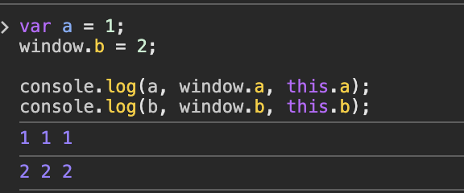

# 코어자바스크립트 3장 - this

주차: 5주차

# 1. 상황에 따라 달라지는 this

JS에서 this는 기본적으로 실행 컨텍스트가 생성될 때 함께 결정된다.

👉🏻 this는 함수를 호출할 때 결정된다

👉🏻 함수를 어떤 방식으로 호출하느냐에 따라 값이 달라진다.

## 1-1. 전역 공간에서의 this

전역 공간에서 this는 전역 객체를 가르킨다.

전역 객체는 JS 런타임에 따라 이름이 다르다. (브라우저 - window, Node.js - global)

전역 변수를 선언하면 JS 엔진은 이를 전역객체의 프로퍼티로도 할당한다.

👉🏻 　변수이면서 객체의 프로퍼티이기도 한 셈이다.

```jsx
var a = 1
window.b = 2

console.log(a, window.a, this.a)
console.log(b, window.b, this.b)
```



위 코드에서 var로 선언된 a는 전역 변수이면서 전역 객체의 프로퍼티로도 자동 등록된다.

## 1-2. 그런데 var(변수)랑 window(전역객체)의 결정적 차이가 있다.

var로 선언한 전역 변수는 삭제가 불가능하다.

왜냐미연,

var로 선언한 전역 변수는 window에 등록되긴 하는데,

`[[Configurable]]` 속성이 false로 설정되어서 삭제가 안 된다!

```jsx
var a = 1
delete window.a // false
console.log(a) // 1
```


window에 직접 할당한 프로퍼티는 삭제가 가능하다.

삭제되면 더이상 스코프 체인에서 찾을 수 없으므로 에러가 발생한다.

```jsx
window.c = 3
delete window.c // true
console.log(c) // ReferenceError
```


## 1-3. 전역 변수를 선언하면….. 자세한 동작 흐름

```jsx
var x = 5
```

1. JS 엔진이 실행 컨텍스트를 생성
2. `x`를 전역 변수로 선언
3. 전역 실행 컨텍스트의 `LexicalEnvironment`에 등록
4. 이 전역 `LE`는 곧 `window`이므로
5. `window.x = 5`처럼 저장됨

→ 자바스크립트에서 변수는 그저 "이름이 붙은 객체의 프로퍼티"일 뿐이다….

## 1-4. 메서드로 호출할 때 그 메서드 내부에서의 this

함수는 그 자체로 독립적인 기능을 수행한다.

메서드는 자신을 호출한 대상 객체에 관한 동작을 수행한다.

```jsx
function func(x) {
  console.log(this, x)
}

func(1) // 함수로 호출 → this는 window (브라우저 기준)
```

func(1)은 그냥 함수로 호출된다.

누가 이 함수를 호출했는지 알 수 없으니까

```jsx
const obj = {
  method: func,
}

obj.method(2) // 메서드로 호출 → this는 obj
obj['method'](2)
```

obj.method(2)는 객체의 프로퍼티에 있는 함수를 호출한 것이다.

이런 경우에는 호출한 주체인 obj가 this로 자동 설정된다.

함수 앞에 점(.)이 있으면 메서드 호출이다. (대괄호 표기법도 동일)

그리고 메서드를 호출할 때 this는 항상 마지막 점(.) 앞에 있는 것이다.

```jsx
obj.method() // this === obj
obj.inner.method() // this === obj.inner
obj['inner']['method']() // this === obj.inner
```

## 1-5. 함수로서 호출할 때 그 함수 내부에서의 this

```jsx
var obj1 = {
  outer: function () {
    console.log(this) // (1)

    var innerFunc = function () {
      console.log(this) // (2)
    }

    innerFunc()

    var obj2 = {
      innerMethod: innerFunc,
    }

    obj2.innerMethod() // (3)
  },
}

obj1.outer()
```

1. obj1

   `obj1.outer();` 를 호출하면 `outer`는 `obj1`의 메서드로서 호출되므로 `this`는 `obj1`을 가르키게 된다.

2. window

   그냥 함수로 호출되었으므로 (`innerFunc();`) this는 전역 객체를 가르킨다.

3. obj2

   `obj2.innerMethod();` 를 호출하면 `innerMethod`는 `obj2`의 메서드로서 호출되므로 `this`는 `obj2`를 가르키게 된다.

👉🏻 this 바인딩에 대해서는 함수를 호출하는 구문 앞에 점 또는 대괄호 표기가 있는지만 보면 된다!!!!

근데 여기 2번에서 갑자기 this가 전역객체가 돼버려서 매우 불편함;;

일반 함수로 호출해도 this를 가장 가까운 환경의 this로 상속받아 사용하면 을마나 좋을까?

아래 코드를 살펴보쟈아

```jsx
var obj = {
  outer: function () {
    console.log(this) // (1) obj

    var self = this // 현재 this(obj)를 저장

    var innerFunc2 = function () {
      console.log(self) // (2) obj 유지!
    }

    innerFunc2()
  },
}

obj.outer()
```

👉🏻 ES5에서는 `outer` 스코프에서 `this`를 `self` 라는 변수에 할당하고 `innerFunc2`에서 `self`를 쓰는 방식이 있따.!

> 😓 **아니 그러면 이 코드는 안 되나??**
>
> > ```jsx
> > var obj = {
> >   outer: function () {
> >     console.log(this) // (1) obj
> >
> >     var innerFunc2 = function () {
> >       console.log(this) // (2)
> >     }
> >
> >     this.innerFunc2()
> >   },
> > }
> >
> > obj.outer()
> > ```
> >
> > `innerFunc2`는 obj의 프로퍼티가 아니고, outer 함수의 지역변수일 뿐이므로 `this.innerFunc2()`는 오류가 발생하게 된다.
> >
> > ```jsx
> > var obj = {
> >   outer: function () {
> >     console.log(this) // (1) obj
> >
> >     this.innerFunc2 = function () {
> >       // obj.innerFunc2() = ... 와 같믐!
> >       console.log(this) // (2) obj
> >     }
> >
> >     this.innerFunc2() // OK!
> >   },
> > }
> >
> > obj.outer()
> > ```
> >
> > `innerFunc2`가 obj의 메서드로 등록되므로, 이건 정상 동작한다.

ES6에서는 함수 내부에서 this가 전역객체를 바라보는 문제를 보완하고자,

자신이 선언된 외부 컨텍스트의 this를 사용하는 화살표 함수를 **참조하여** 사용한다.

복사랑 헷갈렸는데 복사가 아니라 참조다!!!

```jsx
var obj = {
  outer: function () {
    console.log(this) // obj

    const inner = () => {
      console.log(this) // obj 유지!
    }

    inner()
  },
}

obj.outer()
```

## 1-6. 콜백 함수 호출시 그 함수 내부에서의 this

> 😓 **콜백 함수란!**
>
> 함수 A의 제어권을 다른 함수(또는 메서드) B에게 넘겨주는 경우,
>
> 함수 A를 콜백 함수라고 한다.

콜백 함수에서는 제어권을 가지는 함수가 콜백 함수에서의 this를 뭘로 할지 결정하고, 특별히 정의하지 않으면 기본적으로 전역 객체를 바라본다.

## 1-7. 생성자 함수 내부에서의 this (이건 위에서 언급햇슈)

어떤 함수가 생성자 함수로서 호출된 경우에는 내부에서 this가 곧 새로 만들 구체적인 인스턴스 자신이 된다.

# 2. 명시적으로 this를 바인딩하는 방법

## 2-1. call 메서드

문법은 다음과 같다.

- thisArg: 함수 내부에서 사용할 this 값으로 지정하는 객체
- arg1, arg2, … : 함수에 전달할 인자

```jsx
func.call(thisArg, arg1, arg2, ...)
```

## 2-2. apply 메서드

문법은 다음과 같다.

- thisArg: 함수 내부에서 사용할 this 값으로 지정하는 객체
- argsArray: 함수에 전달할 인자들을 담은 배열 (유사배열객체)

```jsx
func.apply(thisArg, argsArray)
```

### 2-2-1. 유사배열객체에 배열 메서드 적용

유사 배열 객체는, 배열처럼 보이지만 실제 배열은 아닌 객체를 의미한다.

이런 객체는 배열 메서드(push, slice, forEach 등)을 직접 사용할 수 없다.

그래서 call, apply로 배열 메서드를 빌려서 써야 한다!

```jsx
var obj = {
  0: 'a',
  1: 'b',
  2: 'c',
  length: 3,
}

Array.prototype.push.call(obj, 'd')

console.log(obj)
// { 0: 'a', 1: 'b', 2: 'c', 3: 'd', length: 4 }
```

👉🏻 call을 이용해서 obj에 d 강제 적용!

```jsx
var arr = Array.prototype.slice.call(obj)
console.log(arr)
// ['a', 'b', 'c', 'd']
```

👉🏻 call을 이용해서 obj를 복사하면 진짜 배열로 변화된다!

요런 애들은 `arguments`, `querySelectorAll()`의 결과물(DOM API의 결과물) 등에 사용하면 된다능 ~ , ~

근데 `slice.call` 같은 방식은 코드 의도를 파악하기 어려울 수 있음

그래서 ES6에서는 `Array.from()`이 등장하게 된 거시다.

훨씬 명확하고 직관적임!!

```jsx
const arr = Array.from(obj)
```

### 2-2-2. 생성자 함수 내부에서 다른 생성자 호출하기

```jsx
function Person(name, gender) {
  this.name = name
  this.gender = gender
}

function Student(name, gender, school) {
  // 중복된 코드
  this.name = name
  this.gender = gender
  this.school = school
}

function Employee(name, gender, company) {
  // 중복된 코드
  this.name = name
  this.gender = gender
  this.company = company
}
```

👉🏻 `this.name = name` , `this.gender = gender` 같은 코드가 **여러 군데에 반복됨**

```jsx
function Person(name, gender) {
  this.name = name
  this.gender = gender
}

function Student(name, gender, school) {
  Person.call(this, name, gender) // Person 생성자 재사용
  this.school = school
}

function Employee(name, gender, company) {
  Person.call(this, name, gender) // or apply(this, [name, gender])
  this.company = company
}
```

👉🏻 공통 속성 변경 시 **하나만 수정하면 끝!**

### 2-2-3. 여러 인수를 묶어서 배열로 전달하고 싶을 때

```jsx
var numbers = [1, 2, 3, 4, 5]
var max = (min = numbers[0])

numbers.forEach(function (number) {
  if (number > max) {
    max = number
  }

  if (number < min) {
    min = number
  }
})

console.log(max, min)
```

배열에서 최소/최대값 구하는 코드인데 겁나 드럽고 복잡함 아우 냄새나

```jsx
var numbers = [1, 2, 3, 4, 5]
var max = Math.max.apply(null, numbers)
var min = Math.min.apply(null, numbers)

console.log(max, min)
```

ES6에서는 전개 연산자로 더 간단하게 쓸 수 있듬드ㅡㅁ듣므

```jsx
const numbers = [1, 2, 3, 4, 5]
const max = Math.max(...numbers)
const min = Math.min(...numbers)

console.log(max, min)
```

## 2-3. bind 메서드

bind는 함수의 this를 미리 고정해서 새로운 함수를 반환하는 메서드다.

- thisArg: 고정하고 싶은 this
- arg1, arg2, ...: 미리 전달할 인수 (부분 적용 가능)

```jsx
func.bind(thisArg[, arg1[, arg2[, ...]]])
```

```jsx
var obj = { name: '치이카와' }

function greet(greeting) {
  console.log(greeting + ', ' + this.name)
}

const greet = greet.bind(obj)
greet('Hello') // Hello, 치이카와
```

👉🏻 greet의 this가 항상 obj로 고정됨

```jsx
function multiply(x, y) {
  return x * y
}

const double = multiply.bind(null, 2) // x는 2로 고정
console.log(double(5)) // 10 (2 * 5)
```

👉🏻  double은 항상 x=2로 고정된 새로운 함수

👉🏻 null을 넣은 이유는, multiply 함수 내에서 this를 안 쓰는데 bind의 첫 번째 인수가 필수라서 걍 넣는 거임

그럼 이렇게 하면 어케 되남?

```jsx
function multiply(x, y) {
  return x * y
}

const double = multiply.bind(null, 2, 4, 5)
console.log(double(4))
```


선행 인자들만 받아서 처리하고 나머지는 무시됨!

### 2-3-1. bind()로 만든 함수는 name 프로퍼티에 ‘bound’가 붙는다.

```jsx
function sayHi() {}
const boundHi = sayHi.bind(null)

console.log(sayHi.name) // "sayHi"
console.log(boundHi.name) // "bound sayHi"
```


그래서 원래 어떤 함수에서 만들어졌는지 추적하기 쉬워짐!

### 2-3-1. 상위 컨텍스트의 this를 내부 함수나 콜백에 전달해주자!

아까도 봤는데 내부 함수에서 갑자기 this가 얼렁뚱땅 바뀔 때가 있음 ㄱ-..

```jsx
var obj = {
  outer: function () {
    console.log(this) // (1) obj

    var innerFunc = function () {
      console.log(this) // (2) Window (브라우저 기준)
    }

    innerFunc() // 그냥 호출하면 this는 전역 객체
  },
}

obj.outer()
```

이럴 때 call이나 bind를 사용할 수가 있다!

1. call(this) 사용

   ```jsx
   var obj = {
     outer: function () {
       console.log(this) // obj

       var innerFunc = function () {
         console.log(this) // obj
       }

       innerFunc.call(this) // outer의 this(obj)를 넘겨줌
     },
   }

   obj.outer()
   ```

   

2. bind(this) 사용

   ```jsx
   var obj = {
     outer: function () {
       console.log(this) // obj

       var innerFunc = function () {
         console.log(this) // obj
       }.bind(this) // 아예 바인딩된 새 함수로 만듦

       innerFunc() // 호출 시에도 this는 obj로 고정
     },
   }

   obj.outer()
   ```

   

근데 결국 화살표 함수 쓰면 해결됨 고트.

```jsx
const obj = {
  name: '희진',
  sayHi: function () {
    const arrow = () => {
      console.log(this.name) // 여기서 this 자기 바깥(상위 스코프)의 this를 참조함!!
    }
    arrow()
  },
}

obj.sayHi() // 희진
```
