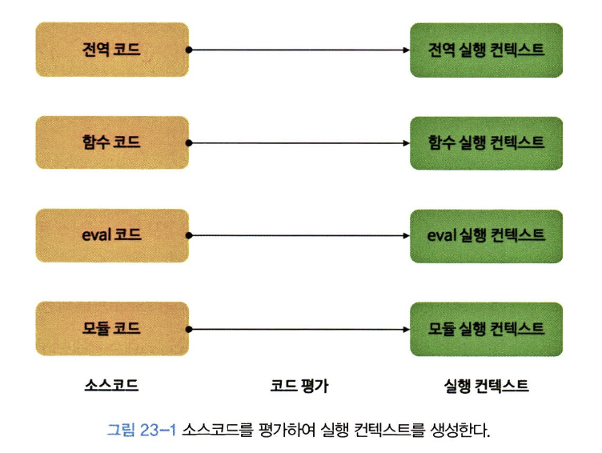

# 1. 소스 코드의 타입

JS 코드에는 4가지 타입이 있다.

코드 타입에 따라 실행 컨텍스트를 생성하고 관리하는 방법이 다르다!

1. **전역 코드 (global code)**

   전역 스코프에서 실행되는 코드로

   전역 변수, 함수 선언문을 위해 전역 스코프가 필요하다.

   👉🏻 전역 코드가 평가되면 전역 실행 컨텍스트가 생성된다.

2. **함수 코드 (function code)**

   함수 안에 있는 코드 (중첩 함수 제외)로,

   함수가 호출되면 그 함수만의 지역 스코프를 만들고

   함수 실행 컨텍스트는 스코프 체인 상 전역 스코프에 이어붙여진다.

   👉🏻 함수가 호출되면 함수 실행 컨텍스트가 생성된다.

3. **eval 코드 (eval code)**

   eval() 함수 안에 문자열로 들어간 코드로,

   strict mode에선 자기만의 스코프를 가질 수 있다.

   👉🏻 실행시 eval 실행 컨텍스트가 생성된다.

4. **모듈 코드 (module code)**

   모듈 안에 있는 코드로.

   ES6의 모듈 코드는 모두 자기만의 스코프를 갖는다.



# 2. 소스코드의 평가와 실행

코드가 실행되기 전에 JS 엔진이 어떤 일을 미리 하는가?

예제 코드로 살펴보쟈아

```jsx
var x
x = 1
```

- 1단계 (소스코드 평가)
  ```jsx
  var x

  // 실행 컨텍스트 내부 상태
  LexicalEnvironment: {
    x: undefined
  }
  ```
  - 실행 컨텍스트를 만들고
  - 변수/함수 선언만 먼저 실행해서 (호이스팅)
  - x 같은 식별자를 스코프에 등록한다.
  - 이때 L.E에는 x가 `undefined`로 등록된다.
- 2단계 (소스코드 실행)
  ```jsx
  x = 1

  // 실행 컨텍스트 내부 상태
  LexicalEnvironment: {
    x: 1
  }
  ```
  - x = 1이 실행되고
  - JS 엔진은 x라는 변수가 선언됐는지 확인하고
  - 실행 컨텍스트가 관리하는 L.E에 x가 있으니까
  - x에 1을 할당한다.
  - 그리고 L.E의 x 값도 업데이트 된다.

# 3. 실행 컨텍스트 역할, 스택

실행 컨텍스트의 역할은 다음과 같다.

1. 스코프와 식별자를 관리한다.

   1. 식별자들을 스코프로 구분해서 값의 변화를 관리한다.
   2. 내부 함수가 외부 변수에 접근할 수 있어야 하므로, 상위 스코프 참조가 필요하다.

1. 코드 실행 순서를 제어한다.
1. 중첩된 함수 호출에도 되돌아갈 수 있도록 상태를 유지한다.


- 🧚🏻 예제 코드를 살펴보쟈아악
  ```jsx
  // 전역 변수
  const x = 1
  const y = 2

  // 함수 정의
  function foo(a) {
    const x = 10
    const y = 20
    console.log(a + x + y) // 130
  }

  // 함수 호출
  foo(100)
  console.log(x + y) // 3
  ```
  - 1단계 (전역 코드 평가)
    ```jsx
    전역 스코프 {
      x → const (초기화 대기)
      y → const (초기화 대기)
      foo → function object
    }
    ```
  - 2단계 (전역 코드 실행)
    - `x = 1`, `y = 2` 할당
    - `foo(100)` 호출되고, foo 함수의 실행 컨텍스트로 진입
  - 3단계 (함수 코드 평가)
    - 새로운 실행 컨텍스트를 생성한다. (지역 스코프)
    ```jsx
    지역 스코프 {
      a → 100
      x → 10
      y → 20
      arguments → [100]
    }
    ```
  - 4단계 (함수 코드 실행)

    - `console.log(a + x + y);` 를 실행하면서 `a, x, y`를 스코프 체인 따라 검색
    - 함수 실행 종료시 실행 컨텍스트 제거 후 전역 코드로 복귀

  - 5단계 (전역 코드 계속 실행)

# 4. LexicalEnvironment

L.E이란, 식별자와 식별자에 바인딩된 값, 상위 스코프에 대한 참조를 저장하는 자료구조이다.

```jsx
const x = 1

function foo() {
  const y = 2
  console.log(x + y)
}

foo()
```

위 코드의 L.E는 다음과 같다.

```
Global Lexical Environment
- x: 1
- foo: function

foo Lexical Environment
- y: 2
- Outer: Global Lexical Environment
```

실행 컨텍스트는 코드 실행 순서를 관리한다면

L.E는 **식별자와 스코프를 저장하고 검색하는 공간**이다.

L.E의 구성은 다음과 같다.

```jsx
{
  EnvironmentRecord, // 현재 스코프의 식별자와 값 관리
    OuterLexicalEnvironmentReference // 상위 스코프 참조
}
```

1. Environment Record
   - 현재 스코프 내에서 선언된 변수, 함수, 매개변수를 기록한다.
   - 식별자와 값을 Key-value 형태로 관리한다.
2. Outer Lexical Environment Reference
   - 상위 L.E를 참조한다.

# 5. 실행 컨텍스트의 생성과 식별자 검색 과정

예제 코드를 봐보쟈아

```jsx
var x = 1
const y = 2

function foo(a) {
  var x = 3
  const y = 4

  function bar(b) {
    const z = 5
    console.log(a + b + x + y + z)
  }

  bar(10)
}

foo(20) // 42
```

- 1단계 (전역 객체 생성)

  - 코드 실행 전, 전역 객체가 먼저 생성된다.
    - `빌트인 전역 프로퍼티`, `빌트인 전역 함수`, `표준 빌트인 객체`, `(브라우저인 경우 Web API)`를 포함한다.
  - 전역 코드를 평가한다.
    - 전역 실행 컨텍스트를 생선한다.
    - 전역 L.E를 생성한다.
      - `Global EnvironmentRecord`를 생성한다.
        - `Object Environment Record`를 생성한다.
        - `Declarative Environment Record` 를 생성한다.
    - this 바인딩을 실행한다.
    - `OuterLexicalEnvironmentReference`를 설정한다.

- 2단계 (전역 환경 레코드 구성)
  - `Object Environment Record` (객체 환경 레코드)
    - `var`로 선언된 변수, 함수 선언문 등이 저장된다.
      ```jsx
      var x = 1, function foo() {}
      ```
  - `Declarative Environment Record` (선언적 환경 레코드)
    - let/const 로 선언된 전역 변수는 전역 객체의 프로퍼티가 아니므로
    - `const y = 2; window.y;` 로 접근이 불가능함!
    - 선언, 초기화 단계가 분리되어 있으므로 초기화 전까지 TDZ에 놓인다.
  
- 3단계 (this 바인딩)
  - 전역 환경 레코드의 `[[GlobalThisValue]]` 내부 슬롯에 this가 바인딩 된다.
  - 전역 코드에서 this는 전역 객체를 가리키므로 전역 객체(`window`)가 바인딩 된다.
  
- 4단계 (외부 렉시컬 환경 참조)
  전역 컨텍스트는 상위 코드가 없으므로 `Outer Lexical Environment Reference`가 `null`이 된다.

식별자 검색 과정은 다음과 같다.

1. 현재 실행 컨텍스트의 렉시컬 환경에서 식별자를 검색한다.
2. 없으면 외부 렉시컬 환경으로 이동한다. (스코프 체인)
3. 최종적으로 없으면 `ReferenceError` 를 출력한다.

# 6. 실행 컨텍스트와 블록 레벨 스코프

`var` 는 함수 레벨 스코프,

`let, const` 는 블록 레벨 스코프이다.

즉 let/const 는 if, for, whie 등의 블록마다 독립적인 스코프를 만들어낸다.

블록 스코프는 실행 컨텍스트가 직접 생성하는 건 아니지만, 렉시컬 환경을 동적으로 교체함으로써 작동한다.

```jsx
let x = 1

if (true) {
  let x = 10
  console.log(x) // 10
}

console.log(x) // 1
```

위 코드에서 전역 렉시컬에는 `x = 1`로 등록되고

if 블록 진입하면 새로운 렉시컬이 생성됨

그리고 기존의 전역 렉시컬은 `Outer Lexical Environment`로 연결됨

for문에서는 반복할 때마다 새로운 렉시컬이 만들어짐! 이건 클로저랑 연관있다고 함
