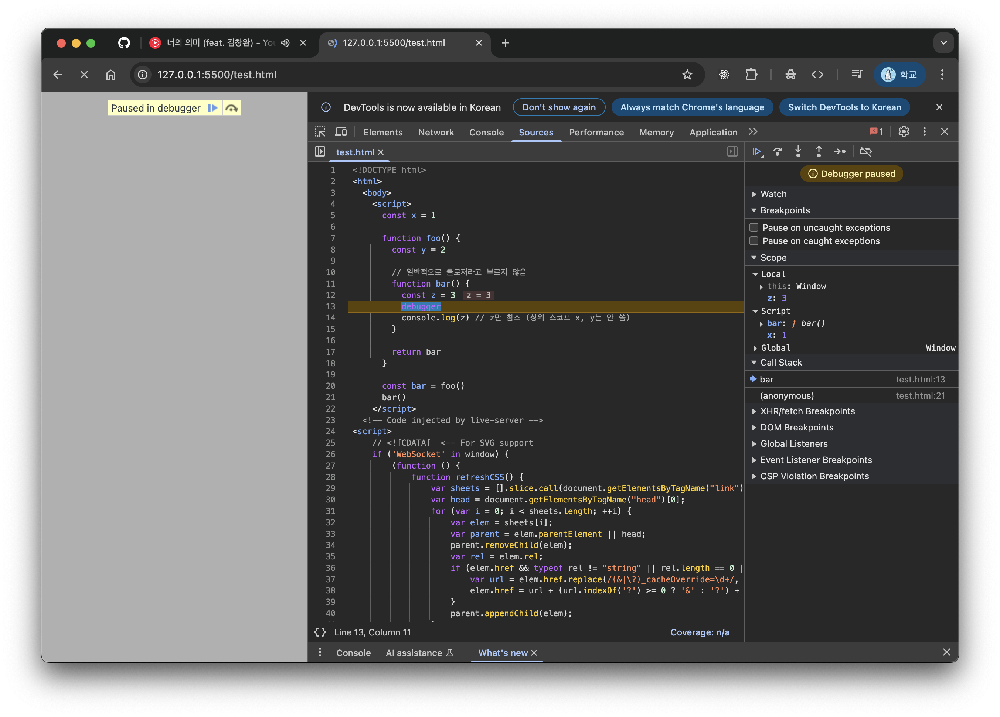

# 1. 클로저란?

> “A closure is the combination of a function and the lexical environment within which that function was declared.”
>
> **함수 + 그 함수가 선언된 시점의 렉시컬 환경(Lexical Environment)**
>
> → 둘의 조합이 “클로저”다.

코드를 보쟈

```jsx
const x = 1

function outerFunc() {
  const x = 10

  function innerFunc() {
    console.log(x) // 10
  }

  innerFunc()
}

outerFunc()
```

innerFunc는 outerFunc 내부에서 정의되었으므로, 상위 스코프는 outerFunc의 렉시컬 환경이고

따라서 innerFunc는 x = 10에 접근이 가능하다!

> 🤓 **요것이 클로저의 기초 지식!**
>
> 내부 함수가 외부 함수의 변수에 접근할 수 있는 것

## 1-2. 렉시컬 스코프는~

함수가 **어디서 정의되었는지**에 따라 스코프가 결정된다.

실행 컨텐스트 관점에서는,

함수가 정의될 때 그 함수는 자신이 정의된 위치의 `L.E`를 기억하고

요것이 `[[Environment]]` 같은 내부 슬롯으로 저장된다.

## 1-3. 스코프 체인과 클로저는~

렉시컬 환경은 서로 단방향의 링크드 리스트처럼 연결돼 있는데

요것 때문에 내부 함수는 외부 함수의 렉시컬 환경을 참조할 수 있는 것이고

이 참조 구조가 클로저의 정체인 것!

## 1-4. **`[[Environment]]` 슬롯이란?**

함수 객체가 생성될 때 자동으로 만들어지는 비공개 내부 슬롯이다.

자신이 정의된 위치의 렉시컬 환경에 대한 참조를 저장하고

나중에 함수가 호출될 때, 이 정보를 바탕으로 상위 스코프를 구성한다.

즉, “함수는 정의될 때 자신이 **어디서 만들어졌는지 기억해야 클로저가 가능하다”는 말은** `[[Environment]]`가 있기 때문에 가능한 이야기인 것!

## 1-5. 함수 실행 시 스코프가 연결되는 방식

1. 함수 호출
2. 함수 실행 컨텍스트 생성
3. 새로운 `L.E` 생성
4. 위 `L.E`의 `외부 참조(Outer L.E)`는 함수의 `[[Environment]]` 슬롯 값을 기반으로 연결

> 🤓 **함수 정의 vs 함수 실행**
>
> - 함수 정의 → `[[Environment]]` 저장
> - 함수 실행 → `[[Environment]]` 를 외부 참조로 복원

> 🤓 **클로저가 발생하는 조건**
>
> 아래 조건을 모두 만족해야 클로저다.
>
> 1. 함수가 자신의 상위 스코프(렉시컬 환경)의 변수를 참조할 것
> 2. 그 함수가 외부 함수보다 오래 살아있을 것

# 2. 클로저와 렉시컬 환경 브라우저에서 직접 확인해보기!

`예시 1` 클로저가 아닌 경우

```jsx
<!DOCTYPE html>
<html>
<body>
<script>
const x = 1;

function foo() {
  const y = 2;

  // 일반적으로 클로저라고 부르지 않음
  function bar() {
    const z = 3;
    debugger;
    console.log(z);    // z만 참조 (상위 스코프 x, y는 안 씀)
  }

  return bar;
}

const bar = foo();
bar();
</script>
</body>
</html>
```



`bar()` 함수 안에서 상위 스코프의 식별자(x, y)를 참조하지 않으므로 클로저가 아니다!

`예시 2` 클로저가 아닌 경우

```jsx
<!DOCTYPE html>
<html>
<body>
<script>
function foo() {
  const x = 1;

  function bar() {
    debugger;
    console.log(x);  // x는 상위 스코프 식별자 (참조함)
  }

  bar();  // 바로 호출하고 끝
}

foo();
</script>
</body>
</html>
```

[화면 기록 2025-06-21 오전 2.03.22.mov](./%E1%84%92%E1%85%AA%E1%84%86%E1%85%A7%E1%86%AB_%E1%84%80%E1%85%B5%E1%84%85%E1%85%A9%E1%86%A8_2025-06-21_%E1%84%8B%E1%85%A9%E1%84%8C%E1%85%A5%E1%86%AB_2.03.22.mov)

`bar`는 `foo`의 `변수 x`를 참조해서 잠시 동안은 클로저지만, 실행되고 바로 사라지므로 클로저라고 부르지는 않는다고 함!

`예시 3` 진짜 클로저!

```jsx
<!DOCTYPE html>
<html>
<body>
<script>
function outer() {
  const secret = '비밀 ㅋㅎㅋ';

  return function inner() {
    debugger;
    console.log(secret);  // outer 스코프 참조
  };
}

const innerFunc = outer();
innerFunc(); // 비밀 ㅋㅎㅋ
</script>
</body>
</html>
```

[화면 기록 2025-06-21 오전 2.14.17.mov](./%E1%84%92%E1%85%AA%E1%84%86%E1%85%A7%E1%86%AB_%E1%84%80%E1%85%B5%E1%84%85%E1%85%A9%E1%86%A8_2025-06-21_%E1%84%8B%E1%85%A9%E1%84%8C%E1%85%A5%E1%86%AB_2.14.17.mov)

`inner`는 `outer`의 지역변수 `secret`을 참조하고

`outer()`가 종료되어도 `secret`을 계속 기억하고 참조하고 있다!

지속적으로 접근 가능한 상태를 유지하므로 클로저라고 할 수 있다능 ~, ~

# 3. 클로저의 활용

클로저는 상태(state)를 안전하게 은닉하고, 특정 함수에서만 변경 가능하도록 만들기 위해 필요하다.

일반적으로 외부에서 직접 접근할 수 없는 private한 상태를 유지하기 위한 용도로 클로저를 사용한다!

**😱 전역 변수 기반 상태 관리의 문제점 😱**

```jsx
// 카운트 상태 변수
let num = 0

// 상태 변경 함수
const increase = function () {
  return ++num
}

console.log(increase()) // 1
console.log(increase()) // 2
console.log(increase()) // 3
```

👉🏻 `num`은 전역 변수이므로 **누구나 접근해서 수정이 가능**한 문제점이 있다.

**🤔 지역 변수로 은닉해보기 🤔**

```jsx
const increase = function () {
  let num = 0 // 지역 변수로 은닉
  return ++num
}

console.log(increase()) // 1
console.log(increase()) // 1
console.log(increase()) // 1
```

👉🏻 num이 호출될 때마다 초기화되고, 이전 상태를 기억하지 못하는 문제점이 있다.

✨ 클로저로 상태 은닉 + 유지 ✨

```jsx
const increase = (function () {
  let num = 0 // 은닉된 private 변수

  // 클로저
  return function () {
    return ++num
  }
})()

console.log(increase()) // 1
console.log(increase()) // 2
console.log(increase()) // 3
```

👉🏻 즉시 실행 함수(IIFE)가 실행되고, `increase` 함수는 `num 변수`를 참조해서 값을 기억, 상태 변경을 할 수 있게 된다.

따라서 클로저를 활용하면

- 외부에서 접근 불가능한 은닉된 상태 관리가 가능하고
- 객체나 생성자 패턴에서도 상태를 보존할 수 있고
- 고차 함수 패턴을 통해 유연한 로직 구성이 가능하다.

- 함수형 프로그래밍에서는 부수 효과 최소화, 상태 불변성 유지를 위해 클로저를 적극 활용한다고 한다!

  > 🤓 **함수형 프로그래밍에서 왜 클로저가 부수효과(side effect)를 줄이고 상태 불변성(immutability)을 도와주지?**
  >
  > 일단 fp(함수형 프로그래밍)은 아래 것들을 원한다!
  >
  > > 1.  입력이 같으면 항상 같은 출력을 내기
  > > 2.  예측 가능하고 순수한 함수 만들기
  > >
  > > 👉🏻 안정적이고 예측 가능한 프로그램 만들기를 목표로 한다.
  > >
  > > 따라서~~ 위에서 말한 클로저의 장점 때문에
  > >
  > > 클로저를 쓰면 함수 밖에서 선언된 상태를 숨기고, 오직 특정 함수만 그 상태를 읽고 바꾸게 제한하므로
  > >
  > > fp에 클로저를 사용하면 외부 상태 차단, 순수성 유지, 상태 유지, 사이드 이펙트 없음 등의 장점이 있다 👍🏻

  ```jsx
  // aux 인자를 통해 함수를 받고
  function makeCounter(aux) {
    let counter = 0

    // 함수를 리턴!
    return function () {
      counter = aux(counter)
      return counter
    }
  }

  // 보조 함수
  function increase(n) {
    return ++n
  }

  function decrease(n) {
    return --n
  }

  const increaser = makeCounter(increase)
  console.log(increaser()) // 1
  console.log(increaser()) // 2

  const decreaser = makeCounter(decrease)
  console.log(decreaser()) // -1
  console.log(decreaser()) // -2
  ```

# 4. 캡슐화와 정보 은닉

캡슐화란, **객체의 상태**와 **해당 상태를 참조/조작할 수 있는 행위**를 하나로 묶는 것이다. ex) 객체의 프로퍼티와 메서드를 하나의 단위로 묶기

정보 은닉이란, 객체의 내부 구현 일부를 외부에 감추는 것이다.

외부로부터 불필요하거나 위험한 접근을 차단하므로, 객체의 상태 보호 및 결합도 감소 효과 등이 있다.

은닉 방법으로는 아래의 것들이 있다.

1. 지역변수를 사용한 정보 은닉

   ```jsx
   function Person(name, age) {
     this.name = name // public
     let _age = age // private

     this.sayHi = function () {
       console.log(`Hi! My name is ${this.name}. I am ${_age}.`)
     }
   }

   const me = new Person('Hazel', 24)
   me.sayHi() // Hi! My name is Hazel. I am 24.
   console.log(me.name) // Lee
   console.log(me._age) // undefined (외부 접근 불가)
   ```

   👉🏻 `sayHi` 메서드가 매 인스턴스마다 중복 생성되어서 메모리 낭비가 발생할 수 있다.

2. 프로토타입 메서드로 변경한 경우

   ```jsx
   function Person(name, age) {
     this.name = name
     let _age = age // private
   }

   Person.prototype.sayHi = function () {
     console.log(`Hi! My name is ${this.name}. I am ${_age}.`)
   }
   ```

   👉🏻 `sayHi`는 `Person의 L.E`를 기억하지 않는다. 그래서 클로저도 아니고, `_age`에 접근이 불가능하다.

3. 즉시 실행 함수로 클로저 환경 유지하기

   ```jsx
   const Person = (function () {
     let _age = 0

     function Person(name, age) {
       this.name = name
       _age = age
     }

     Person.prototype.sayHi = function () {
       console.log(`Hi! My name is ${this.name}. I am ${_age}.`)
     }

     return Person
   })()

   const me = new Person('Hazel', 24)
   me.sayHi() // 24

   const you = new Person('Kim', 10)
   you.sayHi() // 10

   me.sayHi() // 10 <- 값이 바뀌었다!
   ```

   👉🏻 `sayHi`는 클로저로 `_age`에 접근이 가능한데,,. 모든 인스턴스가 하나의 `_age` 값을 공유하게 되는 문제가 있다.

근데 클로저로도 완벽한 정보 은닉은 어려워서 아래와 같은 대안이 존재한다..

🔒 클래스의 private 필드 (#필드) 🔒

```jsx
class Person {
  #age

  constructor(name, age) {
    this.name = name
    this.#age = age
  }

  sayHi() {
    console.log(`Hi! My name is ${this.name}. I am ${this.#age}.`)
  }

  getAge() {
    return this.#age
  }
}

const hazel = new Person('Hazel', 24)
console.log(hazel.getAge()) // 24
```

# 5. 클로저로 인해 발생하는 실수

만약 var로 선언한 변수로 클로저를 만들면..?

```jsx
var funcs = [];

for (var i = 0; i < 3; i++) {
  funcs[i] = function () {
    return i;
  };
}

for (var j = 0; j < funcs.length; j++) {
  console.log(funcs[j]()); // 예상: 0, 1, 2 → 실제: 3, 3, 3

```

var는 **함수 레벨 스코프**를 가지므로 for 루프 안에서 만들어진 함수들은 **동일한 i를 공유**한다.

루프가 끝난 후 `i === 3`이 되고, 클로저는 이 **공유된 i를 참조**하기 때문에 **3이 세 번 출력**된다.

`해결 방법 1` 즉시 실행 함수로 클로저 스코프를 분리한다.

```jsx
var funcs = []

for (var i = 0; i < 3; i++) {
  funcs[i] = (function (id) {
    return function () {
      return id
    }
  })(i) // 현재 i 값을 인자로 전달해 클로저에 고정
}

funcs.forEach((f) => console.log(f())) // 0 1 2
```

(function (id) {...})(i)는 즉시 실행 함수(IIFE)로 현재 i 값을 id에 복사해 클로저 안에 묶어둔다.

각 함수는 자신만의 고유한 상위 스코프(id)를 참조하므로 원하는 결과가 나온다.

`해결 방법 2` ES6 let을 사용한다.

```jsx
const funcs = []

for (let i = 0; i < 3; i++) {
  funcs[i] = function () {
    return i
  }
}

funcs.forEach((f) => console.log(f())) // 0 1 2
```

let은 **블록 레벨 스코프**를 가지므로 **for 루프 반복마다 새로운 i 스코프**가 생성됨

각 함수는 **자신만의 i 값을 클로저로 기억**하게 된다.
