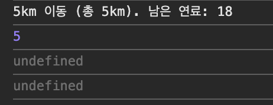

# 1. 클로저

클로저란, 외부 함수가 종료된 후에도 내부 함수가 외부 변수들을 기억하고 참조할 수 있는 것을 의미한다.

```jsx
var outer = function () {
  var a = 1
  var inner = function () {
    return a++
  }
  return inner // 함수 자체를 반환
}

var outer2 = outer() // outer 실행 → inner 반환
console.log(outer2()) // 2
console.log(outer2()) // 3
```

👉🏻 `outer` 함수가 `inner` 함수 자체를 반환했기 때문에 `outer`의 실행 컨텍스트는 종료되어도 `inner`는 살아있게 되고,

`inner`가 a를 참조하고 있으므로 JS의 엔진은 a를 Garbage Collection하지 않음!

[화면 기록 2025-06-21 오후 10.12.40.mov](./%E1%84%92%E1%85%AA%E1%84%86%E1%85%A7%E1%86%AB_%E1%84%80%E1%85%B5%E1%84%85%E1%85%A9%E1%86%A8_2025-06-21_%E1%84%8B%E1%85%A9%E1%84%92%E1%85%AE_10.12.40.mov)

## 1-2. 그럼 클로저는 return이 없으면 안 생길까?

> 🤓 **아니다!! `return`이 없어도 클로저는 발생할 수 있다.**

**클로저 예시 코드 첫 번째**

`setInterval / setTimeout` 의 콜백 함수를 살펴보자

```jsx
;(function () {
  let a = 0
  let intervalId = null

  const inner = function () {
    if (++a > 10) {
      clearInterval(intervalId)
      console.log('끝!', a)
    } else {
      console.log('반복 중...', a)
    }
  }

  intervalId = setInterval(inner, 1000)
})()
```

👉🏻 inner 함수가 a를 사용하고 있는데,

setInterval에 계속 전달되어서 콜백으로 호출되므로

외부 함수의 실행이 끝났어도 inner는 계속 a를 기억하게 된다

**클로저 예시 코드 두 번째**

`addEventListener`의 이벤트 핸들러

```jsx
;(function () {
  let count = 0

  const button = document.createElement('button')
  button.innerText = 'click me'

  button.addEventListener('click', function () {
    console.log(++count, '번 클릭')
  })

  document.body.appendChild(button)
})()
```

👉🏻 click 이벤트에 등록된 익명 함수가 count를 참조한다 이때 클로저가 발생한다.

결론은 뭐냐미연..

클로저란 외부 함수가 종료되었음에도 불구하고, 그 함수의 지역 변수에 접근할 수 있는 내부 함수가 존재해서 그 값이 살아있는 현상~~~~이다.

따라서 반드시 return을 통해 함수가 반환되어야 클로저가 생기는 건 아니고

콜백, 이벤트 리스너, 타이머 등도 클로저의 예시가 될 수 있다!

# 2. 클로저와 메모리 관리

근데 이런 클로저는 메모리를 오래 점유할 수 있어서 의도적으로 해제해야 할 수도 있다.

클로저가 어떤 값을 계속 참조하고 있으면 그 값은 GC(Garbage Collector)의 수거 대상이 안 되고, 그럼 불필요하게 메모리를 차지하게 되는 것!

👉🏻 메모리 누수(leak)이 발생하게 됨

요 문제는 클로저 내부에서 참조하던 값을 `null` 또는 `undefined` 같은 기본형으로 바꿔서 참조를 끊어주면 해결된다.

> 🥲 **메모리 해제에는 `null`을 써야 할까 `undefined`를 써야 할까?**
>
> > `null`은 **의도적으로 없다는 것**을 의미하고, `undefined`는 값이 **아직 정의되지 않음**을 의미하므로
> >
> > 메모리 해제 시에는 null을 주로 사용한다~~

참조를 끊는 예시 코드는 다음과 같다.

```jsx
let outer = (function () {
  let a = 1
  let inner = function () {
    return a
  }
  return inner
})()

console.log(outer()) // 1
console.log(outer()) // 1

// 더 이상 inner 함수가 필요 없다면?
outer = null // 참조를 끊음 → GC 대상이 됨
```

[화면 기록 2025-06-21 오후 10.31.02.mov](./%E1%84%92%E1%85%AA%E1%84%86%E1%85%A7%E1%86%AB_%E1%84%80%E1%85%B5%E1%84%85%E1%85%A9%E1%86%A8_2025-06-21_%E1%84%8B%E1%85%A9%E1%84%92%E1%85%AE_10.31.02.mov)

이렇게 `outer`를 `null`로 바꿔주면 `inner` 함수에 대한 참조가 사라지게 되고, 내부의 `a`도 GC의 대상이 된다.

# 3. 클로저 활용 사례

아까 위에서 본 것처럼 콜백 함수에서도 사용되고,

`bind`로 클로저를 유지하기도 한다.

```jsx
fruits.forEach(function (fruit) {
  var $li = document.createElement('li')
  $li.innerText = fruit
  $li.addEventListener('click', alertFruit.bind(null, fruit)) // ✅ 해결
  $ul.appendChild($li)
})
```

👉🏻 `bind(null, fruit)`은 첫 번째 인자(fruit)를 고정한 새 함수를 만들어주기 때문에 클로저처럼 동작하게 된다!

고차 함수를 이용해서 클로저를 활용하기도 한다.

```jsx
var alertFruitBuilder = function (fruit) {
  return function () {
    alert('your choice is ' + fruit)
  }
}

fruits.forEach(function (fruit) {
  var $li = document.createElement('li')
  $li.innerText = fruit
  $li.addEventListener('click', alertFruitBuilder(fruit))
  $ul.appendChild($li)
})
```

👉🏻 `alertFruitBuilder` 는 함수를 반환하는 고차 함수이고, fruit 값을 받아서 그 값을 기억하는 클로저 함수를 반환한다.

그리고 특정 요소 클릭시 해당 함수가 실행되는데, 자신이 생성될 때 참조했던 fruit을 기억하고 있게 된다.

## 3-1. 접근 권한 제어 (정보 은닉)

정보 은닉 (Information Hiding)은 모듈 내부의 세부 구현을 외부에 감추는 것을 의미한다.

이 방식은 모듈 간의 결합도를 낮추고, 유지보수성과 유연성을 높이는데 도움을 준다.

JS는 클로저를 통해 모듈 내에서만 접근이 가능한 값을 구현할 수 있다!

```jsx
var outer = function () {
  var a = 1 // 외부에 노출시키고 싶지 않은 값 (private)
  var inner = function () {
    return a
  }
  return inner // inner 함수만 외부에 공개
}

var outer2 = outer()
console.log(outer2()) // 1
```

👉🏻 a는 외부에서 직접 접근이 불가능한 변수이므로, 오직 inner를 통해서만 접근이 가능하다! 요것이 바로 정보 은닉~~~~~!

아래 예제 코드로 더 자세히 알아보쟈…

```jsx
var createCar = function () {
  var fuel = Math.ceil(Math.random() * 10 + 10) // 연료 (비공개)
  var power = Math.ceil(Math.random() * 3 + 2) // 연비 (비공개)
  var moved = 0 // 총 이동 거리 (부분 공개)

  return {
    get moved() {
      return moved // moved는 읽기 전용으로 getter만 제공
    },
    run: function () {
      var km = Math.ceil(Math.random() * 6) // 주사위
      var wasteFuel = km / power

      if (fuel < wasteFuel) {
        console.log('이동 불가')
        return
      }

      fuel -= wasteFuel
      moved += km
      console.log(km + 'km 이동 (총 ' + moved + 'km). 남은 연료: ' + fuel)
    },
  }
}

var car = createCar()
```

fuel, power, moved는 모두 **함수 내부의 지역 변수**이므로 외부에서 직접 접근이 불가능한데 moved만 getter로 외부에서 읽기를 허용하게 해주고 있다.

따라서 값을 출력해보면 아래와 같다.

```jsx
car.run() // 정상 실행
console.log(car.moved) // 출력 가능 (getter)
console.log(car.fuel) // undefined (정보 은닉)
console.log(car.power) // undefined
```



근데 run이라는 **메서드**는 외부에서 덮어쓸 수 있어서 완벽한 보호가 안 된다,.

이럴 땐 `Object.freeze`를 사용하면 된다.

요렇게 하면 `run` 메서드가 불변 객체로 보호돼서 덮어쓰기가 불가능하다!

```jsx
var createCar = function () {
  var fuel = Math.ceil(Math.random() * 10 + 10);
  var power = Math.ceil(Math.random() * 3 + 2);
  var moved = 0;

  var publicMembers = {
    get moved() {
      return moved;
    },
    run: function () {
      // 생략!

  Object.freeze(publicMembers);  // 외부 수정 방지
  return publicMembers;
};
```

그래서 클로저를 사용할 땐

1. 내부 함수에서만 접근이 가능한 은닉 변수 사용하기
2. 외부에 접근 권한을 주고자 하는 데이터만 return 하기

등의 접근 권한 제어 방식이 잇따.

# 4. 부분 적용 함수

부분 적용 함수란, n개의 인자를 받는 함수에 대해 일부(m개)의 인자만 먼저 전달해서 기억시켜두고,
나중에 나머지 (n-m)개 인자를 전달하면 실행되는 함수를 만드는 기법이다.

👉🏻 `f(a, b, c) → f(a) → (b, c)를 나중에 채워 넣어서 실행`

## 4-1. bind 메서드를 활용한 부분 적용

```jsx
const add = function () {
  let result = 0
  for (let i = 0; i < arguments.length; i++) {
    result += arguments[i]
  }
  return result
}

const addPartial = add.bind(null, 1, 2, 3, 4, 5) // 앞 인자 고정
console.log(addPartial(6, 7, 8, 9, 10)) // 결과: 55
```


bind는 this를 고정하는 기능이지만, add에서는 this를 사용하지 않으므로 그냥 null로 고정하고 인자만 보내도 된다.

## 4-2. 책에 있는 직접 구현한 함수

예를 들어 아래의 `partial` 함수가 있다.

`partial` 함수의 특징은

첫 번째 인자는 실행할 원본 함수이고,

이후 인자들은 미리 적용할 값이고,

나중에 전달된 인자들과 합쳐서 실행한다.

```jsx
function partial() {
  const originalPartialArgs = arguments
  const func = originalPartialArgs[0]
  if (typeof func !== 'function')
    throw new Error('첫 번째 인자는 함수여야 합니다')

  return function () {
    const partialArgs = Array.prototype.slice.call(originalPartialArgs, 1)
    const restArgs = Array.prototype.slice.call(arguments)
    return func.apply(this, partialArgs.concat(restArgs))
  }
}
```

사용은 아래처럼 할 수 있다!

```jsx
const addPartial = partial(add, 1, 2, 3)
console.log(addPartial(4, 5)) // 15
```

이번에는 빈 칸을 채우는 방식으로 해보자!

미리 고정할 인자 중에 ‘\_\_’을 넣어두고 실행 시점에 그 자리를 동적으로 채워넣는 거시다.

```jsx
function partial2() {
  const originalPartialArgs = arguments
  const func = originalPartialArgs[0]
  if (typeof func !== 'function')
    throw new Error('첫 번째 인자는 함수여야 합니다')

  return function () {
    let partialArgs = Array.prototype.slice.call(originalPartialArgs, 1)
    let restArgs = Array.prototype.slice.call(arguments)

    for (let i = 0; i < partialArgs.length; i++) {
      if (partialArgs[i] === '__') {
        partialArgs[i] = restArgs.shift()
      }
    }

    return func.apply(this, partialArgs.concat(restArgs))
  }
}
```

사용은 아래처럼 할 수 있다!

```jsx
const addPartial = partial2(add, 1, 2, '__', 4, 5, '__', 9)
console.log(addPartial(3, 6, 7, 10)) // 55
```

근데 항상 이렇게 직접 만들기 귀찮고

`bind`는 중간에 빈 칸을 못 만들어서

보통 **lodash**나 **Ramda** 같은 유틸 라이브러리의 `_.partial`을 사용한다고 한다1!

```jsx
import _ from 'lodash'

function greet(greeting, name) {
  return greeting + ' ' + name
}

const sayHiTo = _.partial(greet, 'Hi')
console.log(sayHiTo('Hazel')) // Hi Hazel
```

아무튼 실무에서는 이런 부분 함수를 적용한 예시로 **디바운스**가 있다.

```jsx
var debounce = function (eventName, func, wait) {
  var timeoutId = null

  return function (event) {
    var self = this
    console.log(eventName, 'event 발생!')
    clearTimeout(timeoutId)
    timeoutId = setTimeout(func.bind(self, event), wait)
  }
}

const moveHandler = function (e) {
  console.log('마우스 움직임 처리!')
}

document.body.addEventListener('mousemove', debounce('move', moveHandler, 500))
```

timeoutId는 클로저에 의해 계속 기억되고,

이벤트가 발생할 때마다 기존 타이머를 clearTimeout으로 지운다.

그리고 다시 setTimeout으로 설정해서 결국 마지막 이벤트만 실행이 되는 것!

### 4-2-1. 커링 함수 (Currying Function)

커링이란 여러 개의 인자를 받는 함수를 하나의 인자씩 받는 함수로 쪼개서

차례차례 호출할 수 있도록 만드는 기법이다.

```jsx
// 일반적인 커링 함수
const curry = function (func) {
  return function (a) {
    return function (b) {
      return func(a, b) // 마지막에 원래 함수 실행
    }
  }
}

const getMaxWith10 = curry(Math.max)(10) // 첫 인자 고정
console.log(getMaxWith10(8)) // → 10
console.log(getMaxWith10(25)) // → 25

const getMinWith10 = curry(Math.min)(10)
console.log(getMinWith10(8)) // → 8
console.log(getMinWith10(25)) // → 10
```

한 번에 하나의 인자만 전달하는 게 커링의 원칙이고

마지막 인자가 주어질 때까지는 함수가 실행되지 않는다.

> 🥲 **부분 적용과의 차이점은?**
>
> > 1.  커링은
> >     1.  인자를 하나씩 전달하고
> >     2.  모든 인자가 주어져야 실행된다.
> > 2.  부분적용은
> >     1.  여러 개의 인자도 한 번에 절달할 수 있고
> >     2.  인자의 일부만 주면 바로 실행이 가능하다.

요런식으로 쓸 수도 있는데 인자가 많아질수록 코드가 깊어져서 가독성이 낮아진다.

```jsx
const curry5 = function (func) {
  return function (a) {
    return function (b) {
      return function (c) {
        return function (d) {
          return function (e) {
            return func(a, b, c, d, e)
          }
        }
      }
    }
  }
}

const getMax = curry5(Math.max)
console.log(getMax(1)(2)(3)(4)(5)) // → 5
```

그래서 ES6에서는 화살표 함수로 간단히 표현할 수 있게 됐다!

```jsx
const curry5 = (func) => (a) => (b) => (c) => (d) => (e) => func(a, b, c, d, e)
```

커링에서는 각 단계에서 받은 인자들이 클로저에 의해 메모리에 유지되고, 마지막 함수 호출 후에야 실행 컨텍스트가 종료되고, GC가 한꺼번에 수거한다!

커링 함수는 필요한 정보가 나중에 들어올 수도 있는 상황에 유용하다

당장 넘길 수 있는 정보만 넘기고 나중에 필요한 정보가 들어오면 실행하는 방식인데 이런 방식은 **지연 실행(lazy evaluation)**이라고도 한다.

아래와 같은 상황에서 커링 함수를 쓰면 좋을 것이다 ^\_\_^

1. 실행을 나중에 하고싶을 때
2. 비슷한 함수 호출이 반복될 때
3. 설정 값이 고정되어 있는 경우
