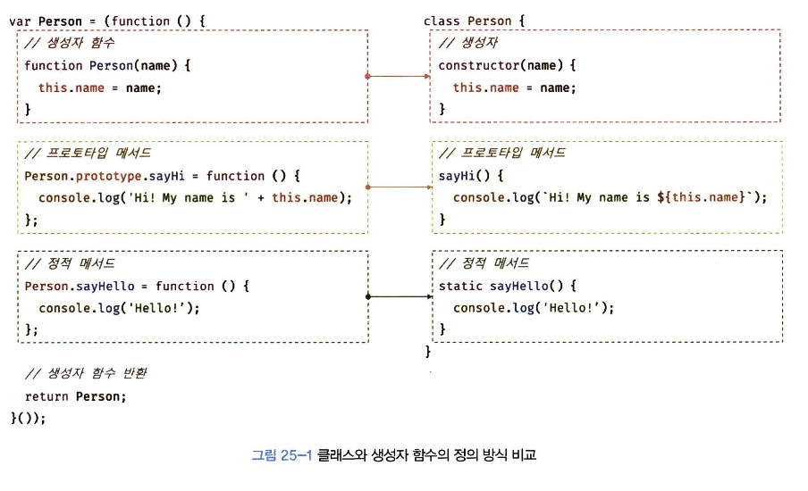
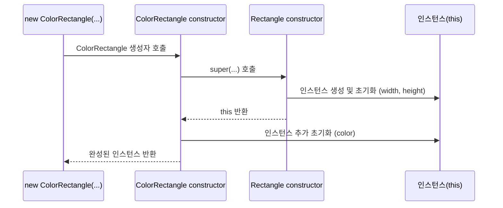

# 1. **클래스는 프로토타입의 문법적 설탕인가?**

JS는 **프로토타입 기반 객체지향 언어**다.

따라서 클래스가 없어도 **생성자 함수 + 프로토타입**으로 객체지향 프로그래밍이 가능하다.

```jsx
// ES5 방식: 생성자 함수와 프로토타입
function Person(name) {
  this.name = name
}
Person.prototype.sayHi = function () {
  console.log('Hi! My name is ' + this.name)
}
const me = new Person('Hazel')
me.sayHi() // Hi! My name is Hazel
```

하지만 클래스 기반 언어에 익숙한 개발자들은 이 방식이 낯설고 어렵게 느껴진다고 하네요 그렇구나 음음!!

그래서 ES6에서 class 문법이 도입되었고 이게 문법적 설탕 같다고 하네욤

> 🥲 **클래스 vs 생성자 함수**
>
> > | **비교 항목**    | **클래스**                                  | **생성자 함수**                   |
> > | ---------------- | ------------------------------------------- | --------------------------------- |
> > | 호출 방식        | new 없이 호출 시 에러                       | new 없이 호출 가능                |
> > | 상속             | extends, super 사용 가능                    | 직접 prototype 체인을 연결해야 함 |
> > | 호이스팅         | **호이스팅되지 않는 것처럼 동작**           | 함수 선언문이면 호이스팅 발생     |
> > | strict mode      | **자동 적용됨 (해제 불가)**                 | 자동 적용되지 않음                |
> > | 메서드 열거 여부 | **열거되지 않음** `([[Enumerable]]: false)` | 기본적으로 열거 가능함            |

결론은! 클래스는 프로토타입 기반을 완전히 대체하는 건 아니고, 기존 방식에 더 직관적인 문법을 제공하는 새로운 객체 생성 메커니즘이다.

# 2. 클래스 정의

`class` 키워드를 사용하여 정의한다.

이름은 일반적으로 PascalCase를 사용한다.

```jsx
// 클래스 선언문
class Person {}
```

클래스 표현식도 가능하다.

```jsx
// 익명 클래스 표현식
const Person = class {}

// 기명 클래스 표현식
const Person = class MyClass {}
```

클래스도 함수처럼 일급 객체로 취급된다.

- 변수에 저장이 가능하다.
- 매개변수로 전달이 가능하다.
- 반환값으로 사용이 가능하다.
- 런타임에 생성할 수 있다.

클래스 구성 요소는 다음과 같다.

```jsx
class Person {
  // 생성자
  constructor(name) {
    this.name = name
  }

  // 프로토타입 메서드
  sayHi() {
    console.log(`Hi! My name is ${this.name}`)
  }

  // 정적 메서드
  static sayHello() {
    console.log('Hello!')
  }
}
```

사용할 땐 요렇게

```jsx
const me = new Person('Hazel')
console.log(me.name) // Hazel
me.sayHi() // Hi! My name is Hazel
Person.sayHello() // Hello!
```

> 🥲 **생성자 함수랑 정의 방식이 어떻게 다른감?**
>
> > 
> >
> > 1.  생성자 함수는
> >     1. 생성자 함수 내부에서 초기화한다.
> >     2. `prototype.method = function` 방식이고
> >     3. 정적 메서드는 `Constructor.func = func~~` 방식이다.
> > 2.  클래스 방식은 1. constructor 메서드 내부에서 초기화된다. 2. 클래스 몸체에 \*\*\*\*프로토타입 메서드를 정의한다. 3. 정적 메서드는 static 키워드를 사용한다.

# 3. 클래스 호이스팅 (클래스는 함수로 평가된다.)

클래스도 사실은 함수다..

```jsx
class Person {}
console.log(typeof Person) // 'function'
```

클래스는 constructor 함수 객체를 생성하며, 프로토타입 객체도 함께 생성된다.

클래스는 호이스팅 된다! 하지만………..

```jsx
console.log(Person) // ReferenceError
class Person {}
```

마치 호이스팅 되지 않는 것처럼 보이쥐만~~

실제로 호이스팅은 일어나고, TDZ에 빠져있어서 에러가 난다.

# 4. 인스턴스 생성

클래스는 생성자 함수이며, new 연산자와 함께 호출되어 인스턴스를 생성한다.

```jsx
class Person {}

const me = new Person()
console.log(me) // Person {}
```

> 🥲 **클래스는 반드시 new를 붙여야 한다!!@!@#!@#!$%5/@%@!!!**

**기명 클래스 표현식(이름이 붙은 클래스 표현식)**의 주의점이 있다.

```jsx
const Person = class MyClass {}

const me = new Person() // 가능
const you = new MyClass() // ReferenceError
```

MyClass는 클래스 표현식 내부에서만 유효한 이름이라서 외부에서는 쓸 수 없음! 외부 식별자인 Person을 쓰쟈~~

# 5. 메서드

클래스 몸체에는 아래 3가지 종류의 메서드만 정리할 수 있다.

1. **constructor**

   인스턴스를 생성하고 초기화하는 메서드 (딱 하나만 가넝)

2. **프로토타입 메서드**

   클래스 인스턴스가 공유하는 메서드 (인스턴스에서 호출 가넝!)

3. **정적 메서드**

   클래스 자체에 속한 메서드 (인스턴스에서 호출 불가넝…)

## 5-1. constructor (생성자)

클래스 인스턴스를 만들 때 자동으로 실행되는 메서드이다.

반드시 이름은 `constructor`여야 함!

```jsx
class Person {
  constructor(name) {
    this.name = name // 인스턴스에 name 프로퍼티를 추가함
  }
}

const me = new Person('Hazel')
console.log(me.name) // "Hazel"
```

요기서 this는 생성 중인 인스턴스를 가리킨다.

> 🥲 **+ 클래스도 함수이다!**
>
> > Person 클래스도 보면 함수 객체처럼 `prototype`, `length`, `name` 등의 프로퍼티가 있고
> >
> > `Person.prototype.constructor === Person` 임을 통해 클래스도 생성자 함수라는 것을 알 수 있다.
> >
> > 

> 🥲 **클래스 필드 정의 제안?**
>
> > 기존에는 클래스 안에 프로퍼티를 직접 정의할 수 없고, 반드시 constructor 안에서만 해야 했는데,
> >
> > ES2020 이후에는 클래스 바깥에서도 필드 선언이 가능해졌다.
> >
> > ```jsx
> > class Person {
> >   name = 'Hazel'
> >   constructor() {}
> > }
> > ```

**constructor는 메서드가 아니다.**

```jsx
class Person {
  constructor(name) {
    this.name = name
  }
}

console.dir(Person) // 함수 객체이며 내부에 constructor 동작 내장
```


메서드처럼 보이지만, 실제로는 함수 객체 코드의 일부로 포함된다!

일반적으로 constructor에서는 return을 생략해야 한다.

생략하면 자동으로 this(인스턴스)를 반환한다.

1. **만약 객체를 반환하면 this가 무시된다.**

   ```jsx
   class Person {
     constructor(name) {
       this.name = name
       return {} // 명시적으로 객체 반환 → this 무시됨
     }
   }
   const me = new Person('Hazel')
   console.log(me) // {}
   ```

1. 원시값을 반환하면 무시되고 this가 반환된다.

   ```jsx
   class Person {
     constructor(name) {
       this.name = name
       return 100 // 원시값은 무시됨
     }
   }
   const me = new Person('Hazel')
   console.log(me) // Person { name: 'Hazel' }
   ```

constructor는 생략할 수도 있다.

다만 프로퍼티 초기화가 필요하다면 생략하면 안 된다.’

```jsx
class Person {}
// 위는 아래와 동일함
class Person {
  constructor() {}
}
```

### 5-1-1. 프로퍼티 초기화 방법

1. 고정값으로 초기화

   ```jsx
   class Person {
     constructor() {
       this.name = 'Hazel'
       this.address = 'Geonggi'
     }
   }
   const me = new Person()
   console.log(me) // Person { name: 'Hazel', address: 'Geonggi' }
   ```

2. 매개변수로 초기화

   ```jsx
   class Person {
     constructor(name, address) {
       this.name = name
       this.address = address
     }
   }
   const me = new Person('Hazel', 'Geonggi')
   console.log(me) // Person { name: 'Hazel', address: 'Geonggi' }
   ```

## 5-2. 프로토타입 메서드

생성자 함수에서는 메서드를 직접 프로토타입에 추가해야 한다.

```jsx
function Person(name) {
  this.name = name
}

// 프로토타입 메서드 추가
Person.prototype.sayHi = function () {
  console.log(`Hi! My name is ${this.name}`)
}

const me = new Person('Hazel')
me.sayHi() // Hi! My name is Hazel
```

그란데! 클래스 방식에서는 몸체에 정의한 메서드가 자동으로 프로토타입에 추가된다.

```jsx
class Person {
  constructor(name) {
    this.name = name
  }

  // 이 메서드는 자동으로 Person.prototype에 저장됨
  sayHi() {
    console.log(`Hi! My name is ${this.name}`)
  }
}

const me = new Person('Hazel')
me.sayHi() // Hi! My name is Hazel
```


Person 클래스의 프로토타입 체인

## 5-3. 정적 메서드 (static)

정적 메서드란, 인스턴스를 생성하지 않고도 클래스에서 직접 호출할 수 있는 메서드이다.

클래스 자체에 바인딩되며 인스턴스에서는 접근이 불가능하다!

```jsx
class Person {
  constructor(name) {
    this.name = name
  }

  // static 키워드를 붙이면 된다
  static sayHi() {
    console.log('Hi!')
  }
}

Person.sayHi() // Hi!
```


Person 클래스의 프로토타입 체인

## 5-4. 프로토타입 메서드 vs 정적 메서드

1. **정적 메서드 (static)**

   - 클래스 자체에 바인딩되는 메서드이다.
   - **인스턴스를 생성하지 않아도** 클래스에서 직접 호출이 가능하다.
   - **인스턴스의 프로퍼티나 상태를 참조하지 않는다.**

   ```jsx
   class Square {
     static area(width, height) {
       return width * height
     }
   }

   console.log(Square.area(10, 10)) // 100
   ```

1. **프로토타입 메서드**

   - 생성된 **인스턴스의 프로토타입**에 존재한다.
   - **인스턴스를 통해 호출**해야 하며, 인스턴스의 프로퍼티에 접근할 수 있다.

   ```jsx
   class Square {
     constructor(width, height) {
       this.width = width
       this.height = height
     }

     area() {
       return this.width * this.height
     }
   }

   const square = new Square(10, 10)
   console.log(square.area()) // 100
   ```

두 메서드는 뚜렷한 차이가 있기 때문에

this를 사용해서 인스턴스의 상태에 접근해야 한다면 → 프로토타입 메서드

인스턴스 상태와 관계없는 유틸리티 함수라면 → 정적 메서드

를 사용하는 것이 조타 ^\_\_^

자주 사용되는 정적 메소드들은 아래와 같은데

요런 메서드들은 클래스/생성자 함수를 일종의 네임스페이스처럼 사용하는 효과도 있다!

이름의 충돌도 피하고, 관련 기능을 묶어서 구조화할 수도 있기 때문이다.

```jsx
Math.max(1, 2, 3) // → 3
Number.isNaN(NaN) // → true
JSON.stringify({ a: 1 }) // → "{"a":1}"
Object.is({}, {}) // → false
Reflect.has({ a: 1 }, 'a') // → true
```

## 5-5. 클래스에서 정의한 메서드의 특징

1. function 키워드 생략

   클래스 내부 메서드는 function 키워드 없이 정의한다.

2. 콤마 필요 없음

   객체 리터럴과 달리 메서드 사이에 쉼표가 필요하지 않다.

3. strict mode 자동 적용

   클래스는 기본적으로 strict mode에서 동작한다.

4. 열거되지 않음

   `for...in, Object.keys()` 등으로 클래스 메서드는 열거되지 않음 → `[[Enumerable]]: false`

5. 생성자로 사용 불가

   클래스 내부 메서드는 `[[Construct]]` 내부 메서드가 없어 new로 호출 불가능함

클래스 안의 메서드는 깔끔하게 정의되지만, new로 직접 만들거나 반복문에 뜨거나 하진 않는다.

# 6. 클래스의 인스턴스 생성 과정

1. **인스턴스 생성 및 this 바인딩**

   new로 클래스를 호출하면

   빈 객체가 하나 만들어지고, this에 바인딩된다.

   이 빈 객체의 내부 `[[Prototype]]`은 `Class.prototype`을 참조하게 된다.

   ```jsx
   console.log(Object.getPrototypeOf(this) === Person.prototype) // true
   ```

2. **인스턴스 초기화**

   `constructor` 내부에서 `this.name = name` 등으로 초기화 작업이 수행된다.

3. **인스턴스 반환**

   this가 자동으로 반환된다. (명시적으로 안 해줘도 됨!)

```jsx
class Person {
  constructor(name) {
    console.log(this) // Person {}
    console.log(Object.getPrototypeOf(this) === Person.prototype) // true

    this.name = name
  }
}

const me = new Person('Hazel')
// 생성자 동작 완료 -> me는 name이 'Hazel'인 Person 인스턴스
```


# 7. 인스턴스 프로퍼티

인스턴스 프로퍼티란, 각 인스턴스에 고유하게 존재하는 값이다.

반드시 클래스의 constructor 내부에서 this를 통해 정의해야 한다.

```jsx
class Person {
  constructor(name) {
    // 인스턴스 프로퍼티
    this.name = name
  }
}

const me = new Person('Hazel')
console.log(me) // Person { name: 'Hazel' }
console.log(me.name) // Hazel
```

> 🥲 ES6 기준, 항상 public이며 이 외에도 private, protected 같은 키워드로 관리할 수 있다.
>
> 이때 완전한 private를 위해서는 #name 같은 private 피드 제안을 써야 한다.

## 7-1. 접근자 프로퍼티 (Accessor Property)

접근자 프로퍼티는 값을 직접 가지고 있지 않고 get, set 함수로 동작하는 프로퍼티임!

```jsx
class Person {
  constructor(firstName, lastName) {
    this.firstName = firstName
    this.lastName = lastName
  }

  // getter
  get fullName() {
    return `${this.firstName} ${this.lastName}`
  }

  // setter
  set fullName(name) {
    ;[this.firstName, this.lastName] = name.split(' ')
  }
}

const me = new Person('Heejin', 'Park')
console.log(me.fullName) // "Heejin Park"
me.fullName = 'Hazel Park' // setter 호출
console.log(me.firstName) // "Hazel"
console.log(me.lastName) // "Park"
```

getter에는 매개변수가 없어야 하고, setter에는 딱 1개만 있어야 하는 특징이 있다.

실제로 얘네는 값을 저장하지 않는다.

**사용하는 이유는?**

1. 파생된 값을 만들고 싶을 때
2. 값이 설정될 때 추가 로직이 필요할 때 ex) 유효성 검사 등
3. 감춰진 데이터와 외부의 인터페이스를 분리하고 싶을 때

## 7-2. 클래스 필드 정의 제안 (Class Fields)

클래스 필드란, 클래스가 생성할 인스턴스의 프로퍼티를 의미한다.

원래 JS에서는 반드시 constructor 안에서 this.필드로 정의해야 했음

```jsx
class Person {
  constructor(name) {
    this.name = name // 인스턴스 프로퍼티 정의
  }
}
```

근데 아까 앞에서 말한 개발자들이 불편해해서 쑐ㄹㅏ숄라의 이유로 인해

JS도 클래스 필드를 클래스 몸체에 쓸 수 있게 되었다.

```jsx
class Person {
  name = 'Hazel' // 클래스 필드 정의 (stage 3)
}

const me = new Person()
console.log(me) // Person {name: "Hazel"}
```


**TC39의 stage 3**에 올라와 있고 대부분 표준화되었다고 한다.

> 🥲 **TC39가 뭐지**
>
> > 자바스크립트는 국제 표준인 **ECMAScript(ECMA-262)**를 기반으로 만들어졌다.
> >
> > 이 **ECMAScript**는 그냥 한 번에 기능을 추가하는 게 아니라, **TC39**라는 위원회에서 기능을 단계별로 **심사하고 실험하면서** 정한다!
> >
> > 
> >
> > [🔗 tc39](https://tc39.es/process-document/)

**[특징 1] 주의할 점은 다음과 같다.**

1. 클래스 몸체에서는 this를 사용할 수 없다.

   ```jsx
   class Person {
     // this.name = 'Hazel'; SyntaxError 발생
   }
   ```

2. 클래스 필드를 참조할 땐 반드시 this가 필요하다.

   ```jsx
   class Person {
     name = 'Hazel'

     constructor() {
       console.log(name) // ReferenceError
       console.log(this.name) // "Hazel"
     }
   }

   const me = new Person()
   console.log(me)
   ```

3. 초기화하지 않으면 undefined가 뜬다.

   ```jsx
   class Person {
     name // 초기화 안 하면 undefined
   }

   const me = new Person()
   console.log(me.name) // undefined
   ```

4. 외부에서 받은 값으로 초기화하려면 constructor를 써야한다.

   ```jsx
   class Person {
     name

     constructor(name) {
       this.name = name
     }
   }

   const me = new Person('Hazel')
   console.log(me.name) // "Hazel"
   ```

**[특징 2]** 클래스 필드는 굳이 추가하지 않아도 된다.

```jsx
class Person {
  constructor(name) {
    this.name = name
  }
}

const p = new Person('Hazel')
console.log(p) // Person { name: 'Hazel' }
```

이렇게 외부에서 초기값을 받아서 사용하면 `this.name = …` 할때 자동으로 name 필드가 추가된다.

**[특징 3]** 클래스 필드에 함수도 할당할 수 있다.

```jsx
class Person {
  name = 'Hazel'

  // 일반 함수 표현식
  getName = function () {
    return this.name
  }

  // 또는 화살표 함수로
  // getName = () => this.name;
}

const me = new Person()
console.log(me.getName()) // Hazel
```

근데 이렇게 하면 getName은 인스턴스 메서드가 되므로

인스턴스마다 메모리를 따로 사용하게 되어서 과도한 메모리를 사용하게 될 수도 있다.

그래서 일반적으로 메서드는 클래스 몸체에 프로토타입 메서드로 정의하는 게 권장된다.

> 🥲 **인스턴스 메서드 vs 프로토타입 메서드**
>
> > **1. 인스턴스 메서드**
> >
> > ```jsx
> > class Person {
> >   getName = function () {
> >     return this.name
> >   }
> > }
> >
> > const a = new Person()
> > const b = new Person()
> >
> > console.log(a.getName === b.getName) // false
> > ```
> >
> > a와 b는 각각 자신만의 `getName` 함수를 갖는다.
> >
> > **2. 프로토타입 메서드**
> >
> > ```jsx
> > class Person {
> >   getName() {
> >     return this.name
> >   }
> > }
> >
> > const a = new Person()
> > const b = new Person()
> >
> > console.log(a.getName === b.getName) // true
> > ```
> >
> > 클래스의 prototype에 저장되어서 모든 인스턴스가 하나의 `getName` 함수를 공유한다.

**[특징 4] 화살표 함수로 이벤트 핸들러 정의하기 (this 문제 해결)**

```jsx
class App {
  constructor() {
    this.$button = document.querySelector('.btn')
    this.count = 0

    // 화살표 함수는 상위 스코프의 this(App 인스턴스)를 가리킴
    this.$button.onclick = this.increase
  }

  // 이벤트 핸들러를 화살표 함수로 만들면 this가 안전하게 인스턴스를 가리킴
  increase = () => {
    this.$button.textContent = ++this.count
  }
}
new App()
```

일반 메서드였으면 bind 써서 this 바인딩을 했을텐데 이런 방식을 스면 이벤트 핸들러에서 this 문제를 피할 수 있다 ^**\_**^

## 7-3. private 필드 정의 제안

JS는 기본적으로 public만 지원한다.

그리고 클래스 바깥에서도 자유롭게 인스턴스 프로퍼티 접근이 가능하다.

그래서 새로운 문법으로 #을 붙인 private 필드가 나왔다.

```jsx
class Person {
  #name = ''

  constructor(name) {
    this.#name = name
  }

  get name() {
    return this.#name.trim()
  }
}

const me = new Person(' Hazel ')
console.log(me.name) // "Hazel"
console.log(me.#name) // SyntaxError
```

반드시 클래스 몸체에서 `#name = 초기값` 형태로 정의해야 한다.

접근하고 싶으면 `getter/setter` 를 제공해야 한다!

## 7-4. static 필드 정의 제안

static 필드란, 클래스 자체에 직접 속하는 프로퍼티이다.

따라서 인스턴스에선 접근할 수 없다!

```jsx
class MyMath {
  // static public 필드
  static PI = 22 / 7

  // static private 필드
  static #num = 10

  // static 메서드 (정적 메서드)
  static increment() {
    return ++MyMath.#num
  }
}

// 클래스명.필드명 으로 접근
console.log(MyMath.PI) // 3.142857142857143
console.log(MyMath.increment()) // 11

// 인스턴스에서는 접근 불가
const math = new MyMath()
console.log(math.PI) // undefined
```

모든 인스턴스가 공유해야 할 값이 있을 때,

인스턴스 없이도 사용할 수 있는 유틸리티 메서드와 함께 사용할 때,

상수나 설정 값을 저장할 때 사용할 수 있다!

# 8. 상속에 의한 클래스 확장

## 8-1. 클래스 상속 (extends 키워드 사용)

클래스 기반 객체지향처럼 기존 클래스를 확장하여 새로운 클래스를 정의할 수 있다.

```jsx
class Animal {
  constructor(age, weight) {
    this.age = age
    this.weight = weight
  }
  eat() {
    return 'eat'
  }
  move() {
    return 'move'
  }
}

// Animal 클래스를 상속한 Bird 클래스
class Bird extends Animal {
  fly() {
    return 'fly'
  }
}

const bird = new Bird(1, 5)
console.log(bird.age) // 1
console.log(bird.weight) // 5
console.log(bird.eat()) // eat
console.log(bird.move()) // move
console.log(bird.fly()) // fly

console.log(bird instanceof Bird) // true
console.log(bird instanceof Animal) // true
```

클래스 도입 이전에는 생성자 함수로 상속을 흉내내기도 했는데, 현재는 지양한다.

```jsx
// 부모 생성자 함수
function Animal(age, weight) {
  this.age = age
  this.weight = weight
}
Animal.prototype.eat = function () {
  return 'eat'
}
Animal.prototype.move = function () {
  return 'move'
}

// 자식 생성자 함수
function Bird(age, weight) {
  Animal.call(this, age, weight) // super 역할
}
Bird.prototype = Object.create(Animal.prototype)
Bird.prototype.constructor = Bird

Bird.prototype.fly = function () {
  return 'fly'
}

const bird = new Bird(1, 5)
console.log(bird.eat()) // eat
console.log(bird.move()) // move
console.log(bird.fly()) // fly
```

😱 코드가 길고 복잡하고,,,, 프로토타입 체인도 직접 연결해야 하고, call/apply로 부모 생성자를 불러야 하고 이만저만 귀찮고 꾸지다!!

## 8-2. extends 키워드

extends 키워드는 상속할 때 사용하는 키워드로, 기존 클래스를 확장하여 새로운 클래스를 만들 수 있게 해준다.

인스턴스의 프로토타입 체인을 구성하고, 클래스 간의 정적 메서드와 프로토타입 메서드 모두 상속이 가능하다.

```jsx
// 부모 클래스 (수퍼 클래스 / 베이스 클래스)
class Base {}

// 자식 클래스 (서브 클래스 / 파생 클래스)
class Derived extends Base {}
```

- **수퍼클래스 (super class)**
  `= 베이스 클래스(base class) = 부모 클래스(parent class)`
  상속되는 클래스
- **서브클래스 (sub class)**
  `파생 클래스(derived class) = 자식 클래스(child class)`
  상속하는 클래스

## 8-3. 동적 상속

클래스 뿐만 아니라 생성자 함수도 상속이 가능하다.

```jsx
function Base(a) {
  this.a = a
}

class Derived extends Base {}

const d = new Derived(1)
console.log(d) // Derived { a: 1 }
```

`extends` 뒤에는 조건에 따라 평가되는 표현식도 올 수 있다.

단, 해당 표현식은 `[[Construct]]` 메서드를 가진 생성자 함수여야 한다.

```jsx
function Base1() {}
class Base2 {}

let condition = true

// 조건에 따라 상속할 대상을 다르게 선택
class Derived extends (condition ? Base1 : Base2) {}

const d = new Derived()

console.log(d instanceof Base1) // true
console.log(d instanceof Base2) // false
```

## 8-4. 서브클래스의 constructor

`constructor`를 생략하면 기본 생성자가 자동으로 정의된다.

```jsx
class Base {}
// 내부적으로 아래와 같음
class Base {
  constructor() {}
}
```

서브클래스에서 constructor를 생략하면 아래와 같이 자동으로 정의된다.

```jsx
class Derived extends Base {}
// 내부적으로 아래와 같음
class Derived extends Base {
  constructor(...args) {
    super(...args)
  }
}
```

서브클래스에서 constructor를 직접 정의했다면 반드시 super()를 호출해야 한다.

```jsx
class Derived extends Base {
  constructor() {
    // super()를 호출하지 않으면 ReferenceError 에러가 발생한다,.,.
    super() // 수퍼클래스 constructor 호출
  }
}
```

## 8-5. super

`super()`는 슈퍼클래스의 constructor(생성자)를 호출한다.

```jsx
class Parent {
  constructor(name) {
    this.name = name
  }
}

class Child extends Parent {
  constructor(name) {
    super(name) // 반드시 super 먼저 호출
    this.age = 24
  }
}
```

`super.method()`는 슈퍼클래스의 메서드를 호출할 때 사용한다.

```jsx
class Parent {
  sayHi() {
    return 'Hi'
  }
}

class Child extends Parent {
  sayHi() {
    return `${super.sayHi()}, how are you doing?`
  }
}

const c = new Child()
console.log(c.sayHi()) // "Hi, how are you doing?"
```

**다만 예외 상황들도 있다.**

1. `super()`는 서브클래스의 constructor 안에서만 호출할 수 있다.
2. 일반 함수나 슈퍼클래스의 constructor 안에서는 사용할 수 없다.

   ```jsx
   class Base {
     constructor() {
       super() // SyntaxError
     }
   }

   function Foo() {
     super() // SyntaxError
   }
   ```

3. 객체 리터럴에서도 사용이 가능하다!

   ```jsx
   const base = {
     sayHi() {
       return 'Hi'
     },
   }

   const derived = {
     __proto__: base,
     sayHi() {
       return `${super.sayHi()}, how are you doing?`
     },
   }

   console.log(derived.sayHi()) // Hi, how are you doing?
   ```

## 8-6. 상속 클래스의 인스턴스 생성 과정

1. **서브클래스 constructor가 호출됨**

   ```jsx
   new ColorRectangle(2, 4, 'red')
   ```

2. **서브클래스 constructor 내부에서 `super(...)` 호출**

   ```jsx
   super(width, height)
   ```

   부모 클래스 Rectangle의 `constructor`가 실행됨

   이 시점 이전에는 this에 접근할 수 없음 (접근 시 에러)

3. **부모 클래스 constructor 내부에서 인스턴스 생성 및 초기화**

   ```jsx
   constructor(width, height) {
     this.width = width;
     this.height = height;
   }
   ```

   여기서 암묵적으로 빈 객체가 생성되고 this에 바인딩됨
   전달된 인수로 초기화 진행

4. **(선택) super() 끝난 후, 서브클래스에서 추가 초기화 진행**

   부모가 만든 this에 서브클래스만의 속성을 추가함

5. 완성된 인스턴스가 암묵적으로 반환됨



## 8-7. 표준 빌트인 생성자 함수 확장

JS에서 표준 빌트인 객체를 상속해서 확장할 때 생기는 메서드 체이닝 이슈와 그 해결법에 대해 알아보쟈

**Array를 extends로 상속받은 클래스**

```jsx
class MyArray extends Array {
  uniq() {
    // 중복 제거: 자기 앞에 처음 등장한 인덱스만 통과
    return this.filter((v, i, self) => self.indexOf(v) === i)
  }

  average() {
    // 배열 요소의 합계를 구하고, 전체 개수로 나누어 평균을 구함
    return this.reduce((a, b) => a + b, 0) / this.length
  }
}
```

Array를 상속한 MyArray는 `filter`, `map` 같은 메서드를 써도 **MyArray 인스턴스가 반환**돼서 **연달아 MyArray의 메서드를 호출할 수 있다.**

```jsx
const arr = new MyArray(1, 1, 2, 3)

// 단계별로 설명
const oddOnly = arr.filter((v) => v % 2) // 홀수만: [1, 1, 3]
const unique = oddOnly.uniq() // 중복 제거: [1, 3]
const avg = unique.average() // 평균: (1 + 3) / 2 = 2
console.log(avg) // 2

// or
// arr.filter(v => v % 2).uniq().average(); // 2
```

그런데 만약 반환 타입을 Array로 바꾸고 싶다면??

MyArray의 내부 구현은 숨기고, 결과만 평범한 배열로 주고싶을 수도 있음!

요럴 때 **`Symbol.species`** 를 쓰면 된닷

```jsx
class MyArray extends Array {
  static get [Symbol.species]() {
    return Array // 이 클래스로부터 파생된 메서드(filter 등)는 Array 인스턴스를 반환함
  }

  uniq() {
    return this.filter((v, i, self) => self.indexOf(v) === i)
  }

  average() {
    return this.reduce((a, b) => a + b, 0) / this.length
  }
}
```

```jsx
const arr = new MyArray(1, 1, 2, 3)
console.log(arr.uniq() instanceof MyArray) // false
console.log(arr.uniq() instanceof Array) // true
```


