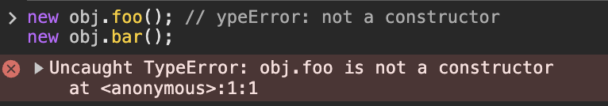

# 26장 - ES6 함수의 추가 기능

주차: 7주차, ModernJS

# 1. 함수의 구분

### ES6 이전 함수의 특징

모든 함수는 **callable (호출 가능)**하면서 **constructor (생성자 호출 가능)**했다.

하나의 함수로 다양한 용도로 사용할 수 있었다.

→ 유연하지만, 명확하지 않고 실수를 유발할 수 있음

생성자 호출이 아닌 함수에도 prototype 객체가 생겨 메모리 낭비가 발생할 수 있다.

### 그래서 ES6에서는 함수의 용도에 따라 다음 세 가지로 함수를 명확히 구분한다.

| **종류**        | **constructor** | **prototype** | **super** | **arguments** |
| --------------- | --------------- | ------------- | --------- | ------------- |
| **일반 함수**   | O               | O             | X         | O             |
| **메서드**      | X               | X             | O         | X             |
| **화살표 함수** | X               | X             | X         | X             |

1. 일반 함수 (Normal Function)

   선언문 또는 표현식으로 정의한다.

   `constructor`를 호출하여 new를 사용할 수 있다.

2. 메서드 (Method)

   객체의 프로퍼티에 축약 메서드 형식으로 정의한다.

   `constructor` 호출이 불가능하다.

   `suepr` 키워드를 사용할 수 있다.

   ```jsx
   const obj = {
     method() {
       console.log('메서드')
     },
   }
   ```

3. 화살표 함수 (Arrow Function)

   `function` 키워드 없이 `⇒` 로 정의한다.

   this를 바인딩하지 않는다.

   `arguments, super, new` 모두 사용할 수 없다.

   ```jsx
   const arrow = () => {
     console.log('화살표 함슈')
   }
   ```

# 2. 메서드

### ES6 이전의 메서드 개념은

개념이 없었다!

단순히 객체에 바인딩된 함수를 의미했는데 일반 함수랑 동일하게 작동해서 new로도 생성자 호출이 가능했다.

### ES6에서는

메서드 축약 표현으로 정의된 함수만 진짜 메서드로 인정한다.

```jsx
const obj = {
  // ES6 메서드
  foo() {
    return this.x
  },

  // 일반 함수 (ES6 메서드 아님)
  bar: function () {
    return this.x
  },
}
```

foo는 메서드이기 때문에 constructor를 호출할 수 없다.

```jsx
new obj.foo() // ypeError: not a constructor
new obj.bar()
```



foo는 메서드이기 때문에 prototype 프로퍼티가 존재하지 않는다.

```jsx
console.log(obj.foo.hasOwnProperty('prototype')) // false
console.log(obj.bar.hasOwnProperty('prototype')) // true
```


> 🥲 **표준 빌트인 객체의 메서드도 `non-constructor` 이다.!**
>
> > ```jsx
> > console.log(String.prototype.toUpperCase.prototype) // undefined
> > console.log(Array.prototype.map.prototype) // undefined
> > console.log(Number.isFinite.prototype) // undefined
> > ```
> >
> > 

ES6 메서드는 `[[HomeObject]] (어디에 바인딩되어 있는지 추적 가능)` 를 가진다.

따라서 super 키워드를 사용할 수 있다!

```jsx
const base = {
  name: 'Hazel',
  sayHi() {
    return `Hi! ${this.name}`
  },
}

const derived = {
  __proto__: base,
  sayHi() {
    return `${super.sayHi()}. how are you doing?`
  },
}

console.log(derived)
console.log(derived.sayHi())
```


# 3. 화살표 함수 (Arrow Function)

화살표 함수는 function 키워드 대신 “⇒” 를 사용하는 간결한 함수 표현식이다.

문법은 다음과 같다.

```jsx
// 기본 형태
const add = (a, b) => a + b

// 매개변수가 하나면 괄호 생략 가능
const square = (x) => x * x

// 매개변수가 없으면 괄호 필수
const greet = () => 'Hi'

// 중괄호가 있으면 return 필요
const sum = (a, b) => {
  const result = a + b
  return result
}
```

> 🥲 **객체를 반환할 땐 소괄호로 감싸야 한다!**
>
> > ```jsx
> > // 올바른 객체 반환
> > const create = (id, name) => ({ id, name })
> >
> > // 중괄호를 함수 블록으로 오해함
> > const wrong = (id, name) => {
> >   id, name
> > } // undefined
> > ```

## 3-1. 화살표 함수 vs 일반 함수

요약하자면 다음과 같다………. 다 안 된대 뭐야

| **항목**                  | **화살표 함수** | **일반 함수** |
| ------------------------- | --------------- | ------------- |
| **this 바인딩**           | X               | O             |
| **arguments 객체**        | X               | O             |
| **super, new.target**     | X               | O             |
| **생성자 사용 가능 여부** | X               | O             |
| **prototype 존재 여부**   | X               | O             |
| **중복 매개변수 허용**    | X               | O             |

따라서 화살표 함수는 “상위 스포크의 문맥을 그대로 따르는” 가볍고 안전한 함수이다~~~!

## 3-2. this

화살표 함수는 자신만의 this를 갖지 않고

자신이 정의된 상위 스코프의 this를 참조하는데, 이를 `Lexical this` 라고 한다.

```jsx
const obj = {
  name: 'Lexical',
  sayLater() {
    setTimeout(() => {
      console.log(this.name) // 'Lexical' 출력
    }, 1000)
  },
}

obj.sayLater()
```


일반 함수는 호출 방식에 따라 this가 동적으로 바인딩된다.

따라서 클래스 내부 메서드에서 콜백으로 쓰면 문제가 발생함!

그래서~~ 화살표 함수를 쓰게 된 거고

this 문제를 간결하게 해결할 수 있게 되었다!

> 🥲 **그럼 원래 this 바인딩 문제를 해결하기 위해 쓰던 `call`, `bind`, `apply`를 화살표 함수에 쓰면 어떻게 되남?**
>
> > 작동은 하는데 넘기는 this는 무시된다!
> >
> > ```jsx
> > const arrow = () => this.x
> > arrow.call({ x: 10 }) // 여전히 상위 스코프의 this를 사용
> > ```

> 🥲 **전역에서 화살표 함수를 쓰면?**
>
> > 화살표 함수의 this는 전역 객체를 가리키게 된다.

## 3-3. 화살표 함수를 쓰면 안 되는 경우는?

1. 객체의 메서드로 사용할 때

   ```jsx
   const person = {
     name: 'Hazel',
     sayHi: () => console.log(`Hi ${this.name}`),
   }

   person.sayHi() // Hi undefined
   ```

   

   👉🏻 this가 전역 객체를 가리킴

2. 프로토타입 메서드 정의할 때

   ```jsx
   function Person(name) {
     this.name = name
   }
   Person.prototype.sayHi = () => console.log(`Hi ${this.name}`)

   const p = new Person('Hazel')
   p.sayHi() // Hi undefined
   ```

   👉🏻 this가 전역 객체를 가리킴

3. this가 필요한 메서드는 일반 함수 또는 ES6 메서드로 정의할 것

   ```jsx
   const person = {
     name: 'Hazel',
     sayHi() {
       console.log(`Hi ${this.name}`)
     },
   }
   person.sayHi()
   ```

## 3-4. super

super는 부모 클래스의 메서드에 접근할 때 사용하는 키워드이기 때문에

화살표 함수 내부에서 사용하면 this처럼 상위 스코프에서 super를 찾게 된다!

근데 화살표 함수에서 super를 사용하면 에러가 안 나도, 의도와 다르게 코드가 동작할 수 있어서 ES6 메서드 문법을 사용하는 게 좋다!

```jsx
class Base {
  constructor(name) {
    this.name = name
  }
  sayHi() {
    return `Hi! ${this.name}`
  }
}

class Derived extends Base {
  // 화살표 함수는 함수 자체의 super 바인딩이 없음
  sayHi = () => `${super.sayHi()} how are you doing?`
}

const derived = new Derived('Hazel')
console.log(derived.sayHi()) // Hi! Hazel how are you doing?
```


## 3-5. arguments

화살표 함수는 자체적인 `arguments` 바인딩을 갖지 않는다.

그래서 내부에서 `arguments`를 참조하면 상위 스코프의 `arguments`를 참조한다.

만약 상위 스코프에도 `arguments`가 없으면 `ReferenceError`가 발생하게 된다.

`예제 1` 즉시 실행 함수(IIFE) 내부에서 화살표 함수를 사용하면?

```jsx
;(function () {
  const foo = () => console.log(arguments)
  foo(3, 4) // [Arguments] { '0': 1, '1': 2 }
})(1, 2)
```


`예제 2` 전역에서 화살표 함수를 사용하면?

```jsx
const foo = () => console.log(arguments)
foo(1, 2) // ReferenceError: arguments is not defined
```


그래서 화살표 함수에서 가변 인자를 다뤄야 한다면!
`…args` 를 사용해야 한다.

→ Rest 파라미터!

```jsx
const foo = (...args) => {
  console.log(args) // [1, 2, 3]
}
foo(1, 2, 3)
```


> 🥲 **그럼 드는 궁금증….**
>
> > 1.  화살표 함수에서 정해진 인자를 전달할 때는 …args 안 써도 되는가?
> >
> >     당연! 그냥 매개변수로 선언해서 사용하면 된다.
> >
> > 2.  꼭 args가 이름이어야 하나?
> >
> >     아님! Rest 파라미터 문법만 붙어있으면 된다.
> >
> > 3.  그럼 Rest 파라미터로 받은 값은 어디에 저장되나?
> >
> >     진짜 배열 객체로 저장된다.

# 4. Rest 파라미터

Rest 파라미터는 `... 세 개의 점 + 매개변수` 이름 이다.
전달된 나머지 인수들을 배열로 모아준다.

```jsx
function foo(...rest) {
  console.log(rest) // [1, 2, 3, 4, 5]
}
foo(1, 2, 3, 4, 5)
```

일반 매개변수와 함께 쓰면

먼저 온 매개변수 먼저 채워지고, 나머지가 rest로 처리된다.

rest는 항상 마지막에 위치해야 한다!

```jsx
function bar(a, b, ...rest) {
  console.log(a) // 1
  console.log(b) // 2
  console.log(rest) // [3, 4, 5]
}
bar(1, 2, 3, 4, 5)
```

그리고 함수의 length에는 영향을 주지 않는다.

length는 rest 파라미터 앞까지의 매개변수 길이만 처리한다.

```jsx
function foo(...args) {}
console.log(foo.length) // 0

function bar(a, ...args) {}
console.log(bar.length) // 1

function baz(a, b, ...args) {}
console.log(baz.length) // 2
```

# 5. 매개변수 기본값 정리

1. JS 함수는 인수 개수를 체크하지 않는다.

   ```jsx
   function sum(x, y) {
     return x + y
   }

   sum(1) // NaN → y는 undefined이기 때문
   ```

   👉🏻 에러는 안 나는데 값이 이상해짐

2. ES6 이전에는 방어 코드로 기본값을 설정했는데, 이후에는 매개변수 기본값 문법이 적용되었다.

   👇🏻 ES6 이전

   ```jsx
   function sum(x, y) {
     x = x || 0
     y = y || 0
     return x + y
   }
   ```

   👇🏻 ES6 이후

   ```jsx
   function sum(x = 0, y = 0) {
     return x + y
   }

   sum(1, 2) // 3
   sum(1) // 1 (y는 기본값 0)
   sum() // 0
   ```

3. undefined는 기본값으로 처리된다.

   ```jsx
   function logName(name = 'Hazel') {
     console.log(name)
   }

   logName() // Hazel
   logName(undefined) // Hazel
   logName(null) // null ← 기본값 적용 X
   ```

4. Rest 파라미터에는 기본값이 설정되지 않는다.

   ```jsx
   function foo(...rest = []) {
     // SyntaxError: Rest parameter may not have a default initializer
   }
   ```
