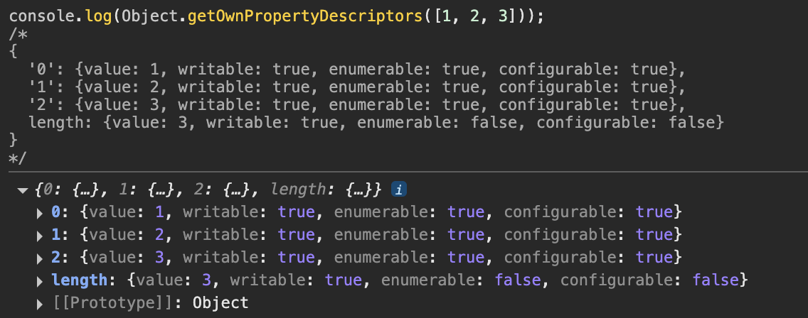

# 1. 배열이란?

배열(array)은 여러 개의 값을 순차적으로 나열한 자료구조이다.

JS의 모든 값은 배열의 요소(element)가 될 수 있으며, 요소는 0 이상의 정수인 인덱스(index)를 가진다.

인덱스는 배열의 요소에 접근할 때 사용하며, 인덱스는 0부터 시작!

**`예제 1` 배열 리터럴로 배열 생성**

```jsx
const arr = ['apple', 'banana', 'orange']
```

배열은 인덱스를 통해 효율적으로 요소에 접근할 수 있지만,

**정렬되지 않은 배열**에서 특정 요소를 검색하는 경우

**선형 검색(linear search)**을 해야 하므로 비효율적이다.

⏰ `시간 복잡도 O(n)`

> 🤓 **선형 검색이 왜 비효율적인가?**
>
> > 아래는 선형 검색 함수를 간단히 구현한 것이다.
> >
> > ```jsx
> > function linearSearch(array, target) {
> >   const length = array.length
> >
> >   for (let i = 0; i < length; i++) {
> >     if (array[i] === target) return i
> >   }
> >   return -1
> > }
> >
> > console.log(linearSearch([1, 2, 3, 4, 5, 6], 3)) // 2
> > console.log(linearSearch([1, 2, 3, 4, 5, 6], 0)) // -1
> > ```
> >
> > 선형 검색을 할 경우 배열에 요소를 삽입하거나 삭제할 때,
> >
> > 요소를 연속적으로 유지하기 위해 요소를 이동해야 하는 단점이 있기 때문ㅔ
> >
> > 비효율적인 거시다!!!

JS의 배열은 일반적인 배열과 다르다!

배열의 요소를 위한 각각의 메모리 공간이 동일한 크기를 갖지 않아도 되고,

연속적으로 이어져 있지 않을 수도 있다.

이런 경우를 **희소 배열(sparse array)**이라고 한다.

배열은 인덱스를 나타내는 문자열을 프로퍼티 키로 가지고

`length 프로퍼티`를 갖는 특수한 객체이다.

## 1-1. 배열은 특수한 객체이다.

```jsx
console.log(Object.getOwnPropertyDescriptors([1, 2, 3]))
/*
{
  '0': {value: 1, writable: true, enumerable: true, configurable: true},
  '1': {value: 2, writable: true, enumerable: true, configurable: true},
  '2': {value: 3, writable: true, enumerable: true, configurable: true},
  length: {value: 3, writable: true, enumerable: false, configurable: false}
}
*/
```



JS에서 사용할 수 있는 모든 값은 객체의 프로퍼티 값이 될 수 있다.

따라서 어떤 타입의 값이라도 배열의 요소가 될 수 있다.

### 1-1-1. 다양한 타입의 요소를 가질 수 있는 배열

```jsx
const arr = [
  'string',
  10,
  true,
  null,
  undefined,
  NaN,
  Infinity,
  [],
  {},
  function () {},
]
```


> 🤓 **일반적인 배열과 JS 배열의 장단점은 뭘까남?**
>
> > 1.  일반적인 배열은
> >
> >     인덱스로 요소에 빠르게 접근할 수 있지만,
> >
> >     요소를 삽입 또는 삭제하는 경우 비효율적이다.
> >
> > 2.  JS 배열은
> >
> >     해시 테이블로 구현된 **객체이므로**, 인덱스로 요소에 접근하는 경우에 일반적인 배열보다 성능이 느릴 수 있지만
> >
> >     요소를 삽입 또는 삭제하는 경우엔 더 빠른 성능을 나타낼 수도 있다!

## 1-2. 배열과 객체의 성능 비교

```jsx
const MAX = 10_000_000 // 1천만

const arr = []
console.time('Array Test')
for (let i = 0; i < MAX; i++) {
  arr.push(i)
}
console.timeEnd('Array Test') // 더 빠를 것임!

const obj = {}
console.time('Object Test')
for (let i = 0; i < MAX; i++) {
  obj[i] = i
}
console.timeEnd('Object Test') // 객체라 더 늦을 거임 ㄱ-..
```

[화면 기록 2025-06-26 오후 6.33.05.mov](./%E1%84%92%E1%85%AA%E1%84%86%E1%85%A7%E1%86%AB_%E1%84%80%E1%85%B5%E1%84%85%E1%85%A9%E1%86%A8_2025-06-26_%E1%84%8B%E1%85%A9%E1%84%92%E1%85%AE_6.33.05.mov)

## 1-3. length 프로퍼티와 희소 배열

`length` 프로퍼티는 요소의 개수, 즉 배열의 길이를 나타내는 0 이상의 정수를 값으로 가진다.

빈 배열일 경우 0이며, 빈 배열이 아닐 경우 가장 큰 인덱스에 1을 더한 것과 가트다.

```jsx
;[].length // -> 0
;[1, 2, 3].length // -> 3
```

> 🤓 `length` 프로퍼티의 값은 0 이상 2^32-1 미만의 양의 정수이다.

`length` 값은 배열에 값을 추가하거나 삭제하면 자동으로 갱신된다.

임의의 값을 명시적으로 할당할 수도 있다.

현재 length 프로퍼티 값보다 작은 숫자 값을 할당하면 배열의 길이가 줄어든다.

```jsx
const arr = [1, 2, 3, 4, 5]
console.log(arr) // [1, 2, 3, 4, 5]
arr.length = 3
console.log(arr) // [1, 2, 3]
```


> 🤓 현재 `length` 프로퍼티 값보다 큰 숫자를 할당하면 `length` 프로퍼티 값은 변경되지만, 실제로 배열의 길이가 늘어나진 않는다.

### 1-3-1. 희소 배열의 프로퍼티 디스크립터

```jsx
const arr = [1]
arr.length = 3
console.log(Object.getOwnPropertyDescriptors(arr))
/*
{
  '0': {value: 1, writable: true, enumerable: true, configurable: true},
  length: {value: 3, writable: true, enumerable: false, configurable: false}
}
*/
```


희소 배열은 배열의 요소가 연속적으로 위치하지 않고 **일부가 비어 있는 배열**이다. 따라서 희소 배열의 `length`는 실제 요소 개수와 일치하지 않고, 실제 요소 개수보다 항상 크다.

JS는 문법적으로 희소 배열을 허용하지만, 사용하지 않는 것이 좋다.

희소 배열은 연속적인 집합이라는 배열의 기본적인 개념과 맞지 않고,

성능에도 좋지 않은 영향을 준다.

배열을 생성할 땐 희소 배열을 생성하지 않도록 주의하고, 같은 타입의 요소를 연속적으로 위치시키는 것이 좋음!

# 2. 배열 생성

배열을 생성하는 방법은 다양하지만, 가장 일반적/간편한 방식은 배열 리터럴을 쓰는 것이다.

## 2-1. 배열 리터럴

0개 이상의 요소를 쉼표로 구분하여 대괄호([])로 묶는다.

```jsx
const arr = [1, 2, 3]
console.log(arr.length) // 3
```

> 🤓 배열 리터럴에 요소를 생략하면 희소 배열이 생긴다!
>
> > ```jsx
> > const arr = [1, , 3] // 희소 배열
> > console.log(arr.length) // 3
> > console.log(arr) // [1, empty, 3]
> > console.log(arr[1]) // undefined
> > ```
> >
> > 

## 2-2. Array 생성자 함수

`Object` 생성자 함수를 통해 객체를 생성할 수 있듯이 `Array` 생성자 함수를 통해 배열을 생성할 수도 있다.

`Array` 생성자 함수는 전달된 인수의 개수에 따라 다르게 동작하므로 주의해야 한다.

1. **유효한 경우**

   ```jsx
   const arr = new Array(10)
   console.log(arr) // [empty x 10]
   console.log(arr.length) // 10
   console.log(Object.getOwnPropertyDescriptors(arr))
   ```

   

1. **유효하지 않은 경우 (유효하지 않은 인수)**

   ```jsx
   // 배열은 요소를 최대 4,294,967,295개 가질 수 있다.
   new Array(4294967295)

   // 전달된 인수가 0~4,294,967,295를 벗어나면 RangeError가 발생한다.
   new Array(4294967296) // RangeError: Invalid array length

   // 전달된 인수가 음수이면 에러가 발생한다.
   new Array(-1) // RangeError: Invalid array length
   ```

   

1. 유효하지 않은 경우 (인수 없음)

   ```jsx
   new Array() // []
   ```

   빈 배열을 생성한다.

1. 유효하지 않은 경우 (인수 2개 이상 or 숫자가 아닌 경우)

   ```jsx
   // 전달된 인수가 2개 이상이면 인수를 요소로 갖는 배열을 생성한다.
   new Array(1, 2, 3) // -> [1, 2, 3]

   // 전달된 인수가 1개지만 숫자가 아니면 인수를 요소로 갖는 배열을 생성한다.
   new Array({}) // -> [{}]
   ```

   

1. 유효하지 않은 경우 (new 없이 호출)

   ```jsx
   Array(1, 2, 3) // -> [1, 2, 3]
   ```

   new 없이 호출해도 배열을 생성하는 생성자 함수로 동작한다.

## 2-3. Array.of

ES6에서 도입된 `Array.of` 메서드는 전달된 인수를 요소로 갖는 배열을 생성한다.

`Array.of`는 `Array` 생성자 함수와 다르게 전달된 인수가 1개이고 숫자이더라도 인수를 요소로 갖는 배열을 생성한다.

```jsx
// 전달된 인수가 1개이고 숫자이더라도 인수를 요소로 갖는 배열을 생성한다.
Array.of(1) // -> [1]
Array.of(1, 2, 3) // -> [1, 2, 3]
Array.of('string') // -> ['string']
```

## 2-4. Array.from

ES6에서 도입된 `Array.from` 메서드는 **유사 배열 객체(array-like object)**

또는 **이터러블 객체(iterable object)**를 인수로 전달받아 배열로 변환하여 반환한다.

```jsx
// 유사 배열 객체를 변환하여 배열을 생성한다.
Array.from({ length: 2, 0: 'a', 1: 'b' }) // -> ['a', 'b']

// 이터러블을 변환하여 배열을 생성한다. 문자열은 이터러블이다.
Array.from('Hello') // -> ['H', 'e', 'l', 'l', 'o']
```

`Array.from` 메서드는 두 번째 인수로 전달한 콜백 함수를 통해 값을 만들면서 요소를 채울 수 있다.

```jsx
// Array.from에 length만 존재하는 유사 배열 객체를 전달하면 undefined를 요소로 채운다.
Array.from({ length: 3 }) // -> [undefined, undefined, undefined]

// Array.from에 두 번째 인수로 전달한 콜백 함수의 반환값으로 구성된 배열을 반환한다.
Array.from({ length: 3 }, (_, i) => i) // -> [0, 1, 2]
```

# 3. 배열 요소의 참조

배열의 요소를 참조할 때는 대괄호([]) 표기법을 사용할 수 있다.

대괄호 안에는 인덱스가 와야 한다.

존재하지 않는 요소에 접근하면 `undefined`가 반환된다. (희소 배열에서도 동일하다.)

```jsx
const arr = [1, 2]

console.log(arr[0]) // 1

console.log(arr[1]) // 2

console.log(arr[2]) // undefined
```


# 4. 배열 요소의 추가와 갱신

배열에도 요소를 동적으로 추가할 수 있다.

존재하지 않는 인덱스를 사용해 값을 할당하면 새로운 요소가 추가되며, 이때 `length` 프로퍼티 값은 자동 갱신된다.

```jsx
const arr = [0]
// 배열 요소의 추가
arr[1] = 1
console.log(arr) // [0, 1]
console.log(arr.length) // 2
```


이미 요소가 존재하는 요소에 값을 재할당하면 요소값은 갱신된다 크아아악

```jsx
// 요소 값의 갱신
arr[1] = 10
console.log(arr) // [0, 10, empty x 98, 100]
```


## 4-1. 유효하지 않은 인덱스 사용

인덱스는 요소의 위치를 나타내므로 반드시 0 이상의 정수를 사용해야 한다.

만약 정수 이외의 값을 인덱스처럼 사용하면 요소가 생성되는 것이 아니라 프로퍼티가 생성된다.

이때 추가된 프로퍼티는 `length` 프로퍼티 값에 영향을 주지 않는다.

```jsx
const arr = []
// 배열 요소의 추가
arr[0] = 1
arr['1'] = 2

// 프로퍼티 추가
arr['foo'] = 3
arr.bar = 4
arr[1.1] = 5
arr[-1] = 6
console.log(arr) // [1, 2, foo: 3, bar: 4, '1.1': 5, '-1': 6]
// 프로퍼티는 length에 영향을 주지 않는다.
console.log(arr.length) // 2
```


# 5. 배열 요소의 삭제

배열은 객체이기 때문에 배열의 특정 요소를 삭제하려면 delete 연산자를 쓰면 된다.

```jsx
const arr = [1, 2, 3]
// 배열 요소의 삭제
delete arr[1]
console.log(arr) // [1, empty, 3]
// length 프로퍼티에 영향을 주지 않는다. 즉, 희소 배열이 된다.
console.log(arr.length) // 3
```


위 예제의 `delete arr[1]`은 `arr`에서 프로퍼티 키가 `'1'`인 프로퍼티를 삭제한다.

이때 배열은 희소 배열이 되며 `length` 프로퍼티 값은 변하지 않는다!

따라서 희소 배열을 만드는 delete 연산자는 안 쓰는 게 좋다.

> 🤓 **그럼 delete 대신 뭘 쓰나?**
>
> > `Array.prototype.splice` 메서드를 쓰면 된다!
> >
> > ```jsx
> > const arr = [1, 2, 3]
> > // Array.prototype.splice(삭제를 시작할 인덱스, 삭제할 요소 수)
> > // arr[1]부터 1개의 요소를 제거
> > arr.splice(1, 1)
> > console.log(arr) // [1, 3]
> > // length 프로퍼티가 자동 갱신된다.
> > console.log(arr.length) // 2
> > ```
> >
> > 

# 6. 배열 메서드

배열을 다룰 때 유용한 빌트인 메서드들이 있다.

Array 생성자 함수는 정적 메서드를 제공하며,

배열 객체의 프로토타입인 `Array.prototype`은 프로토타입 메서드를 제공한다.

> 🤓 **배열 메서드가 반환하는 결과물은 패턴이 두 개다!!**
>
> > 1.  원본 배열을 **직접 변경**하는 메서드 (mutator method) `push`
> > 2.  원본 배열을 직접 변경하지 않고, **새로운 배열을 생성**하여 반환하는 메서드 (accessor method) `concat`

ES6부터 도입된 배열 메서드는 대부분 원본 배열을 직접 변경하지 않지만,

초창기 배열 메서드는 원본 배열을 직접 변경하는 경우가 많다.

이러한 경우에는 사이드 이펙트가 있을 수 있으므로 주의해야 한다!

## 6-1. Array.isArray

`Array` 생성자 함수의 정적 메서드이다.

전달된 인수가 배열이면 `true`, 배열이 아니면 `false`를 반환한다.

```jsx
// true
Array.isArray([])
Array.isArray([1, 2])
Array.isArray(new Array())

// false
Array.isArray()
Array.isArray({})
Array.isArray(null)
Array.isArray(undefined)
Array.isArray(1)
Array.isArray('Array')
Array.isArray(true)
Array.isArray(false)
Array.isArray({ 0: 1, length: 1 })
```

## 6-2. Array.prototype.indexOf

원본 배열에서 인수로 전달된 요소를 **검색**하여 인덱스를 반환한다.

중복되는 요소가 여러 개 있다면 첫 번째로 검색된 요소의 인덱스를 반환한다.

원본 배열에 인수로 전달된 요소가 존재하지 않으면 -1을 반환한다.

```jsx
const arr = [1, 2, 2, 3]
// 배열 arr에서 요소 2를 검색하여 첫 번째로 검색된 요소의 인덱스를 반환한다.
console.log(arr.indexOf(2)) // -> 1
// 배열 arr에 요소 4가 없으므로 -1을 반환한다.
console.log(arr.indexOf(4)) // -> -1
// 두 번째 인수는 검색을 시작할 인덱스다. 두 번째 인수를 생략하면 처음부터 검색한다.
console.log(arr.indexOf(2, 2)) // -> 2
```


> 🤓 **ES7에서는 `Array.prototype.includes` 메서드가 나왔다능**
>
> > ES6에서는 👇🏻
> >
> > ```jsx
> > const foods = ['apple', 'banana', 'orange']
> > // foods 배열에 'orange' 요소가 존재하는지 확인한다.
> > if (foods.indexOf('orange') === -1) {
> >   // foods 배열에 'orange' 요소가 존재하지 않으면 'orange' 요소를 추가한다.
> >   foods.push('orange')
> > }
> > console.log(foods) // ["apple", "banana", "orange"]
> > ```
> >
> > ES7에서는 👇🏻
> >
> > 훠ㄹ씬 가독성 좋다 야호
> >
> > ```jsx
> > const foods = ['apple', 'banana', 'orange']
> > // foods 배열에 'orange' 요소가 존재하는지 확인한다.
> > if (!foods.includes('orange')) {
> >   // foods 배열에 'orange' 요소가 존재하지 않으면 'orange' 요소를 추가한다.
> >   foods.push('orange')
> > }
> > console.log(foods) // ["apple", "banana", "orange"]
> > ```

## 6-3. Array.prototype.push

인수로 전달받은 모든 값을 원본 배열의 마지막 요소로 추가하고 변경된 `length` 프로퍼티 값을 반환한다.

🤓 원본 배열을 직접 변경한다.

```jsx
const arr = [1, 2]
// 인수로 전달받은 모든 값을 원본 배열 arr의 마지막 요소로 추가하고 변경된 length 값을 반환한다.
let result = arr.push(3, 4)
console.log(result) // 4
// push 메서드는 원본 배열을 직접 변경한다.
console.log(arr) // [1, 2, 3, 4]
```

> 🤓 **`push` 메서드는 성능면에서 좋지 않다!** 마지막에 추가할 요소가 하나뿐이라면 `length` 프로퍼티를 사용해서 요소를 **직접 추가하는 게 더 빠르다.**
>
> > ```jsx
> > const iterations = 1000000
> >
> > // push 테스트
> > const arr1 = []
> > console.time('push')
> > for (let i = 0; i < iterations; i++) {
> >   arr1.push(i)
> > }
> > console.timeEnd('push')
> >
> > // length 직접 할당 테스트
> > const arr2 = []
> > console.time('length')
> > for (let i = 0; i < iterations; i++) {
> >   arr2[arr2.length] = i
> > }
> > console.timeEnd('length')
> > ```
> >
> > 

push 함수는 원본 배열을 직접 변경하는 사이드 이펙트가 있어서 이런 속도 차이가 나는 것인데

또 만약 추가할 요소가 여러 개라면! 스프레드 문법을 사용하는 것이 좋다.

사이드 이펙트가 없다. 🤓

```jsx
const arr = [1, 2]
// ES6 스프레드 문법
const newArr = [...arr, 3]
console.log(newArr) // [1, 2, 3]
```

## 6-4. Array.prototype.pop

원본 배열에서 마지막 요소를 제거하고 제거한 요소를 반환한다.

원본 배열이 빈 배열이면 `undefined`를 반환한다.

`pop` 메서드는 원본 배열을 직접 변경한다.

```jsx
const arr = [1, 2]
// 원본 배열에서 마지막 요소를 제거하고 제거한 요소를 반환한다.
let result = arr.pop()
console.log(result) // 2
// pop 메서드는 원본 배열을 직접 변경한다.
console.log(arr) // [1]
```

> 🤓 **pop 메서드와 push 메서드를 사용하면 LIFO 구조의 스택을 쉽게 구현할 수 있다?!**
>
> > ```jsx
> > const Stack = (function () {
> >   function Stack(array = []) {
> >     if (!Array.isArray(array)) {
> >       throw new TypeError(`${array} is not an array.`)
> >     }
> >     this.array = array
> >   }
> >
> >   Stack.prototype = {
> >     constructor: Stack,
> >     // 스택의 가장 마지막에 데이터를 밀어 넣는다.
> >     push(value) {
> >       return this.array.push(value)
> >     },
> >     // 스택의 가장 마지막 데이터, 즉 가장 나중에 밀어 넣은 최신 데이터를 꺼낸다.
> >     pop() {
> >       return this.array.pop()
> >     },
> >     // 스택의 복사본 배열을 반환한다.
> >     entries() {
> >       return [...this.array]
> >     },
> >   }
> >   return Stack
> > })()
> >
> > const stack = new Stack([1, 2])
> > console.log(stack.entries()) // [1, 2]
> > stack.push(3)
> > console.log(stack.entries()) // [1, 2, 3]
> > stack.pop()
> > console.log(stack.entries()) // [1, 2]
> > ```

## 6-5. Array.prototype.unshift

인수로 전달받은 모든 값을 원본 배열의 선두에 요소로 추가하고

변경된 `length` 프로퍼티 값을 반환한다.

`unshift` 메서드는 원본 배열을 직접 변경한다.

```jsx
const arr = [1, 2]
// 인수로 전달받은 모든 값을 원본 배열의 선두에 요소로 추가하고 변경된 length 값을 반환한다.
let result = arr.unshift(3, 4)
console.log(result) // 4
// unshift 메서드는 원본 배열을 직접 변경한다.
console.log(arr) // [3, 4, 1, 2]
```

unshift 메서드도 원본 배열을 직접 변경하기 때문에 사이드 이펙트가 있고

따라서 ES6의 스프레드 문법을 사용하는 편이 좋다.

```jsx
const arr = [1, 2]
// ES6 스프레드 문법
const newArr = [3, ...arr]
console.log(newArr) // [3, 1, 2]
```

## 6-6. Array.prototype.shift

원본 배열에서 첫 번째 요소를 제거하고 제거한 요소를 반환한다.

원본 배열이 빈 배열이면 `undefined`를 반환한다.

`shift` 메서드는 원본 배열을 직접 변경한다.

```jsx
const arr = [1, 2]
// 원본 배열에서 첫 번째 요소를 제거하고 제거한 요소를 반환한다.
let result = arr.shift()
console.log(result) // 1
// shift 메서드는 원본 배열을 직접 변경한다.
console.log(arr) // [2]
```

> 🤓 **shift 메서드와 push 메서드를 활용하여 FIFO 구조의 큐를 쉽게 구현할 수 있다?!?!!**
>
> > ```jsx
> > const Queue = (function () {
> >   function Queue(array = []) {
> >     if (!Array.isArray(array)) {
> >       throw new TypeError(`${array} is not an array.`)
> >     }
> >     this.array = array
> >   }
> >
> >   Queue.prototype = {
> >     constructor: Queue,
> >     // 큐의 가장 마지막에 데이터를 밀어 넣는다.
> >     enqueue(value) {
> >       return this.array.push(value)
> >     },
> >     // 큐의 가장 처음 데이터, 즉 가장 먼저 밀어 넣은 데이터를 꺼낸다.
> >     dequeue() {
> >       return this.array.shift()
> >     },
> >     // 큐의 복사본 배열을 반환한다.
> >     entries() {
> >       return [...this.array]
> >     },
> >   }
> >   return Queue
> > })()
> >
> > const queue = new Queue([1, 2])
> > console.log(queue.entries()) // [1, 2]
> > queue.enqueue(3)
> > console.log(queue.entries()) // [1, 2, 3]
> > queue.dequeue()
> > console.log(queue.entries()) // [2, 3]
> > ```

## 6-6. Array.prototype.concat

인수로 전달된 값들(배열 또는 원시값)을 원본 배열의 마지막 요소로 추가한 새로운 배열을 반환한다.

인수로 전달한 값이 배열인 경우 배열을 해체하여 새로운 배열의 요소로 추가한다.

원본 배열은 변경되지 않는다!

```jsx
const arr1 = [1, 2]
const arr2 = [3, 4]
// 배열 arr2를 원본 배열 arr1의 마지막에 추가한 새로운 배열을 반환한다.
// 인수로 전달한 값이 배열인 경우 배열을 해체하여 새로운 배열의 요소로 추가한다.
let result = arr1.concat(arr2)
console.log(result) // [1, 2, 3, 4]
// 숫자를 원본 배열 arr1의 마지막 요소로 추가한 새로운 배열을 반환한다.
result = arr1.concat(3, 4)
console.log(result) // [1, 2, 3, 4]
```
