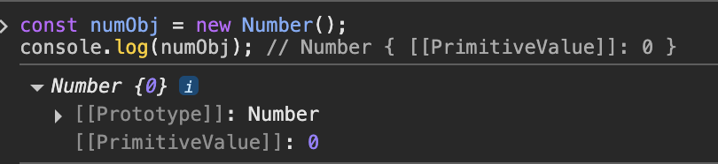

# 28장 - Number

주차: 7주차, ModernJS

# 1. Number 객체 정리

Number는 표준 빌트인 객체이며, 숫자와 관련된 유용한 프로퍼티/메서드를 제공한다.

생성자 함수로 동작하며, new 연산자와 함께 호출하면 Number 래퍼 객체를 반환한다.

1. 생성자로 사용하면 `[[NumberData]]` 내부 슬롯에 기본값 0이 들어간다.
    
    ```jsx
    const numObj = new Number();
    console.log(numObj); // Number { [[PrimitiveValue]]: 0 }
    ```
    
    
    

1. 생성자에 매개변수도 전달하면 인수를 숫자로 변환한 후, 내부 슬롯에 저장한다.
    
    ```jsx
    const numObj = new Number(10);
    console.log(numObj); 
    
    const numObj2 = new Number("90");
    console.log(numObj2); 
            
    const numObj3 = new Number("Hello");     
    console.log(numObj3); 
    ```
    
    
    
2. 그냥 객체 호출 시 (`Number()`) 그냥 숫자 값을 반환한다.
    
    ```jsx
    Number("0");      // 0
    Number("-1");     // -1
    Number("10.53");  // 10.53
    Number(true);     // 1
    Number(false);    // 0
    ```
    

# 2. 자주 쓰이는 정적 프로퍼티

1. **Number.EPSILON**
    
    값으로는 약 `2.220446049250313e-16` 을 가지며
    
    부동소수점 오차를 비교할 때 사용한다.
    
    ```jsx
    0.1 + 0.2 === 0.3;         // false
    0.1 + 0.2;                 // 0.30000000000000004
    
    // 오차 허용 함수
    function isEqual(a, b) {
      return Math.abs(a - b) < Number.EPSILON;
    }
    
    isEqual(0.1 + 0.2, 0.3);   // true
    ```
    

1. **Number.MAX_VALUE**
JS에서 표현 가능한 가장 큰 양수이다.
    
    값으로는 약 `1.7976931348623157e+308` 을 가진다.
    
    ```jsx
    Number.MAX_VALUE;           // 1.7976931348623157e+308
    Infinity > Number.MAX_VALUE; // true
    ```
    

1. **Number.MIN_VALUE**
JS에서 표현 가능한 가장 작은 양수이다.
    
    값으로는 약 5e-324 를 가진다.
    
    ```jsx
    Number.MIN_VALUE;     // 5e-324
    Number.MIN_VALUE > 0; // true
    ```
    

1. **Number.MAX_SAFE_INTEGER**
    
    JS에서 정확하게 표현 가능한 최대 정수이다.
    
    값으로는 약 `9007199254740991 (2^53 - 1)` 을 가진다.
    
    ```jsx
    Number.MAX_SAFE_INTEGER; // 9007199254740991
    ```
    

**5. Number.MIN_SAFE_INTEGER**

JS에서 정확하게 표현 가능한 최소 정수이다.

값으로는 약 `-9007199254740991 (-(2^53 - 1))` 을 가진다.

```jsx
Number.MIN_SAFE_INTEGER; // -9007199254740991
```

1. **Number.POSITIVE_INFINITY**
    
    **양의 무한대** (Infinity) 값과 동일하다.
    
    ```jsx
    Number.POSITIVE_INFINITY; // Infinity
    ```
    
2. **Number.NEGATIVE_INFINITY**
    
    음의 무한대 (-Infinity) 값과 동일하다.
    
    ```jsx
    Number.NEGATIVE_INFINITY; // -Infinity
    ```
    
3. **Number.NaN**
숫자가 아님을 나타내는 값이다.
    
    ```jsx
    Number.NaN; // NaN
    ```
    

# 3. 자주 쓰는 정적 메서드

1. **Number.isFinite(value)**
    
    전달된 값이 유한한 수인지 검사한다.
    
    Infinity, -Infinity, NaN은 false
    
    ```jsx
    Number.isFinite(10);          // true
    Number.isFinite(Infinity);    // false
    Number.isFinite('10');        // false
    
    isFinite('10');               // true (전역 함수는 변환함)
    ```
    

1. **Number.isInteger(value)**
    
    값이 **정수인지** 검사한다.
    
    ```jsx
    Number.isInteger(123);        // true
    Number.isInteger(0.5);        // false
    Number.isInteger('123');      // false
    ```
    

1. **Number.isNaN(value)**
    
    값이 **정확히 NaN인지** 확인한다.
    
    ```jsx
    Number.isNaN(NaN);            // true
    Number.isNaN('NaN');          // false
    
    isNaN('NaN');                 // true (전역 함수는 변환함)
    ```
    

1. **Number.isSafeInteger(value)**
    
    **정확하게 표현 가능한 정수**인지 확인한다.
    
    범위는 다음과 같다. `±(2^53 - 1) → ±9007199254740991`
    
    ```jsx
    Number.isSafeInteger(9007199254740991);  // true
    Number.isSafeInteger(9007199254740992);  // false
    Number.isSafeInteger(0.1);               // false
    ```
    

## 3-1. 프로토타입 메서드도 있다.

1. **toExponential(fractionDigits?)**
    
    숫자를 지수 표기법 문자열로 변환한다.
    
    * `fractionDigits`: 소수점 자릿수
    
    ```jsx
    (77.1234).toExponential();      // "7.71234e+1"
    (77.1234).toExponential(2);     // "7.71e+1"
    ```
    
2. **toFixed(digits?)**
    
    소수점 아래를 반올림해서 문자열로 반환한다.
    
    ```jsx
    (123.456).toFixed();       // "123"
    (123.456).toFixed(2);      // "123.46"
    ```
    
3. **toPrecision(precision?)**
    
    전체 자릿수 기준으로 반올림된 문자열을 반환한다.
    
    ```jsx
    (123.456).toPrecision();      // "123.456"
    (123.456).toPrecision(2);     // "1.2e+2"
    (123.456).toPrecision(6);     // "123.456"
    ```
    
4. **toString(radix?)**
숫자를 문자열로 변환한다.
    
    ```jsx
    (10).toString();         // "10"     (10진수)
    (16).toString(2);        // "10000"  (2진수)
    (16).toString(8);        // "20"     (8진수)
    (16).toString(16);       // "10"     (16진수)
    ```