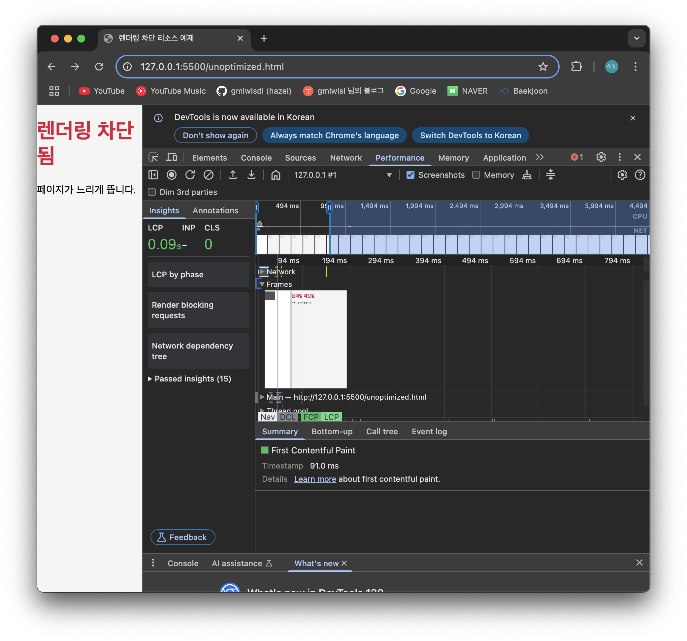

# 38장 부록 - 간단하게 렌더링 최적화 실험해보기

### 1. 최적화되지 않은 경우

- 실험 코드

  ```html
  <!-- unoptimized.html -->
  <!DOCTYPE html>
  <html lang="ko">
    <head>
      <meta charset="UTF-8" />
      <title>렌더링 차단 리소스 예제</title>

      <!-- ⚠️ CSS와 JS 모두 렌더링 차단 -->
      <link rel="stylesheet" href="style.css" />
      <script src="main.js"></script>
    </head>
    <body>
      <h1>렌더링 차단됨</h1>
      <p>페이지가 느리게 뜹니다.</p>
    </body>
  </html>
  ```

  ```css
  body {
    margin: 0;
    font-family: sans-serif;
    background-color: #f5f5f5;
  }
  h1 {
    color: crimson;
  }
  ```

  ```css
  console.log('JS Loaded')
  document.body.style.border = '5px solid red'
  ```



FCP


### 2. 최적화된 경우

- 실험 코드

  ```html
  <!DOCTYPE html>
  <html lang="ko">
    <head>
      <meta charset="UTF-8" />
      <meta name="viewport" content="width=device-width, initial-scale=1.0" />
      <title>최적화된 렌더링</title>

      <!-- CSS 비동기 로딩 (preload + onload) -->
      <link
        rel="preload"
        href="style.css"
        as="style"
        onload="this.onload=null;this.rel='stylesheet'"
      />
      <noscript><link rel="stylesheet" href="style.css" /></noscript>

      <!-- JS는 defer로 렌더링 차단 제거 -->
      <script defer src="app.js"></script>

      <style>
        /* 필수 above-the-fold CSS 인라인 처리 */
        body {
          font-family: sans-serif;
          margin: 0;
          padding: 20px;
          background-color: #f5f5f5;
        }

        h1 {
          color: #3b82f6;
        }

        p {
          font-size: 18px;
        }
      </style>
    </head>
    <body>
      <h1>렌더링 최적화 완료!</h1>
      <p>이 페이지는 렌더링 차단 리소스를 제거하여 빠르게 로드됩니다.</p>
    </body>
  </html>
  ```

  ```css
  body {
    background-color: white;
    transition: background-color 0.3s ease;
  }

  p::after {
    content: ' 🚀';
  }
  ```

  ```jsx
  document.addEventListener('DOMContentLoaded', () => {
    console.log('📦 DOM fully loaded and parsed')
  })
  ```


FCP


### 3. 결과

**최적화 전 vs 최적화 후**

| **항목**                           | **최적화 전**                         | **최적화 후**                                    | **개선 내용 요약**                            |
| ---------------------------------- | ------------------------------------- | ------------------------------------------------ | --------------------------------------------- |
| **LCP (Largest Contentful Paint)** | ~0.09초 (약 91ms)                     | ~0.05초 (약 50ms)                                | 약 40ms 감소                                  |
| **Time to First Byte**             | 28ms                                  | 3ms                                              | 서버 응답 속도 개선됨 (캐시 or 간단해진 요청) |
| **Element Render Delay**           | 47ms (또는 51ms로 보이는 스샷도 있음) | 없음 (분석 UI 상 Element delay 없거나 매우 짧음) | DOM 렌더링 지연 해소                          |
| **렌더링 블록 리소스**             | <link rel="stylesheet">, 외부 CSS 등  | defer, inline style, 비동기 로딩 등              | 차단 요소 제거 완료                           |

이렇게 개선된 이유는

| **항목**                       | **원리**                | **효과**                  |
| ------------------------------ | ----------------------- | ------------------------- |
| **렌더링 차단 리소스 제거**    | preload + defer         | FCP/LCP 향상              |
| **초기 스타일 인라인화**       | 화면에 즉시 스타일 적용 | CLS 방지, LCP 앞당김      |
| **JS 지연 실행**               | DOM 파싱 완료 후 실행   | Main thread blocking 제거 |
| **DOMContentLoaded 이후 실행** | 사용 시점에만 실행      | 초기 렌더링 경쟁 줄임     |
